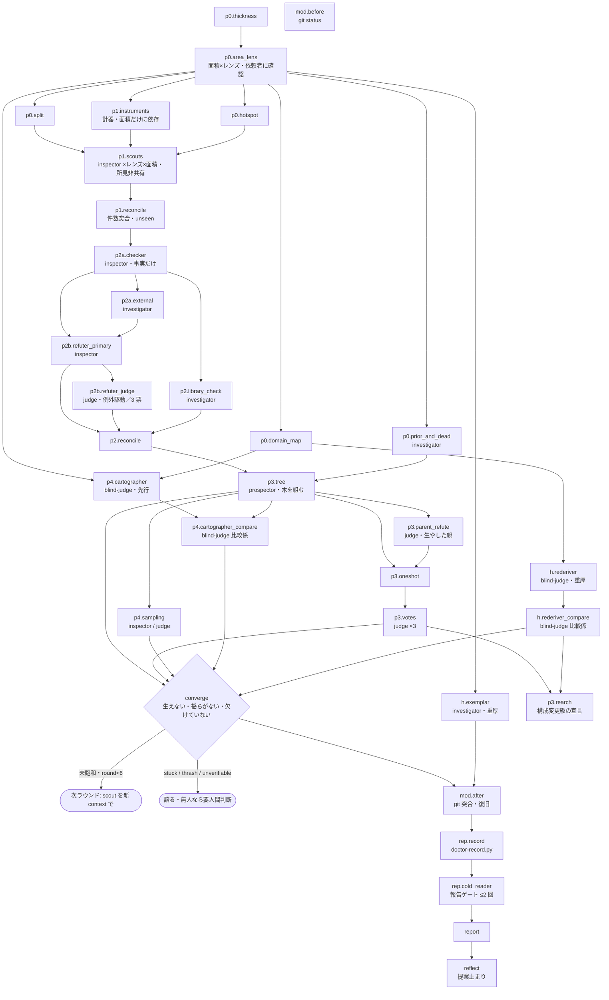

# doctor-loop の仕様（人が読む側）

## 何の文書か

`/doctor-loop` は、このリポジトリが配る Claude Code のプラグイン（AI 開発支援ツール Claude Code に足す拡張）`convergence-loops` の 4 本のコマンドの 1 つで、リポジトリの現状そのもの（コード・文書・CI・開発環境）を読み取り専用で診て、改善候補を敵対検証で刈り込みながら根本の木を組み、生き残った候補と一撃（最も梃子の効く根本）を提案として報告する。変更は一切適用しない。回す手順は手順書 `commands/doctor-loop.md` に散文で、記録の検査は検証器 `scripts/doctor-record.py`（Python）に書いてある。この 2 つが正本で、`graphloops/graphs/doctor-loop.json`（グラフ実行版プラグイン graphloops の側にある。research と review は実行用の欄も持ち engine で回せる。doctor / firstread は写しだけ） はそれを「節（工程）＋依存＋周回条件」のグラフに写した機械が読む側、この文書はその図と、図に落ちない説明を持つ人が読む側である。

用語:

- **prospector** — このループを回すメインのセッション（Claude Code の会話そのもの）。走査者・統合者。以下「回す側」
- **役割 agent** — 回す側と別の context（子の会話）で動く subagent。`agents/*.md` に 6 本あり、ここで使うのは `inspector`（読むだけ）・`investigator`（読む＋shell＋web）・`judge`（覆せない判定を下す）・`blind-judge`（道具なし。渡されたものだけから導出）・`cold-reader`（道具なし。初見の読み手）
- **scout / checker / refuter** — 役割 agent に手順書が与える席の名前。scout は候補を掘る `inspector`、checker は事実を照合する `inspector`、refuter は価値を反証する `inspector`（一次）か `judge`（二次）
- **記録** — 実行結果を書く JSON。検証器はこれを読んで「発行を妨げるもの」を列挙し、終了コード 0（阻害なし）／1（阻害あり）／2（記録が不正）で返す。機械は不合格だけを宣言する
- **P0〜P4** — 手順書の節の名前。P0 走査範囲の固定、P1 発見（層化走査）、P2 検証と刈り込み（P2a 事実照合・P2b 敵対検証）、P3 木の構築と一撃、P4 ラウンドと飽和
- **版** — プラグインの `plugin.json` にある `version`

**基準**: この写しを起こした時点の作業ツリーの手順書と検証器（版は `.claude-plugin/plugin.json` の `version` が正本。ここに写さない——写した版は pull のたびに腐る）。

## 図



## 図から読めること

- **計器（`p1.instruments`。既にある lint・型検査・テスト等の読み取り専用の道具）は面積の確定だけに依存する**。レンズが未定でも回し始めてよく、P0 の他の項目を待たない
- **scout はレンズ×面積の単位で並行**し、返った候補から順に P2a へ流す。待ち合わせが要るのは木の構築（`p3.tree`）だけ
- **P2 は二段**。事実（checker）で刈ってから価値（refuter）で刈る。`judge` は例外駆動で、推奨・条件付きの判定、ライブラリ級以上の重さ（独立 3 票）、回す側が生やした節にだけ出る
- **収束ゲートは比較係**。cartographer（被覆に要る観点を列挙する目）と、それを実走査範囲と突き合わせる目（`p4.cartographer_compare`）を分ける。重厚の rederiver（目的と制約だけからの独立再導出）も同じ形。回す側が自分の被覆を自分で採点しない
- **cartographer・rederiver・模範照合（`h.exemplar`）は序盤に先行起動できる**（入力が P0 だけ）。突合だけを収束確認の時点で行う
- **手順書の「生やした親を同じラウンドの P2b に掛けろ」は依存の上では循環**なので、木の構築の後の別の節（`p3.parent_refute`）として置いた

## doctor-loop にだけある形

- **根本の木**が中心の成果物。節に高さ（症状・機構・体制・方針の固定 4 段）・親・確度・重さ・判定を持ち、刈るとは下と横を閉じて上だけ開けておくこと（木から外さない）
- **飽和の三条件**「生えない・揺らがない・欠けていない」。新しい節と数えるのは判定が推奨・条件付き・検証不能の節だけ（棄却の新規はカウンタを動かさない）。連続カウントは、抜き取りで判定が覆った・ゲートが redesign-needed・thrash で面積を割り直した、のいずれでも 0 に戻る
- **判定語彙は 2 系統**。候補の判定（推奨・条件付き・棄却・検証不能・事実誤り・既決着・判定不一致）は日本語、ゲートの verdict（pass / redesign-needed / unverifiable）は英語。混ぜない
- **変更禁止の機械確認**。走査の前後で `git status --porcelain` と `git stash list` を突き合わせ、記録は作業ツリーの**外**に書く（突合に映らないため）
- **提案止まり**。候補の採否・実装・issue 起票・手順書自身の更新はすべて依頼者が決める

## 記録と検証器

- 1 実行 1 記録、作業ツリーの外。`python3 doctor-record.py <記録.json>` が exit 0／1（飽和を名乗りながら条件が揃っていない）／2（記録が不正）。`outcome=stopped`（未飽和の正直な申告）は 1 にならない
- 返答の突合が検証器の要。返答を欠いた scout の面積は記録の `unseen` に載っていないと不正（欠落を「見つからなかった」と読む誤りを等式で塞ぐ）
- `mod_check`（変更禁止の確認）と `rescan`（再走査の手引き）が必須欄

## 既知の未決

手順書の側に残っている未決で、正本は `docs/doctor-loop-v2-remaining-findings.md`（doctor-loop を検証したときの残存所見の一覧）:

- 厚みの昇格義務（一撃が高さ 3 以上なら重厚へ）と、構成変更級の一撃の「昇格するか報告に留めるかを選べ」が衝突する
- 子を持たない生成節（手筋で生えた直後の節）を P2b に掛けるときの入力仕様が無い
- 3 票が「棄却」で確定したときの一撃の運びが無い
- 標準から重厚へ途中昇格したときの入力整備（要約レビュアー・連続カウント）が未定義
- 面積が狭くレンズ未指定のときの既定が無い
- 記録の `rescan` 欄は検証器が必須要求するが、手順書 `commands/doctor-loop.md` にこれを書けという指示が無い（機械だけにあって散文に無い）
- 手順書の先頭の `allowed-tools` に Workflow（複数 subagent を script で回す道具）を宣言しているが、本文が使わない

## 機械検査

```bash
python3 graphloops/scripts/graphcheck.py graphloops/graphs/doctor-loop.json scripts/doctor-record.py
```
