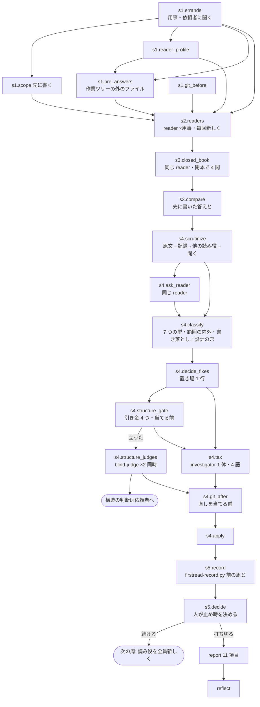

# firstread-loop の仕様（人が読む側）

## 何の文書か

`/firstread-loop` は、このリポジトリが配る Claude Code のプラグイン（AI 開発支援ツール Claude Code に足す拡張）`convergence-loops` の 4 本のコマンドの 1 つで、書いた文書が書いていない人に通じるかを確かめる。文書を知らない読み役を毎回新しく立て、用事だけを渡してリポジトリの入口から探させ、どこで止まったか・何を推測で埋めたか・読んだ後に何を誤解したか・どんな疑問が湧いたかを集めて直す。回す手順は手順書 `commands/firstread-loop.md` に散文で、記録の検査は検証器 `scripts/firstread-record.py`（Python）に書いてある。この 2 つが正本で、`graphloops/graphs/firstread-loop.json`（グラフ実行版プラグイン graphloops の側にある。research と review は実行用の欄も持ち engine で回せる。doctor / firstread は写しだけ） はそれを「節（工程）＋依存＋周回条件」のグラフに写した機械が読む側、この文書はその図と、図に落ちない説明を持つ人が読む側である。JSON の欄名の意味は同じディレクトリの `README.md` の凡例に書いてある。

用語:

- **author** — このループを回すメインのセッション（Claude Code の会話そのもの）。文書の作者で、手順書は「あなた」と呼ぶ。以下「回す側」
- **読み役** — 文書を知らない subagent（子の会話）。役割 agent `reader`（`agents/reader.md`。読むだけで、issue・PR・web に届く道具を持たない）で立てる。他に検証役として `investigator`（読む＋shell＋web）、構造の判断に `blind-judge`（道具なし。渡されたものだけから導出）を使う
- **記録** — 周ごとに書く JSON。検証器はこれを読んで「収束を妨げるもの」を列挙し、終了コード 0（阻害なし）／1（阻害あり）／2（記録が不正）で返す。機械は不合格だけを宣言する
- **手順 1〜5** — 手順書の節の名前。1 準備、2 探させて読ませる、3 読み終わったら質問する、4 詰まりを分類して直す場所を決める、5 もう一度別の読み役で
- **版** — プラグインの `plugin.json` にある `version`

**基準**: この写しを起こした時点の作業ツリーの手順書と検証器（版は `.claude-plugin/plugin.json` の `version` が正本。ここに写さない）。検証器は途中で素材の状態の表に「収束を妨げるか」の属性を行として持たせたが、意味は同じ。

## 図



## 図から読めること

- **読み役は用事の数だけ並行**し、1 周の中では同じ相手に続けて聞く（閉本の 4 問・吟味の追加の問い）。周をまたいで使い回さない
- **直しを当てる前に 2 つの門**がある。導線の引き金（`s4.structure_gate`）を先に見て、立っていれば置き場を選ぶ直しを止める。次に検証税（`s4.tax`）で、この周に当てる直し全部を `investigator` 1 体に叩かせる
- **git 突合の 2 回目は直しを当てる前**（`s4.git_after`）。周の最後に取ると自分の直しと役の書き換えが見分けられない
- **止め時は人が決める**（`s5.decide`）。機械は不合格しか宣言せず、読み役に「もう大丈夫」と言わせない
- **同時に走らせてよいのは 1 周の中だけ**。直しながら次の人を走らせない。これはグラフの外側の周回規律

## このループだけの形

- **上限なし**。新しい詰まりはゼロにならない（同じ版で 1 件から 3 件に増えた実測）ので、費用（読み役 1 人あたり 10〜12.5 万トークン）と見合わせて人が打ち切る
- **塞げないものを実測して書いている**（JSON の `unblockable_context`）。規約ファイル `CLAUDE.md` の自動読み込み、回す側のセッションを始めた時点のブランチ名・直近のコミット・未コミット変更、読み役が自分で開ける `.git` 配下。4 本の手順書でこれを持つのはこの 1 本だけ
- **集めるものと集めないもの**を厳密に分ける。集めるのは止まった場所・推測で埋めた場所・読んだ後の誤解・辿り着けなかった先（この 4 つだけが範囲の内外を持つ）と、湧いた疑問・着想・読み飛ばし。集めないのは読みやすさの点数・誤字・内容の正しさ・読み役が考えた直し方
- **回収されなかった疑問**は書き落とし（設計に答えがある）か設計の穴（誰も決めていない）に仕分け、後者は書き足して埋めずに残す
- **構造の判断はループの中で実行しない**。改名・移動・入口の付け替えは根拠を揃えて依頼者へ渡す（外しても読み役には見つからない。読み役は文章の採点者であって構造の採点者ではない）

## 記録と検証器

- 周ごとに 1 つ、作業ツリーの外。先に書いた答え・git status の写しも同じ場所
- `python3 firstread-record.py <今の周> [<前の周>]` が exit 0（阻害なし。収束の宣言ではない）／1（聞いていない素材・片づかない用事・範囲内の書き落とし・git 突合未確認・新しい詰まり・同じ場所の再出・前の周が無い）／2（記録が不正）
- 阻害にしないが報せるもの: 範囲外の行き先・2 周続けて読み飛ばされた箇所・読み役の性質で外した再出（`structural`）・足す側にしか倒れていない行数・押し切った直し・税を省いた直し・引き金が立った

## 既知の未決（`docs/firstread-loop-remaining-findings.md` が正本）

- 読み役が読み始める前に落ちたとき・途中で落ちたときの扱いが無い（立て直してよいか、同じ周の 1 人として数えてよいか）
- 読み役が使った道具の癖（検索の上限・パターンの不発）と文書の欠陥を切り分ける規定が無い
- 複数の領域を 1 周に載せたとき、引き金 4（要約が別の文書群の話になる）の読み方が無い
- 4 つ目の問い（一般の知識で答えると外れる問い）を選ぶときの「文書」の範囲に、サンプル設定のコメント・テストコードを含めるかが未定義

## 機械検査

```bash
python3 graphloops/scripts/graphcheck.py graphloops/graphs/firstread-loop.json scripts/firstread-record.py
```

`s4.classify` は回す側（author）が判定を出す節だが、手順書がそう定めた分類（採点ではない）なので、JSON に `runner_judgment_by_design` の印を付けて検査に認識させている。
