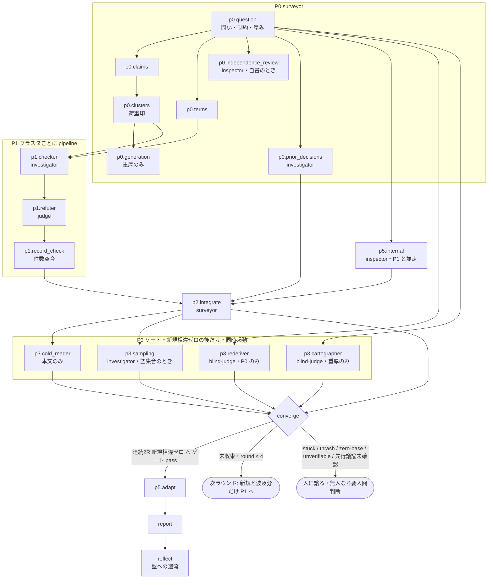

# research-loop の仕様（人が読む側）

## 何の文書か

`/research-loop` は、このリポジトリが配る Claude Code のプラグイン（AI 開発支援ツール Claude Code に足す拡張）`convergence-loops` の 4 本のコマンドの 1 つで、設計・手法・技術選定の見立てを、業界や学界の一次情報で校正してから自分のドメインに最適化する。回す手順は手順書 `commands/research-loop.md` に散文で、記録の検査は検証器 `scripts/research-record.py`（Python）に書いてある。この 2 つが散文版の正本で（グラフ実行版の正本は JSON——宣言は同じディレクトリの `README.md`「決めてもらうこと」）、`graphloops/graphs/research-loop.json`（グラフ実行版プラグイン graphloops の側にある。research と review は実行用の欄も持ち engine で回せる。doctor / firstread は写しだけ） はそれを「節（工程）＋依存＋周回条件」のグラフに写した機械が読む側、この文書はその図と、図に落ちない説明を持つ人が読む側である。

用語:

- **surveyor** — このループを回すメインのセッション（Claude Code の会話そのもの）。調査者・統合者。以下「回す側」
- **役割 agent** — 回す側と別の context（子の会話）で動く subagent。`agents/*.md` に 6 本あり、ここで使うのは `investigator`（読む＋shell＋web）・`judge`（覆せない判定を下す）・`inspector`（読むだけ）・`blind-judge`（道具なし。渡されたものだけから導出）・`cold-reader`（道具なし。初見の読み手）
- **記録** — 実行結果を書く JSON。検証器はこれを読んで「発行を妨げるもの」を列挙し、終了コード 0（阻害なし）／1（阻害あり）／2（記録が不正）で返す。機械は不合格だけを宣言する
- **P0〜P5** — 手順書の節の名前。P0 断面の固定、P1 校正（外部照合）、P2 統合、P3 収束ゲート、P4 収束判定、P5 ドメイン適応
- **Workflow** — Claude Code の、複数 subagent を JavaScript の script で回す道具。手順書の P1 はこの script として書かれている
- **版** — プラグインの `plugin.json` にある `version`

**基準**: この写しを起こした時点の作業ツリーの手順書と検証器（版は `.claude-plugin/plugin.json` の `version` が正本。ここに写さない）。2026-09-12 の時点で、手順書・検証器はこの写しと同じ形だった。

## 図



## 図から読めること

- **rederiver（前提だけからの独立再導出）・cartographer（完全な地図に要る観点の列挙）・内部突合（`p5.internal`）は、問いと制約だけに依存する**。P1 と同じ波で先行起動できる。手順書の「起動自体はループ序盤に先行してよい」を依存から機械が導く
- **P1 はクラスタ（同じ一次情報群で検証できる主張の束）ごとの pipeline**。checker が返り次第その束の相違と荷重確証に refuter が走り、全クラスタを待ち合わせない
- **待ち合わせは 2 点**。`p2.integrate`（P1 の全束＋内部突合＋先行議論）と `converge`
- **P3 のゲートは毎ラウンド回さない**。新規の相違がゼロだったラウンドの後にだけ回す（荒れている間に回しても訂正で捨てられる）

## research-loop にだけある形

- **厚みの三段**（軽量・標準・重厚。検査の厚さ）で動く節が変わる（JSON の `active_in`）。既定は標準。軽量への降格は依頼者の明示指定だけ、昇格は自律で自由。軽量は 1 ラウンドで打ち切るので、上限 4 は標準・重厚のもの
- **荷重と反証**。結論が乗る主張（荷重）には確証でも反証を掛け、相違は反証を経て初めて確定する。反証が掛からなかった荷重は理由付きで申告する。検証器はこれを機械で守る（4 本の中でこのループだけ）
- **抜き取り検査**。2 ラウンド目の検証対象が空集合なら、確定済みの主張から無作為に 1〜2 割を新しい checker で引き直す。空集合での自明成立を収束と認めない
- **無人実行の読み替え**。回す側が subagent として走るときは「人に諮れ」で止まらず、保守的な既定で続行して「要人間判断」を報告の冒頭に列挙する
- **開いた問いはここで解けない**。地図が無い・選択肢の洗い出しは deep-research（Claude Code の調査コマンド）に委譲し、持ち帰った事実主張を次ラウンドの P1 に入れる

## 記録と検証器

- 1 実行 1 記録。置き場所の指定は無い（作業ツリーの外が無難）
- `python3 research-record.py <記録.json>` が exit 0（発行を妨げるものなし）／1（収束を名乗りながらゲート未 pass・覆り・未反証の相違）／2（記録が不正）。`outcome=stopped`（未収束の正直な申告）は 1 にならない
- 件数突合（クラスタに入れた主張数 `claims_submitted` ＝ 判定数）がこの検証器の要。Workflow の subagent が死ぬと `agent()` が `null` を返し、script がそのクラスタを黙って落とす。それが見えるのはこの突合だけ

## 機械が守らないもの

- 暴走ガード（4 ラウンド）と軽量の 1 ラウンド打ち切りは手順書の散文だけ。検証器は `rounds_total` の下限しか見ない
- 連続 2 ラウンドは記録の `convergence.consecutive_zero` の自己申告。1 実行 1 記録なので、ラウンド間の突合が無い
- `investigator` を立てる前後の `git status --porcelain` 突合は散文だけ（記録の欄が無い）
- Workflow が無い環境では Agent の並列起動で同じ構造を再現する、と手順書が書く。その再現が同じ遮断を保っているかを確かめる手段は無い

## 実行版（`/research-graph`）

このグラフは 2026-09-12 に実行用の欄（節ごとの prompt_file・schema・reads・writes・cond）を足され、graphloops の engine（`graphloops/scripts/loop.py`）で回せる。手順書は `graphloops/commands/research-graph.md`、ループの算術は `graphloops/rules/research-loop.py`。記録の形と検証器は `/research-loop` と同じ。散文の側と食い違いが出たら、どちらを正本にするかは依頼者が決める（両方生かすとズレる）。

## 機械検査

```bash
python3 graphloops/scripts/graphcheck.py graphloops/graphs/research-loop.json scripts/research-record.py
```
