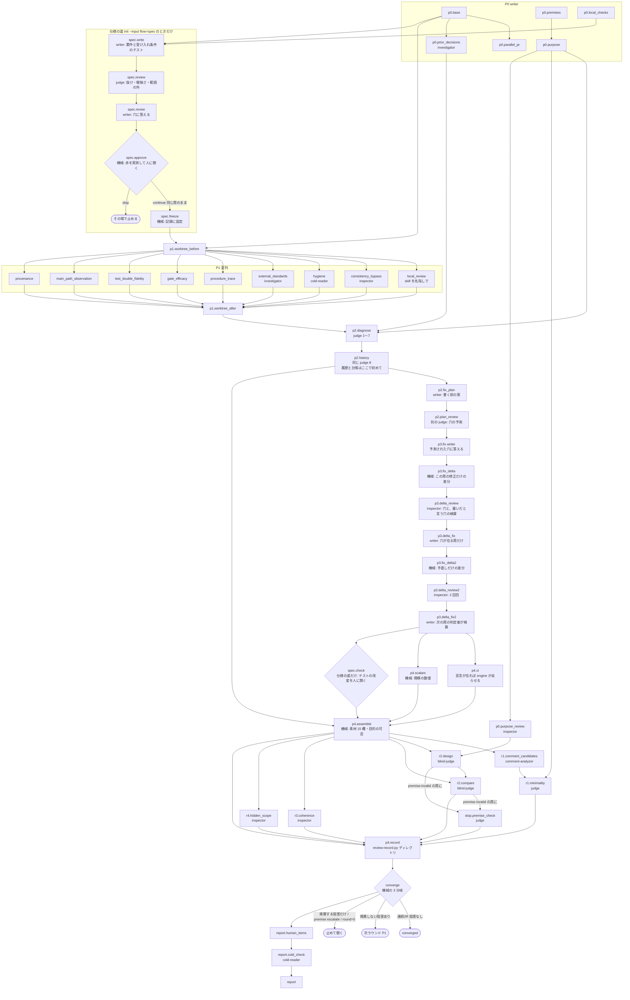

# review-loop の仕様（人が読む側）

## 何の文書か

`/review-loop` は、このリポジトリが配る Claude Code のプラグイン（AI 開発支援ツール Claude Code に足す拡張）`convergence-loops` の 4 本のコマンドの 1 つで、実装したコード変更を、レビューと修正を繰り返して指摘が出なくなるまで回す。回す手順は手順書 `commands/review-loop.md` に散文で、記録の検査は検証器 `scripts/review-record.py`（Python）に書いてある。この 2 つが散文版の正本で（グラフ実行版の正本は JSON——宣言は同じディレクトリの `README.md`「決めてもらうこと」）、`graphloops/graphs/review-loop.json`（グラフ実行版プラグイン graphloops の側にある。research と review は実行用の欄も持ち engine で回せる。doctor / firstread は写しだけ） はそれを「節（工程）＋依存＋周回条件」のグラフに写した機械が読む側、この文書はその図と、図に落ちない説明を持つ人が読む側である。JSON の欄名の意味は同じディレクトリの `README.md` の凡例に書いてある。

用語:

- **writer** — このループを回すメインのセッション（Claude Code の会話そのもの）。実装者。以下「回す側」
- **grader** — 回す側と別の context（子の会話）で採点する subagent の総称。実体は役割 agent（`agents/*.md` の 6 本）で、ここで使うのは `inspector`（読むだけ）・`investigator`（読む＋shell＋web）・`judge`（覆せない判定を下す）・`blind-judge`（道具なし。渡されたものだけから導出）・`cold-reader`（道具なし。初見の読み手）
- **記録** — ラウンドごとに書く JSON。検証器はこれを読んで「収束を妨げるもの」を列挙し、終了コード 0（阻害なし）／1（阻害あり）／2（記録が不正）で返す。機械は不合格だけを宣言する
- **P0〜P4・P-R** — 手順書の節の名前。P0 基準点と目的の固定、P1 素材集め、P2 診断、P3 修正、P4 再採点と収束判定、P-R 俯瞰（R1 最小性・R2 目的からの独立再設計・R3 全体整合・R4 見えてないスコープ）
- **版** — プラグインの `plugin.json` にある `version`

**基準**: この写しを起こした時点の手順書と検証器（版は `.claude-plugin/plugin.json` の `version` が正本。ここに写さない——写した版は pull のたびに腐り、読み手に手元の検証器を疑わせる）。review はこの写しの前後で大きく変わった版が続いたので、写しは新しい側に合わせてある。

## 図



## 図から読めること

- **修正を見る目は直す前と直した直後にも在る。** 以前は修正の良し悪しを見る段が全部『直した後』（P3 の自己申告・R1〜R4・次の周の全体レビュー）に在り、修正が作った写し・塞がない入口・契約のずれは次の周に新しい指摘として挙がった（実測 2026-09-24: 3 周目の指摘のうち 8 件が 2 周目の修正の産物）。今は writer が書く前の案（`p2.fix_plan`）を別の judge（`p2.plan_review`、判定をした judge と別の context）が叩き、P3 は予測された穴と別案に key ごとに答える（`plan_faces`。答えない key は機械が拒む）。書いた直後は、周の頭に固めた版から修正後の姿までの差分（`p3.fix_delta`。修正後も同じ手続きで固める）を inspector が 3 点（写し・入口・宣言と実装のずれ）だけ見て、修正が塞いだと言う事前審査の穴を 1 件ずつ検算し（`checks`）、挙がった穴を同じ周で直す（`p3.delta_fix`）。手直しにはもう 1 回だけ同じレビューを当て（`p3.delta_review2`）、その手直し（`p3.delta_fix2`）と、直さずに残すと宣言した穴は、次の周の `p2.history` が 1 件ずつ振り分ける（`declared_routed`。振り分け漏れは機械が拒む）——記録に残るだけの穴を作らない。効いたかは次の周の `faces_created_by_prev_fix` で測る

- **P1 の 9 節は互いに依存が無い**。同時に走らせてよく、待ち合わせは `p1.worktree_after`（作業ツリーが変わっていないことの機械突合）の 1 点
- **R2 は 2 体**。独立設計（`r2.design`）は目的テキストだけに依存するので P1 と同じ波で先行起動できるが、比較役（`r2.compare`）は累積差分が要るので記録の後。手順書の「R2 は先行してよい」は設計の半分にだけ当てはまる
- **P2 は 2 段**。同じ judge が、今ラウンドの材料だけで根本ユニットとラベルを確定（1〜7）してから、履歴と問いの台帳を受け取って再審（8）する。先に渡すと追認になる
- **収束は機械が読む**。`converge` は検証器の 3 分岐（止めて聞け／帰属する分は待て・帰属しない分を先に直せ／前提不成立が先）を写すだけで、writer は数えない
- **最終報告にも初見検査**がある。人に聞くところの本文だけを `cold-reader` に渡し、詰まりは report の節に渡って writer が直してから出す（直したかは機械では見ない——注記であって門ではない。verdict と件数は `process.cold_check` に残る）

## この写しの前の版から変わったこと

- 人に聞く候補は止めずに**問いの台帳**（記録の `questions` 欄）へ載せ、次の周の judge が再審する。止めて聞くのは、機械が「残る阻害は保留の問いに帰属するものだけ」と言ったときと、前提不成立が確定したときと、上限（5 ラウンド）の 3 つだけ。stuck・thrash・設計の岐路・目的の外・観点の誤発火・未観測・独立検証不能は台帳の**種類**になった
- R1〜R4 の verdict は記録の `reviews` 欄に載り、再発火条件に当たらない周は `carried_over`（実際に見たラウンド付き）で持ち越す。連続 2 ラウンドと持ち越しの連鎖は検証器が数える
- 検証器の入口はディレクトリ渡しの 1 つ。全ラウンドを読み、履歴（キーごとの推移・消えて戻った回数・問いの推移）を出す
- 前の周の R1 最小性が挙げた削除候補は、次の周の judge が **1 件につき 1 行**で処理する（`carried_r1`）。配線（`p2.diagnose` と `p3.fix` の `reads` の `prev.r1.minimality`）は前から在り、欠けていたのは**数える口**だった——直す義務は `record["units"]` にしか掛からないので、judge が unit に上げなければ誰も赤くならず、読んだ上で黙って落とせた（実測 2026-09-16、別リポジトリの run: 1 周目の 14 件が 2 周目の修正対象に 1 件も入らなかった）。
- `fork` の問いが出どころの `[block]` を免除するのは **1 周だけ**。次の周も開けたままにするなら `escalate`（人に実際に届く形）に上げる。`held` のまま持ち越すと `fix_covers_open_units` は免除せず、直す義務が戻る——`held` は判定者がまだ考えている状態で、人には届いていない。以前は無条件の免除だったので、`held` を保持するだけで `[block]` を何周でも未着手にできた。
- 本文が引く「実測 YYYY-MM-DD」の置き場は `$(git rev-parse --git-dir)/graphloops/<loop>/<run-id>/` で、**git に追跡されていない**（`git ls-files .git` が 0 件）。読み手は断り書きを信じるしかない——検算したいなら、その run を回した環境の置き場を見るか、同じ手順で測り直す。リポジトリ全体で同じ形の引用が 51 か所 21 ファイルに在り、BASE 時点から在る慣行である。
- 局所レビューはまとめ役（`review-pr`）を挟まず、レンズを 1 本ずつ名指しで起こす。**名指しの正本は `graphs/review-loop.json` の `p1.local_review.skills` 1 か所**で、要素は `{skill, args, note, required, applies_cond}`——engine が `{{node.skills}}` でそのまま役へ渡すので、プロンプトにも手順書にも写しを置かない（写した周に写しだけが取り残され、しかも役は写しの方を読む）。post_check `local_review_covers_lenses` が**宣言 1 本につき findings の行 1 本**を要求する: 起こして 0 件は `failed` に「起こしたが所見なし」、起こしていない・非該当も `failed` に理由で、`required: false` の 1 本も行は省けない。`required: false` の要素は必ず `applies_cond`（rules の条件の関数の名前。graphcheck が対で縛る）を持ち、当てるかは回す側の読みでなく条件の関数が決める——`/security-review` は `security_surface_touched`（p0.base の `touches_security_surface` か `touches_external_seams`、または前のどれかの周の p3.fix の `security_surface_changed` か `seams_changed`。申告はどれも迷うなら true。欄の無い古い盤面は当てる側に倒す）。engine が節を出す時点に評価して `{{node.skills}}` の要素と instance に `applies`・`applies_why` を足し、post_check は `applies` が真の要素で `invoked` が true でない行を拒む（material が awaiting_human の行は通す）。**直さずに残す穴**: 受け付けの柵は `p1.local_review` の post_check にだけ在るので、ほかの節に条件付きのレンズを書くと engine は評価して役に見せるが、未起動を拒む者はいない。これで「起動しなかった」が「見たが所見なし」と同じ形では通らなくなる（実測 2026-09-15: 3 周続けて型設計のレンズが起動されず、記録のどこにも赤が出なかった）。**嘘は捕まらない**——変わるのは、沈黙で通せた形が明示の虚偽を経由しないと通せない形になるところまで。`/simplify` は指摘だけ返す形で呼ぶ。**散文版（`/review-loop`）とは道具構成が割れている**——散文版はまとめ役 `review-pr` を使い、`pr-test-analyzer` は 1 度も呼ばない。散文版の道具選定はこのグラフの担当範囲の外なので揃えていない
- R1 の前段に `comment-analyzer` によるコメント削除候補の取得。ゲートの赤の確認は腕ごとに、写し（`mktemp -d`）の上で、対照の緑も見る
- 探す役に「ここは見るな」の線を writer が引かない。見た範囲と見ていない範囲を返させる
- **世界の解（先行例）を処方の梯子に置く**（REVIEW.md「処方の最小性」）。実行版は、判定役に直す単位と人へ回す問いごとの先行例の行（`precedents`。出典つき。人へ回す問いには「世界の解を当たっても決まらない理由」）を、修正役に修正ごとの先行例（`precedent`）を、外部標準照合に一次情報の順位と差分が乗る位置（`rankings`）を必須にする。世界の解で決まる問いは人に回さない
- 人が実地で確かめるまで決まらない問いは台帳の種類 `field`（出どころを持たない）。`awaiting` の出どころは今 `awaiting_human` の素材だけで、実行版は素材を書く全部の節の done で同じ規則を当てる（検証器は周の最後の 1 回しか見ないので、CI を再実行する P4 が人待ちの欄を上書きすると毎周弾かれていた）

## 記録と検証器

- 記録は `.claude/review-rounds/round-<N>.json`。採点 1 回につき 1 つで、前ラウンド分を消さない。同じリポジトリの前のレビューは `archive-<前の BASE>/` へ退避する
- `python3 review-record.py <ディレクトリ>` が exit 0（今ラウンドにも前ラウンドにも阻害なし。収束の宣言ではない）／1（阻害あり）／2（記録が不正）を返す。1 と 2 を混ぜない
- 欄と語彙の正本は検証器の定数（`MATERIALS`・`STATUS`・`REVIEWS`・`REVIEW_STATUS`・`LABELS`・`QUESTION_KINDS`・`QUESTION_STATUS`）。JSON もこの文書も列挙を持たない

## この文書の JSON にだけ書いてあること

`review-loop.json` の各節には `source`（手順書の見出し）・`inputs` / `forbidden_inputs`（遮断）・`refire_when`（R1 / R2 の再発火条件）・`retry`（差し戻し）・`note`（他プラグインの門番が掛かる箇所など）がある。図には載せていない。

## 既知の未決・機械が守らないもの

実走から上がった残存所見の正本は `docs/feedback/review-loop-remaining-findings.md`（doctor / firstread の同名文書が `docs/` 直下に在るのと同じ役割。受け取った申し送りを溜める棚として`docs/feedback/` を新しく立てており、既存 2 本を移すかは未決）。以下はこの図から直接見えるもの。

- 暴走ガード（5 ラウンド）は散文版では散文だけで、検証器にも上限の検査は無い。実行版（graphloops）は rules の `converge` が先頭で `round >= max_rounds` を見て止める（全分岐に掛かる。以前は converged 分岐の早期 return が飛ばしていた）
- P1 前後の作業ツリー突合は散文版には記録の欄が無い（doctor の `mod_check`、firstread の `git_status_match` に相当するものが無い）。実行版は機械の節 `p1.worktree_before` / `p1.worktree_after` が porcelain・stash・固めた版の木の id を突き合わせ、違えば止める（記録の `process.git_mismatches`）。writer が自分の変更として受理したら、審査対象の写しを取り直し、変更前の姿を見て書き終えた材料の節を待ちに戻して撃ち直す
- 並行 PR 衝突チェックの 6 段は、検証器は素材欄の有無しか見ない
- 検証器が塞ぐ「聞く時」の帰属は 1 周で通る経路だけ。2 周かければ帰属を作れると検証器自身が書いている。守るのは「台帳を書くのが judge であること」と「R1 が台帳を監査すること」の 2 枚
- 担当 PR へのコメント申し送り（`gh` の投稿）には、`gates` プラグインを入れている環境でその門番が掛かる

## 実行版（`/review-graph`）

このグラフは 2026-09-12 に実行用の欄（節ごとの prompt_file・schema・reads・writes・cond）を足され、graphloops の engine（`graphloops/scripts/loop.py`）で回せる。手順書は `graphloops/commands/review-graph.md`、ループの算術は `graphloops/rules/review-loop.py`（検証器の定数を写さず import する）。写しの側と違う点が 3 つある: P4 の記録の節は機械の節 2 つ（`p4.assemble` が [block] の数と R1/R2 の再発火を数え、`p4.record` が周の記録を組んで検証器にディレクトリを渡す）に割れ、P1 の前後の作業ツリー突合と走らせなかった素材の欄の穴埋めも機械の節が持つ。R2 の独立設計と比較役は別の節で、premise-invalid は設計の節が返す。判定・履歴の突合は同じ judge を続ける形（engine が agent の id を持ち回る）。

**判定から入る run（人の修正依頼）。** `loop.py add` は人の依頼（findings の型）を、その周の判定役が起きる前なら何周目でも何度でも、記録の `process.request_findings` に周と出どころつきで積む（前の周の分は周の頭で `process.request_history` に移る）。1 周目の P1 より前の最初の `add` だけが入口の印 `process.request_entry` を立て、その run は P1 の役の 9 節を起こさずに判定から始まる（2026-09-25 に足した。背景は docs/feedback/review-loop-remaining-findings.md の R12）。節を外すのは graph の cond（`not request_entry`）で、飛ばした素材は入口の理由つきの not_applicable、空の差分でも周の頭で止まらない。入口が効くのは修正が入るまでで、次の周からは通常の run と同じく P1 が修正差分を見る。途中の周の `add` は P1 を外さない。述語は rules の `request_entry` 1 本（印だけを見る）で、engine には run の種類を持ち込んでいない。`add` を受ける時機は判定役が入力を読む前まで（instance が出ていても、起こしていない・返答の置き場が空なら受ける）で、積んだ欄を graph の `reads` で読む起きていない instance は engine が新しい試行として描き直す（プロンプトは instance を出した時点で固まるため）。

**回し方の制御（並べた run を合流させる運用）。** `init --stop-after-round N` は N 周目の締め（周の記録・検証器・収束の判定）の後で次の周を開かずに止める（engine の周を開く口 `open_next_round` が見る。止めた run は `halted` の `by: stop_after_round`）。`init --input gates=merge` は変異の検算の線（`p3.delta_gates`）と最後の関門（`p4.final_gates`）を条件外で閉じ、収束の手前で `stop_reason=gates_deferred` で止める——関門は合流した版を gates=merge 無しの run で回して撃つ（2026-09-25 に足した。実測: 並べた run が各自撃って負荷 99）。

**仕様の道（選んだときだけ）。** `init --input flow=spec` を渡した run だけが、判定の前に仕様の節を通る（2026-09-25 に足した。設計の正本は docs/graphloops-rearchitecture.md の「開発手法の候補」の仕様駆動の項）。writer が要件と受け入れ条件を書き、受け入れ条件は対象リポジトリの実行できるテスト（Given/When/Then をテストの中に書く）として置く——記録が持つのは置き場・sha・承認の時点の終了コードだけで、本文は写さない（同じテストが TDD の「先に書く赤いテスト」になる）。別の judge が抜け・曖昧さ・範囲の外を挙げ、writer が key ごとに答え、engine が各テストの `run` のコマンドの字面を添えて人に諮り、承認の後に走らせて承認の時点の終了コードを記録する（承認の前には走らせない）。この問いは**周の途中の問い**（ask の `in_round`）で、continue は周を進めずに同じ周のまま先へ、stop は run をその場で止め（`halted`）、後の節を 1 つも出さない。承認した仕様は `record.process.spec` に固定され、受け入れ条件は `process.request_findings` のバッチとして 1 周目の判定に 1 度だけ届く（今の流れの指示書は変えない）。2 周目以降に受け入れ条件の緑を engine が確かめる節は無く（緑を収束の条件にするかは選べる流れの選び方の決着で決める）、承認の後のテストの改変は毎周の修正の後の `spec.check` が人に諮り直す。flow を渡さない run では spec.* の節は条件外（na）になり、節の並び・プロンプト・記録・報告は仕様の道を足す前と変わらない（台本 `test_spec_default_unchanged` が比べる）。

## 機械検査

```bash
git show origin/main:scripts/review-record.py > /tmp/rr.py
python3 graphloops/scripts/graphcheck.py graphloops/graphs/review-loop.json /tmp/rr.py
```

検証器は `scripts/review-record.py`（同じリポジトリ）が正本。`reviews`・`questions` の欄を持たない古い版しか手元に無い場合だけ、上流の版を取り出して渡す。
