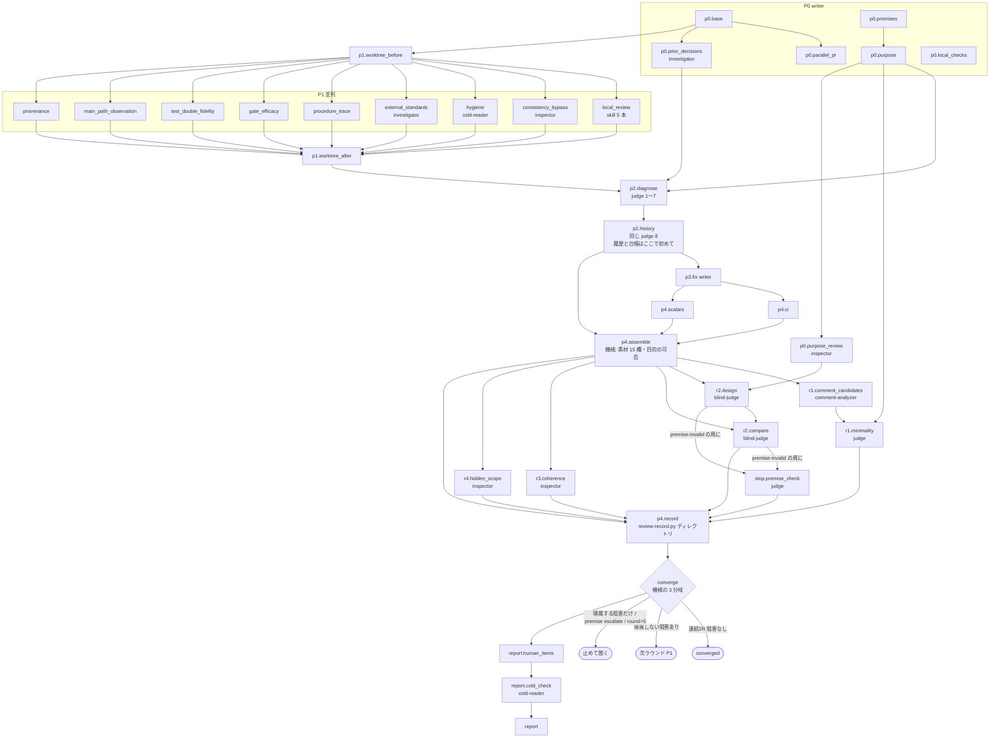

# review-loop の仕様（人が読む側）

## 何の文書か

`/review-loop` は、このリポジトリが配る Claude Code のプラグイン（AI 開発支援ツール Claude Code に足す拡張）`convergence-loops` の 4 本のコマンドの 1 つで、実装したコード変更を、レビューと修正を繰り返して指摘が出なくなるまで回す。回す手順は手順書 `commands/review-loop.md` に散文で、記録の検査は検証器 `scripts/review-record.py`（Python）に書いてある。この 2 つが散文版の正本で（グラフ実行版の正本は JSON——宣言は同じディレクトリの `README.md`「決めてもらうこと」）、`graphloops/graphs/review-loop.json`（グラフ実行版プラグイン graphloops の側にある。research と review は実行用の欄も持ち engine で回せる。doctor / firstread は写しだけ） はそれを「節（工程）＋依存＋周回条件」のグラフに写した機械が読む側、この文書はその図と、図に落ちない説明を持つ人が読む側である。JSON の欄名の意味は同じディレクトリの `README.md` の凡例に書いてある。

用語:

- **writer** — このループを回すメインのセッション（Claude Code の会話そのもの）。実装者。以下「回す側」
- **grader** — 回す側と別の context（子の会話）で採点する subagent の総称。実体は役割 agent（`agents/*.md` の 6 本）で、ここで使うのは `inspector`（読むだけ）・`investigator`（読む＋shell＋web）・`judge`（覆せない判定を下す）・`blind-judge`（道具なし。渡されたものだけから導出）・`cold-reader`（道具なし。初見の読み手）
- **記録** — ラウンドごとに書く JSON。検証器はこれを読んで「収束を妨げるもの」を列挙し、終了コード 0（阻害なし）／1（阻害あり）／2（記録が不正）で返す。機械は不合格だけを宣言する
- **P0〜P4・P-R** — 手順書の節の名前。P0 基準点と目的の固定、P1 素材集め、P2 診断、P3 修正、P4 再採点と収束判定、P-R 俯瞰（R1 最小性・R2 目的からの独立再設計・R3 全体整合・R4 見えてないスコープ）
- **版** — プラグインの `plugin.json` にある `version`

**基準**: この写しを起こした時点の手順書と検証器（版は `.claude-plugin/plugin.json` の `version` が正本。ここに写さない——写した版は pull のたびに腐り、読み手に手元の検証器を疑わせる）。review はこの写しの前後で大きく変わった版が続いたので、写しは新しい側に合わせてある。

## 図



## 図から読めること

- **P1 の 9 節は互いに依存が無い**。同時に走らせてよく、待ち合わせは `p1.worktree_after`（作業ツリーが変わっていないことの機械突合）の 1 点
- **R2 は 2 体**。独立設計（`r2.design`）は目的テキストだけに依存するので P1 と同じ波で先行起動できるが、比較役（`r2.compare`）は累積差分が要るので記録の後。手順書の「R2 は先行してよい」は設計の半分にだけ当てはまる
- **P2 は 2 段**。同じ judge が、今ラウンドの材料だけで根本ユニットとラベルを確定（1〜7）してから、履歴と問いの台帳を受け取って再審（8）する。先に渡すと追認になる
- **収束は機械が読む**。`converge` は検証器の 3 分岐（止めて聞け／帰属する分は待て・帰属しない分を先に直せ／前提不成立が先）を写すだけで、writer は数えない
- **最終報告にも初見検査**がある。人に聞くところの本文だけを `cold-reader` に渡し、詰まりは report の節に渡って writer が直してから出す（直したかは機械では見ない——注記であって門ではない。verdict と件数は `process.cold_check` に残る）

## この写しの前の版から変わったこと

- 人に聞く候補は止めずに**問いの台帳**（記録の `questions` 欄）へ載せ、次の周の judge が再審する。止めて聞くのは、機械が「残る阻害は保留の問いに帰属するものだけ」と言ったときと、前提不成立が確定したときと、上限（5 ラウンド）の 3 つだけ。stuck・thrash・設計の岐路・目的の外・観点の誤発火・未観測・独立検証不能は台帳の**種類**になった
- R1〜R4 の verdict は記録の `reviews` 欄に載り、再発火条件に当たらない周は `carried_over`（実際に見たラウンド付き）で持ち越す。連続 2 ラウンドと持ち越しの連鎖は検証器が数える
- 検証器の入口はディレクトリ渡しの 1 つ。全ラウンドを読み、履歴（キーごとの推移・消えて戻った回数・問いの推移）を出す
- 局所レビューに `/security-review`・`silent-failure-hunter`・`type-design-analyzer` を名指しで足し、`/simplify` は指摘だけ返す形で呼ぶ
- R1 の前段に `comment-analyzer` によるコメント削除候補の取得。ゲートの赤の確認は腕ごとに、写し（`mktemp -d`）の上で、対照の緑も見る
- 探す役に「ここは見るな」の線を writer が引かない。見た範囲と見ていない範囲を返させる

## 記録と検証器

- 記録は `.claude/review-rounds/round-<N>.json`。採点 1 回につき 1 つで、前ラウンド分を消さない。同じリポジトリの前のレビューは `archive-<前の BASE>/` へ退避する
- `python3 review-record.py <ディレクトリ>` が exit 0（今ラウンドにも前ラウンドにも阻害なし。収束の宣言ではない）／1（阻害あり）／2（記録が不正）を返す。1 と 2 を混ぜない
- 欄と語彙の正本は検証器の定数（`MATERIALS`・`STATUS`・`REVIEWS`・`REVIEW_STATUS`・`LABELS`・`QUESTION_KINDS`・`QUESTION_STATUS`）。JSON もこの文書も列挙を持たない

## この文書の JSON にだけ書いてあること

`review-loop.json` の各節には `source`（手順書の見出し）・`inputs` / `forbidden_inputs`（遮断）・`refire_when`（R1 / R2 の再発火条件）・`retry`（差し戻し）・`note`（他プラグインの門番が掛かる箇所など）がある。図には載せていない。

## 既知の未決・機械が守らないもの

- 暴走ガード（5 ラウンド）は散文版では散文だけで、検証器にも上限の検査は無い。実行版（graphloops）は rules の `converge` が先頭で `round >= max_rounds` を見て止める（全分岐に掛かる。以前は converged 分岐の早期 return が飛ばしていた）
- P1 前後の作業ツリー突合は散文版には記録の欄が無い（doctor の `mod_check`、firstread の `git_status_match` に相当するものが無い）。実行版は機械の節 `p1.worktree_before` / `p1.worktree_after` が porcelain・stash・diff の sha を突き合わせ、違えば止める（記録の `process.git_mismatches`）
- 並行 PR 衝突チェックの 6 段は、検証器は素材欄の有無しか見ない
- 検証器が塞ぐ「聞く時」の帰属は 1 周で通る経路だけ。2 周かければ帰属を作れると検証器自身が書いている。守るのは「台帳を書くのが judge であること」と「R1 が台帳を監査すること」の 2 枚
- 担当 PR へのコメント申し送り（`gh` の投稿）には、`gates` プラグインを入れている環境でその門番が掛かる

## 実行版（`/review-graph`）

このグラフは 2026-09-12 に実行用の欄（節ごとの prompt_file・schema・reads・writes・cond）を足され、graphloops の engine（`graphloops/scripts/loop.py`）で回せる。手順書は `graphloops/commands/review-graph.md`、ループの算術は `graphloops/rules/review-loop.py`（検証器の定数を写さず import する）。写しの側と違う点が 3 つある: P4 の記録の節は機械の節 2 つ（`p4.assemble` が [block] の数と R1/R2 の再発火を数え、`p4.record` が周の記録を組んで検証器にディレクトリを渡す）に割れ、P1 の前後の作業ツリー突合と走らせなかった素材の欄の穴埋めも機械の節が持つ。R2 の独立設計と比較役は別の節で、premise-invalid は設計の節が返す。判定・履歴の突合は同じ judge を続ける形（engine が agent の id を持ち回る）。

## 機械検査

```bash
git show origin/main:scripts/review-record.py > /tmp/rr.py
python3 graphloops/scripts/graphcheck.py graphloops/graphs/review-loop.json /tmp/rr.py
```

検証器は `scripts/review-record.py`（同じリポジトリ）が正本。`reviews`・`questions` の欄を持たない古い版しか手元に無い場合だけ、上流の版を取り出して渡す。
