# darkfactory の設計図

工程の YAML（役・順序・輪・with・when）、役の指示書に機械が貼る節の宣言（出どころ・受け手・入る条件）、各ブロックの manifest（produces・consumes）から作った文書。手で書かない（`uv run --no-project --with pyyaml python3 works/dev/graphmap_build.py build works` で作り直す）。

- 役の四角: 名前・役の 1 行・`機械が貼る N`（その役の指示書に機械が貼る節の数）・`返す:`（返答の必須の欄）
- 実線の矢印: 工程の順序。字は後の工程が `when`・`with` で読む前の工程の返答の欄、または manifest の produces → consumes の名
- 点線の矢印: 役が 2 つ以上いる輪の、次の周への戻り
- 丸い箱から役への矢印: 機械が貼る節の出どころ → 受け取る役。字は見出し / 入る条件を判じる関数

## 線の全体（darkfactory）

```mermaid
flowchart TD
  subgraph F_blk_entry["blk-entry"]
    entering["entering ⇒ blk-entry<br/>起動の関所を越えたら、入口の入力を 1 つの形に揃え、盤面と修正前の CI の段を開く"]
  end
  subgraph F_blk_ci["blk-ci"]
    ci_checking["ci-checking ⇒ blk-ci<br/>宣言の CI を機械で走らせられない run で、CI を任せ先の役が回す"]
    ci_final["ci-final ⇒ blk-ci<br/>最後のテストを機械で走らせられない run で、任せ先の役が回す"]
  end
  subgraph F_blk_spec["blk-spec"]
    speccing["speccing ⇒ blk-spec<br/>判定の前に、仕様（要件と受け入れ条件のテスト）を書いて人が承認する"]
  end
  subgraph F_blk_pr["blk-pr"]
    pr_checking["pr-checking ⇒ blk-pr<br/>並行して開いている PR との重なりを確かめる"]
  end
  subgraph F_blk_premises["blk-premises"]
    premising["premising ⇒ blk-premises<br/>依頼の数値・在る無いの主張をコマンドで実測する"]
  end
  subgraph F_blk_purpose["blk-purpose"]
    purposing["purposing ⇒ blk-purpose<br/>依頼の元の目的を 1 つの文に固める"]
  end
  subgraph F_blk_world["blk-world"]
    worlding["worlding ⇒ blk-world<br/>依頼の行を問題の類に言い直し、世の中の定石を集めて依頼の解き方と比べる"]
  end
  subgraph F_blk_material["blk-material"]
    gathering["gathering ⇒ blk-material<br/>判定の前に、差分を P1 の目と先行議論に見せて素材を集める"]
  end
  subgraph F_blk_judge["blk-judge"]
    judging["judging ⇒ blk-judge<br/>依頼を根本の単位にまとめる判定（直す義務の元）"]
  end
  subgraph F_blk_structure["blk-structure"]
    structuring["structuring ⇒ blk-structure<br/>判定の単位が名指すファイルの構造を実測し、汚れるかを判定する"]
    measuring_after["measuring-after ⇒ blk-structure<br/>直しの後の差分で、設計の考えを知る場所の増減・新しい名・写しの塊を測る"]
  end
  subgraph F_blk_plan["blk-plan"]
    planning["planning ⇒ blk-plan<br/>独立設計・修正案（項目ごとの範囲とテスト）・事前審査の壁打ち"]
    replanning["replanning ⇒ blk-plan<br/>案の直し（修正の段の裁定が案の項目の誤りとした時だけ）"]
  end
  subgraph F_blk_fix["blk-fix"]
    fixing["fixing ⇒ blk-fix<br/>修正: 単位ごとの TDD の輪（枝を並べて 3 方向で合わせる）と修正役"]
    refitting["refitting ⇒ blk-fix<br/>直した案で 2 回目の修正"]
  end
  subgraph F_blk_rejudge["blk-rejudge"]
    rejudging["rejudging ⇒ blk-rejudge<br/>修正役が判定に異議を出した時の再審"]
  end
  subgraph F_blk_lens["blk-lens"]
    lensing["lensing ⇒ blk-lens<br/>修正の後の局所レビュー（レンズ）"]
  end
  subgraph F_blk_delta["blk-delta"]
    reviewing["reviewing ⇒ blk-delta<br/>修正の差分の審査（新しい穴と塞いだ穴の検算）"]
  end
  subgraph F_blk_refix["blk-refix"]
    refixing["refixing ⇒ blk-refix<br/>差分の審査の穴の手直し"]
  end
  subgraph F_blk_tests["blk-tests"]
    testing["testing ⇒ blk-tests<br/>最後のテスト（木の全部で 1 回）"]
  end
  subgraph F_blk_eyes["blk-eyes"]
    eyeing["eyeing ⇒ blk-eyes<br/>独立の目（冗長と最小性・独立設計との比較・整合・範囲）"]
  end
  subgraph F_blk_report["blk-report"]
    reporting["reporting ⇒ blk-report<br/>AI の報告と初見の検査"]
  end
  policy_gate{"policy-gate<br/>修正の前の人の関所（要る時だけ）"}
  replan_gate{"replan-gate<br/>案の直しの人の関所（要る時だけ）"}
  final_gate{"final-gate<br/>最後の人の関所"}
  ci_checking -->|"go"| ci_final
  ci_checking -->|"go, skip"| eyeing
  ci_checking -->|"ask"| final_gate
  ci_checking -->|"go, judgment_file, notes_file, open_units, plan_file, ripple_file, unit_depths"| fixing
  ci_checking -->|"mat_go"| gathering
  ci_checking -->|"go, premises_file"| judging
  ci_checking -->|"go"| lensing
  ci_checking --> measuring_after
  ci_checking -->|"go, verify_file"| planning
  ci_checking -->|"ask"| policy_gate
  ci_checking -->|"pr_go"| pr_checking
  ci_checking -->|"premises_go"| premising
  ci_checking -->|"premises_file, purpose_go"| purposing
  ci_checking -->|"go, judgment_file, notes_file, open_units, plan_file, ripple_file"| refitting
  ci_checking -->|"go"| refixing
  ci_checking -->|"go"| rejudging
  ci_checking -->|"ask"| replan_gate
  ci_checking -->|"go"| replanning
  ci_checking -->|"ai_report_go, report_file"| reporting
  ci_checking -->|"go"| reviewing
  ci_checking -->|"spec_go"| speccing
  ci_checking -->|"go, structure_units_file"| structuring
  ci_checking -->|"go"| testing
  ci_checking -->|"world_go, world_purpose_file"| worlding
  ci_final -->|"go"| eyeing
  ci_final -->|"ask"| final_gate
  ci_final --> measuring_after
  ci_final -->|"ai_report_go, report_file"| reporting
  entering --> ci_checking
  entering -->|"go"| ci_final
  entering -->|"go, skip"| eyeing
  entering -->|"ask"| final_gate
  entering -->|"go, judgment_file, notes_file, open_units, plan_file, ripple_file, unit_depths"| fixing
  entering -->|"mat_go"| gathering
  entering -->|"go, premises_file"| judging
  entering -->|"go"| lensing
  entering --> measuring_after
  entering -->|"go, verify_file"| planning
  entering -->|"ask"| policy_gate
  entering -->|"pr_go"| pr_checking
  entering -->|"premises_go"| premising
  entering -->|"premises_file, purpose_go"| purposing
  entering -->|"go, judgment_file, notes_file, open_units, plan_file, ripple_file"| refitting
  entering -->|"go"| refixing
  entering -->|"go"| rejudging
  entering -->|"ask"| replan_gate
  entering -->|"go"| replanning
  entering -->|"ai_report_go, report_file"| reporting
  entering -->|"go"| reviewing
  entering -->|"spec_go"| speccing
  entering -->|"go, structure_units_file"| structuring
  entering -->|"go"| testing
  entering -->|"world_go, world_purpose_file"| worlding
  eyeing -->|"ask"| final_gate
  eyeing -->|"ai_report_go, report_file"| reporting
  final_gate -->|"ai_report_go, report_file"| reporting
  fixing -->|"go"| ci_final
  fixing -->|"go, skip"| eyeing
  fixing -->|"ask"| final_gate
  fixing -->|"go"| lensing
  fixing --> measuring_after
  fixing -->|"go, judgment_file, notes_file, open_units, plan_file, ripple_file"| refitting
  fixing -->|"go"| refixing
  fixing -->|"go"| rejudging
  fixing -->|"ask"| replan_gate
  fixing -->|"go"| replanning
  fixing -->|"ai_report_go, report_file"| reporting
  fixing -->|"go"| reviewing
  fixing -->|"go"| testing
  gathering --> judging
  judging -->|"go"| ci_final
  judging -->|"go, skip"| eyeing
  judging -->|"ask"| final_gate
  judging -->|"go, judgment_file, notes_file, open_units, plan_file, ripple_file, unit_depths"| fixing
  judging -->|"go"| lensing
  judging --> measuring_after
  judging -->|"go, verify_file"| planning
  judging -->|"ask"| policy_gate
  judging -->|"go, judgment_file, notes_file, open_units, plan_file, ripple_file"| refitting
  judging -->|"go"| refixing
  judging -->|"go"| rejudging
  judging -->|"ask"| replan_gate
  judging -->|"go"| replanning
  judging -->|"ai_report_go, report_file"| reporting
  judging -->|"go"| reviewing
  judging -->|"go, structure_units_file"| structuring
  judging -->|"go"| testing
  lensing --> reviewing
  measuring_after -->|"go"| eyeing
  measuring_after -->|"ask"| final_gate
  measuring_after -->|"ai_report_go, report_file"| reporting
  planning -->|"go"| ci_final
  planning -->|"go, skip"| eyeing
  planning -->|"ask"| final_gate
  planning -->|"go, judgment_file, notes_file, open_units, plan_file, ripple_file, unit_depths"| fixing
  planning -->|"go"| lensing
  planning --> measuring_after
  planning -->|"ask"| policy_gate
  planning -->|"go, judgment_file, notes_file, open_units, plan_file, ripple_file"| refitting
  planning -->|"go"| refixing
  planning -->|"go"| rejudging
  planning -->|"ask"| replan_gate
  planning -->|"go"| replanning
  planning -->|"ai_report_go, report_file"| reporting
  planning -->|"go"| reviewing
  planning -->|"go"| testing
  policy_gate -->|"go"| ci_final
  policy_gate -->|"go, skip"| eyeing
  policy_gate -->|"ask"| final_gate
  policy_gate -->|"go, judgment_file, notes_file, open_units, plan_file, ripple_file, unit_depths"| fixing
  policy_gate -->|"go"| lensing
  policy_gate --> measuring_after
  policy_gate -->|"go, judgment_file, notes_file, open_units, plan_file, ripple_file"| refitting
  policy_gate -->|"go"| refixing
  policy_gate -->|"go"| rejudging
  policy_gate -->|"ask"| replan_gate
  policy_gate -->|"go"| replanning
  policy_gate -->|"ai_report_go, report_file"| reporting
  policy_gate -->|"go"| reviewing
  policy_gate -->|"go"| testing
  pr_checking --> premising
  premising -->|"go"| ci_final
  premising -->|"go, skip"| eyeing
  premising -->|"ask"| final_gate
  premising -->|"go, judgment_file, notes_file, open_units, plan_file, ripple_file, unit_depths"| fixing
  premising -->|"mat_go"| gathering
  premising -->|"go, premises_file"| judging
  premising -->|"go"| lensing
  premising --> measuring_after
  premising -->|"go, verify_file"| planning
  premising -->|"ask"| policy_gate
  premising -->|"premises_file, purpose_go"| purposing
  premising -->|"go, judgment_file, notes_file, open_units, plan_file, ripple_file"| refitting
  premising -->|"go"| refixing
  premising -->|"go"| rejudging
  premising -->|"ask"| replan_gate
  premising -->|"go"| replanning
  premising -->|"ai_report_go, report_file"| reporting
  premising -->|"go"| reviewing
  premising -->|"go, structure_units_file"| structuring
  premising -->|"go"| testing
  premising -->|"world_go, world_purpose_file"| worlding
  purposing -->|"go"| ci_final
  purposing -->|"go, skip"| eyeing
  purposing -->|"ask"| final_gate
  purposing -->|"go, judgment_file, notes_file, open_units, plan_file, ripple_file, unit_depths"| fixing
  purposing -->|"mat_go"| gathering
  purposing -->|"go"| judging
  purposing -->|"go"| lensing
  purposing --> measuring_after
  purposing -->|"go, verify_file"| planning
  purposing -->|"ask"| policy_gate
  purposing -->|"go, judgment_file, notes_file, open_units, plan_file, ripple_file"| refitting
  purposing -->|"go"| refixing
  purposing -->|"go"| rejudging
  purposing -->|"ask"| replan_gate
  purposing -->|"go"| replanning
  purposing -->|"ai_report_go, report_file"| reporting
  purposing -->|"go"| reviewing
  purposing -->|"go, structure_units_file"| structuring
  purposing -->|"go"| testing
  purposing -->|"world_go, world_purpose_file"| worlding
  refitting -->|"go"| ci_final
  refitting -->|"go, skip"| eyeing
  refitting -->|"ask"| final_gate
  refitting -->|"go"| lensing
  refitting --> measuring_after
  refitting -->|"go"| refixing
  refitting -->|"go"| rejudging
  refitting -->|"ai_report_go, report_file"| reporting
  refitting -->|"go"| reviewing
  refitting -->|"go"| testing
  refixing -->|"go"| ci_final
  refixing -->|"go"| eyeing
  refixing -->|"ask"| final_gate
  refixing --> measuring_after
  refixing -->|"ai_report_go, report_file"| reporting
  refixing -->|"go"| testing
  rejudging -->|"go"| ci_final
  rejudging -->|"go, skip"| eyeing
  rejudging -->|"ask"| final_gate
  rejudging -->|"go"| lensing
  rejudging --> measuring_after
  rejudging -->|"go"| refixing
  rejudging -->|"ai_report_go, report_file"| reporting
  rejudging -->|"go"| reviewing
  rejudging -->|"go"| testing
  replan_gate -->|"go"| ci_final
  replan_gate -->|"go, skip"| eyeing
  replan_gate -->|"ask"| final_gate
  replan_gate -->|"go"| lensing
  replan_gate --> measuring_after
  replan_gate -->|"go, judgment_file, notes_file, open_units, plan_file, ripple_file"| refitting
  replan_gate -->|"go"| refixing
  replan_gate -->|"go"| rejudging
  replan_gate -->|"ai_report_go, report_file"| reporting
  replan_gate -->|"go"| reviewing
  replan_gate -->|"go"| testing
  replanning -->|"go"| ci_final
  replanning -->|"go, skip"| eyeing
  replanning -->|"ask"| final_gate
  replanning -->|"go"| lensing
  replanning --> measuring_after
  replanning -->|"go, judgment_file, notes_file, open_units, plan_file, ripple_file"| refitting
  replanning -->|"go"| refixing
  replanning -->|"go"| rejudging
  replanning -->|"ask"| replan_gate
  replanning -->|"ai_report_go, report_file"| reporting
  replanning -->|"go"| reviewing
  replanning -->|"go"| testing
  reviewing -->|"go"| ci_final
  reviewing -->|"go"| eyeing
  reviewing -->|"ask"| final_gate
  reviewing --> measuring_after
  reviewing -->|"go"| refixing
  reviewing -->|"ai_report_go, report_file"| reporting
  reviewing -->|"go"| testing
  speccing -->|"pr_go"| pr_checking
  structuring -->|"go"| ci_final
  structuring -->|"go, skip"| eyeing
  structuring -->|"ask"| final_gate
  structuring -->|"go, judgment_file, notes_file, open_units, plan_file, ripple_file, unit_depths"| fixing
  structuring -->|"go"| lensing
  structuring --> measuring_after
  structuring --> planning
  structuring -->|"ask"| policy_gate
  structuring -->|"go, judgment_file, notes_file, open_units, plan_file, ripple_file"| refitting
  structuring -->|"go"| refixing
  structuring -->|"go"| rejudging
  structuring -->|"ask"| replan_gate
  structuring -->|"go"| replanning
  structuring -->|"ai_report_go, report_file"| reporting
  structuring -->|"go"| reviewing
  structuring -->|"go"| testing
  testing -->|"go"| ci_final
  testing -->|"go"| eyeing
  testing -->|"ask"| final_gate
  testing --> measuring_after
  testing -->|"ai_report_go, report_file"| reporting
  worlding --> gathering
  worlding --> judging
  F_blk_delta -->|"delta-verdicts.json"| F_blk_refix
  F_blk_entry -->|"start.json"| F_blk_ci
  F_blk_entry -->|"prior-failures-in.json"| F_blk_judge
  F_blk_entry -->|"prior-failures-in.json"| F_blk_plan
  F_blk_judge -->|"judgment.json"| F_blk_fix
  F_blk_lens -->|"lens.json"| F_blk_delta
  F_blk_lens -->|"lens.json"| F_blk_refix
  F_blk_plan -->|"design-premises.json"| F_blk_eyes
```

## blk-ci

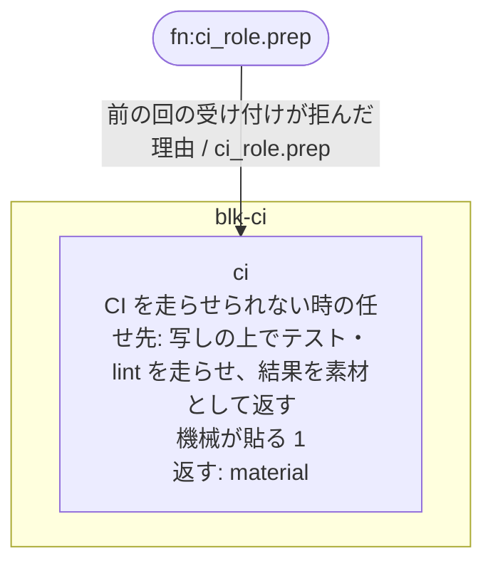

## blk-delta

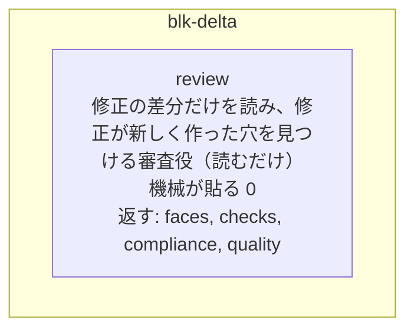

## blk-entry

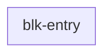

## blk-eyes

```mermaid
flowchart TD
  subgraph F_blk_eyes["blk-eyes"]
    r1_comments["r1-comments<br/>独立の目: 変更が足したコメントのうち削除候補を挙げる（読むだけ）<br/>機械が貼る 2<br/>返す: candidates, kept"]
    r1_minimality["r1-minimality<br/>独立の目: 変更の冗長さと最小性を見て、削れる所を判じる（読むだけ）<br/>機械が貼る 5<br/>返す: status, reason, deletions, ledger_audit, increments"]
    r2_compare["r2-compare<br/>独立の目: 目的だけから作った独立設計と累積差分を突き合わせる比較役（Read のみ）<br/>機械が貼る 7<br/>返す: status, reason, differences"]
    premise_check["premise-check<br/>独立の目: 設計の前提が実態で崩れていないかを検算する（読むだけ）<br/>機械が貼る 2<br/>返す: key, assumption, assumption_false, evidence, verdict, reason"]
    r3_coherence["r3-coherence<br/>独立の目: 変更全体の整合を見る（読むだけ）<br/>機械が貼る 5<br/>返す: status, reason"]
    r4_scope["r4-scope<br/>独立の目: 見えていない影響範囲（隠れたスコープ）を探す（読むだけ）<br/>機械が貼る 3<br/>返す: status, reason, capability_inventory, policy_conflicts, surfaced"]
  end
  S_0(["fn:concepthome.section"])
  S_1(["fn:eyes.diff_section"])
  S_2(["fn:eyes.premise_section"])
  S_3(["fn:gatemarks.carried_section"])
  S_4(["fn:rolekit.with_reject"])
  S_5(["fn:rolekit.with_role_definition"])
  S_6(["fn:structmark.after_counts"])
  premise_check --> r4_scope
  r1_comments --> r1_minimality
  r1_comments --> r4_scope
  r1_minimality --> r4_scope
  r2_compare --> premise_check
  r2_compare --> r4_scope
  S_4 -->|"前の回の受け付けが拒んだ理由 / rolekit.with_reject"| premise_check
  S_5 -->|"お前の役の定義（{agent}） / rolekit.with_role_definition"| premise_check
  S_4 -->|"前の回の受け付けが拒んだ理由 / rolekit.with_reject"| r1_comments
  S_5 -->|"お前の役の定義（{agent}） / rolekit.with_role_definition"| r1_comments
  S_0 -->|"考えの住処の地図（機械が追跡されたファイルから探した。先に Read で読め） / concepthome.section"| r1_minimality
  S_0 -->|"考えの住処の地図 / concepthome.section"| r1_minimality
  S_6 -->|"最小の意味（works が足した読み替え。下の指示書の「累積差分が最小か」と観点の正本の「処方の最小性」の大きさは、この意味で読め） / eyes.concept_heads"| r1_minimality
  S_4 -->|"前の回の受け付けが拒んだ理由 / rolekit.with_reject"| r1_minimality
  S_5 -->|"お前の役の定義（{agent}） / rolekit.with_role_definition"| r1_minimality
  S_4 -->|"前の回の受け付けが拒んだ理由 / rolekit.with_reject"| r2_compare
  S_2 -->|"記録の制約 / eyes.premise_section"| r2_compare
  S_1 -->|"累積差分の渡し方（機械が貼った） / eyes.diff_section"| r2_compare
  S_2 -->|"前提のずれ（修正の中の申告） / eyes.premise_section"| r2_compare
  S_2 -->|"独立設計の後に来た人の答え（独立設計は見ていない） / eyes.premise_section"| r2_compare
  S_2 -->|"独立設計を作った後に分かった前提（機械が貼った） / eyes.premise_section"| r2_compare
  S_5 -->|"お前の役の定義（{agent}） / rolekit.with_role_definition"| r2_compare
  S_0 -->|"考えの住処の地図（機械が追跡されたファイルから探した。先に Read で読め） / concepthome.section"| r3_coherence
  S_0 -->|"考えの住処の地図 / concepthome.section"| r3_coherence
  S_6 -->|"考えの住処（works が足した観点） / eyes.concept_heads"| r3_coherence
  S_4 -->|"前の回の受け付けが拒んだ理由 / rolekit.with_reject"| r3_coherence
  S_5 -->|"お前の役の定義（{agent}） / rolekit.with_role_definition"| r3_coherence
  S_4 -->|"前の回の受け付けが拒んだ理由 / rolekit.with_reject"| r4_scope
  S_3 -->|"直す前の関所で人が通した狭まり（機械が貼った） / gatemarks.carried_section"| r4_scope
  S_5 -->|"お前の役の定義（{agent}） / rolekit.with_role_definition"| r4_scope
```

## blk-fix

```mermaid
flowchart TD
  subgraph F_blk_fix["blk-fix"]
    tdd["tdd<br/>TDD の役（今の単位を直す）<br/>機械が貼る 31<br/>返す: phase"]
    tdd_lane_1["tdd-lane-1<br/>枝 1 の TDD の役（cwd は枝の worktree）<br/>機械が貼る 34<br/>返す: phase"]
    tdd_lane_2["tdd-lane-2<br/>枝 2 の TDD の役（cwd は枝の worktree）<br/>機械が貼る 34<br/>返す: phase"]
    tdd_lane_3["tdd-lane-3<br/>枝 3 の TDD の役（cwd は枝の worktree）<br/>機械が貼る 34<br/>返す: phase"]
    tdd_rest["tdd-rest<br/>残りの単位の TDD の役<br/>機械が貼る 29<br/>返す: phase"]
    fix_lane_1["fix-lane-1<br/>枝 1 の修正役<br/>機械が貼る 31<br/>返す: changes, fix_closure, gates_changed, interactions, mechanism_changed, not_done, path_changed, plan_faces, premise_drift, seams_changed, security_surface_changed, wrote_refs"]
    plan_answer_lane_1["plan-answer-lane-1<br/>枝 1 の範囲の相談に答える（修正案の会話の写し）<br/>機械が貼る 3<br/>返す: answers"]
    fix_lane_2["fix-lane-2<br/>枝 2 の修正役<br/>機械が貼る 31<br/>返す: changes, fix_closure, gates_changed, interactions, mechanism_changed, not_done, path_changed, plan_faces, premise_drift, seams_changed, security_surface_changed, wrote_refs"]
    plan_answer_lane_2["plan-answer-lane-2<br/>枝 2 の範囲の相談に答える（修正案の会話の写し）<br/>機械が貼る 3<br/>返す: answers"]
    fix_lane_3["fix-lane-3<br/>枝 3 の修正役<br/>機械が貼る 31<br/>返す: changes, fix_closure, gates_changed, interactions, mechanism_changed, not_done, path_changed, plan_faces, premise_drift, seams_changed, security_surface_changed, wrote_refs"]
    plan_answer_lane_3["plan-answer-lane-3<br/>枝 3 の範囲の相談に答える（修正案の会話の写し）<br/>機械が貼る 3<br/>返す: answers"]
    fix["fix<br/>修正役: TDD の輪と枝で直していない単位を直す<br/>機械が貼る 42<br/>返す: changes, fix_closure, gates_changed, interactions, mechanism_changed, not_done, path_changed, plan_faces, premise_drift, seams_changed, security_surface_changed, wrote_refs"]
    plan_answer["plan-answer<br/>範囲の相談に答える（修正案を書いた会話の続き。読むだけ）<br/>機械が貼る 3<br/>返す: answers"]
    rule["rule<br/>裁定役: 食い違いを持ち主の決まりで裁く（読むだけ）<br/>機械が貼る 0<br/>返す: rulings"]
    fix_ruled["fix-ruled<br/>裁定の文を読んで直す（修正役の会話の続き）<br/>機械が貼る 39<br/>返す: changes, fix_closure, gates_changed, interactions, mechanism_changed, not_done, path_changed, plan_faces, premise_drift, seams_changed, security_surface_changed, wrote_refs"]
    plan_answer_ruled["plan-answer-ruled<br/>範囲の相談に答える（修正案を書いた会話の続き。読むだけ）<br/>機械が貼る 3<br/>返す: answers"]
  end
  S_0(["fn:conflict.write_rulings"])
  S_1(["fn:consult.answer_text"])
  S_2(["fn:consult.question"])
  S_3(["fn:fixlanes._item"])
  S_4(["fn:fixlanes._next_text"])
  S_5(["fn:fixlanes.render_rejects"])
  S_6(["fn:fixlanes.summary_text"])
  S_7(["fn:fixrules.held_text"])
  S_8(["fn:fixrules.lanes_text"])
  S_9(["fn:fixrules.tdd_render"])
  S_10(["fn:graphmap.render"])
  S_11(["fn:libdocs._local_text"])
  S_12(["fn:libdocs._render"])
  S_13(["fn:libdocs.section"])
  S_14(["fn:planbrief._unit"])
  S_15(["fn:planbrief.head_text"])
  S_16(["fn:planbrief.render"])
  S_17(["fn:replan._notes"])
  S_18(["fn:seat.g1_prompt"])
  S_19(["fn:seat.g1_section"])
  S_20(["fn:seat.section"])
  S_21(["fn:structmark.plan_section"])
  S_22(["fn:tddlanes._next_text"])
  S_23(["fn:tddlanes.lane_prep"])
  S_24(["fn:tddlanes.unit_text"])
  S_25(["fn:tddloop._finish"])
  S_26(["fn:tddloop._together_lines"])
  S_27(["fn:tddloop.handoff_lines"])
  S_28(["fn:tddloop.prep"])
  fix --> fix_ruled
  fix -->|"go"| plan_answer
  fix -->|"go"| plan_answer_ruled
  fix --> rule
  fix_lane_1 --> fix
  fix_lane_1 -->|"go"| plan_answer
  fix_lane_1 -->|"go"| plan_answer_lane_1
  fix_lane_2 --> fix
  fix_lane_2 -->|"go"| plan_answer
  fix_lane_2 -->|"go"| plan_answer_lane_2
  fix_lane_3 --> fix
  fix_lane_3 -->|"go"| plan_answer
  fix_lane_3 -->|"go"| plan_answer_lane_3
  fix_ruled -->|"go"| plan_answer_ruled
  plan_answer --> fix_ruled
  plan_answer -->|"go"| plan_answer_ruled
  plan_answer --> rule
  plan_answer_lane_1 --> fix
  plan_answer_lane_1 -->|"go"| plan_answer
  plan_answer_lane_2 --> fix
  plan_answer_lane_2 -->|"go"| plan_answer
  plan_answer_lane_3 --> fix
  plan_answer_lane_3 -->|"go"| plan_answer
  rule --> fix_ruled
  rule -->|"go"| plan_answer_ruled
  tdd --> fix
  tdd -->|"go"| fix_lane_1
  tdd -->|"go"| fix_lane_2
  tdd -->|"go"| fix_lane_3
  tdd -->|"go"| plan_answer
  tdd -->|"go"| plan_answer_lane_1
  tdd -->|"go"| plan_answer_lane_2
  tdd -->|"go"| plan_answer_lane_3
  tdd -->|"go"| tdd_lane_1
  tdd -->|"go"| tdd_lane_2
  tdd -->|"go"| tdd_lane_3
  tdd -->|"go"| tdd_rest
  tdd_lane_1 --> fix
  tdd_lane_1 -->|"go"| fix_lane_1
  tdd_lane_1 -->|"go"| fix_lane_2
  tdd_lane_1 -->|"go"| fix_lane_3
  tdd_lane_1 -->|"go"| plan_answer
  tdd_lane_1 -->|"go"| plan_answer_lane_1
  tdd_lane_1 -->|"go"| plan_answer_lane_2
  tdd_lane_1 -->|"go"| plan_answer_lane_3
  tdd_lane_1 -->|"go"| tdd_rest
  tdd_lane_2 --> fix
  tdd_lane_2 -->|"go"| fix_lane_1
  tdd_lane_2 -->|"go"| fix_lane_2
  tdd_lane_2 -->|"go"| fix_lane_3
  tdd_lane_2 -->|"go"| plan_answer
  tdd_lane_2 -->|"go"| plan_answer_lane_1
  tdd_lane_2 -->|"go"| plan_answer_lane_2
  tdd_lane_2 -->|"go"| plan_answer_lane_3
  tdd_lane_2 -->|"go"| tdd_rest
  tdd_lane_3 --> fix
  tdd_lane_3 -->|"go"| fix_lane_1
  tdd_lane_3 -->|"go"| fix_lane_2
  tdd_lane_3 -->|"go"| fix_lane_3
  tdd_lane_3 -->|"go"| plan_answer
  tdd_lane_3 -->|"go"| plan_answer_lane_1
  tdd_lane_3 -->|"go"| plan_answer_lane_2
  tdd_lane_3 -->|"go"| plan_answer_lane_3
  tdd_lane_3 -->|"go"| tdd_rest
  tdd_rest --> fix
  tdd_rest -->|"go"| fix_lane_1
  tdd_rest -->|"go"| fix_lane_2
  tdd_rest -->|"go"| fix_lane_3
  tdd_rest -->|"go"| plan_answer
  tdd_rest -->|"go"| plan_answer_lane_1
  tdd_rest -->|"go"| plan_answer_lane_2
  tdd_rest -->|"go"| plan_answer_lane_3
  plan_answer_lane_1 -.->|"次の周"| fix_lane_1
  plan_answer_lane_2 -.->|"次の周"| fix_lane_2
  plan_answer_lane_3 -.->|"次の周"| fix_lane_3
  plan_answer -.->|"次の周"| fix
  plan_answer_ruled -.->|"次の周"| fix_ruled
  S_1 -->|"範囲の相談の答え（相談の周 {turn}） / consult.answer_text"| fix
  S_1 -->|"相談（項目 {item}・パス {paths}・テスト {tests}） / consult.answer_text"| fix
  S_6 -->|"順に戻した項目（この周で直す。下請けの項目に載る） / fixlanes.summary_text"| fix
  S_6 -->|"当てた項目（直しは run の作業ツリーに在る。changes に枝の返答の行を写す） / fixlanes.summary_text"| fix
  S_6 -->|"修正役の並べの枝の結末（機械が書いた。締めの節 fix-join） / fixlanes.summary_text"| fix
  S_8 -->|"修正役の並べの枝の結末（機械が書いた） / fixrules.lanes_text"| fix
  S_11 -->|"{lib} {version}（手元の版。import せずに読んだ署名と説明） / libdocs._local_text"| fix
  S_11 -->|"{title} / libdocs._local_text"| fix
  S_12 -->|"{lib} {version} / libdocs._render"| fix
  S_13 -->|"ライブラリの文書（手元の版・公式） / libdocs.section"| fix
  S_16 -->|"足す物（adds） / planbrief.render"| fix
  S_16 -->|"書いてよいパス（allowed_paths） / planbrief.render"| fix
  S_16 -->|"やり方（approach） / planbrief.render"| fix
  S_16 -->|"背景（参照。brief と食い違えば brief が勝つ。brief が誤りと見たら申し出よ） / planbrief.render"| fix
  S_15 -->|"要求の正本（brief） / planbrief.head_text"| fix
  S_16 -->|"狭める能力（narrows） / planbrief.render"| fix
  S_16 -->|"触らない物（out_of_scope） / planbrief.render"| fix
  S_16 -->|"目的の文（凍結） / planbrief.render"| fix
  S_16 -->|"整えの申告（refactor） / planbrief.render"| fix
  S_16 -->|"消す物（removes） / planbrief.render"| fix
  S_16 -->|"書き換えてよい既存のテスト（rewrite_tests） / planbrief.render"| fix
  S_16 -->|"直し方の道（route） / planbrief.render"| fix
  S_16 -->|"足さずに閉じる形（shrink_first） / planbrief.render"| fix
  S_16 -->|"構造の目の行と処方への答え（structure） / planbrief.render"| fix
  S_16 -->|"構造の目の行 / planbrief.render"| fix
  S_16 -->|"受け入れのテスト（tests） / planbrief.render"| fix
  S_16 -->|"要求の正本: 修正案の項目 {n} / planbrief.render"| fix
  S_16 -->|"直す単位 / planbrief.render"| fix
  S_14 -->|"{key} / planbrief._unit"| fix
  S_17 -->|"直した項目 {item}（単位 {units}）の事前審査の穴 / replan._notes"| fix
  S_17 -->|"修正の前の関所（policy-gate）で人が答えた条件（1 回目の修正の段と同じく、この段にも効く） / replan._notes"| fix
  S_17 -->|"人の一言（関所 replan-gate） / replan._notes"| fix
  S_19 -->|"下請けを回す / seat.g1_section"| fix
  S_18 -->|"works の決まり（下請け。上の型の文にも、読み替え unattended.md にも勝つ） / seat.g1_prompt"| fix
  S_20 -->|"借りたスキルの座 / seat.section"| fix
  S_20 -->|"下請けの型（superpowers の {file}。works の節で包んだ物） / seat.section"| fix
  S_21 -->|"構造の目の行（設計を知らない次の人が足す形が増えないかを別の目が見た判定。機械が貼った） / structmark.plan_section"| fix
  S_25 -->|"食い違いで止めた単位（直すな。輪の後に裁定役が裁き、裁定が理由のファイルで届く） / tddloop._finish"| fix
  S_25 -->|"direct の単位（ここで直せ） / tddloop._finish"| fix
  S_25 -->|"輪で直した単位（直さず、changes に 1 行を書け。テストのファイルは変えるな——受け付けが拒む。食い違いの裁定 fix_test_scope が範囲に並べた所だけは例外。修正案の rewrite_tests の名指しは輪で書き換えて凍結した） / tddloop._finish"| fix
  S_25 -->|"直す義務から外れた単位（直すな。not_done に理由を書け） / tddloop._finish"| fix
  S_25 -->|"TDD の輪の結果（機械が書いた） / tddloop._finish"| fix
  S_1 -->|"範囲の相談の答え（相談の周 {turn}） / consult.answer_text"| fix_lane_1
  S_1 -->|"相談（項目 {item}・パス {paths}・テスト {tests}） / consult.answer_text"| fix_lane_1
  S_5 -->|"{head}（確かめ {cid}・{count} 件） / fixlanes.render_rejects"| fix_lane_1
  S_3 -->|"修正役の並べの枝 {n} の {j} 番目の項目（修正案の項目 {item}） / fixlanes._item"| fix_lane_1
  S_4 -->|"前の回の返答を機械が拒んだ理由（直して、返答を丸ごと出し直せ） / fixlanes._next_text"| fix_lane_1
  S_4 -->|"読む物 / fixlanes._next_text"| fix_lane_1
  S_4 -->|"修正役の並べの枝 {n} の {j} 番目の項目（修正案の項目 {item}・この項目の {tries} 回目） / fixlanes._next_text"| fix_lane_1
  S_11 -->|"{lib} {version}（手元の版。import せずに読んだ署名と説明） / libdocs._local_text"| fix_lane_1
  S_11 -->|"{title} / libdocs._local_text"| fix_lane_1
  S_12 -->|"{lib} {version} / libdocs._render"| fix_lane_1
  S_13 -->|"ライブラリの文書（手元の版・公式） / libdocs.section"| fix_lane_1
  S_16 -->|"足す物（adds） / planbrief.render"| fix_lane_1
  S_16 -->|"書いてよいパス（allowed_paths） / planbrief.render"| fix_lane_1
  S_16 -->|"やり方（approach） / planbrief.render"| fix_lane_1
  S_16 -->|"背景（参照。brief と食い違えば brief が勝つ。brief が誤りと見たら申し出よ） / planbrief.render"| fix_lane_1
  S_15 -->|"要求の正本（brief） / planbrief.head_text"| fix_lane_1
  S_16 -->|"狭める能力（narrows） / planbrief.render"| fix_lane_1
  S_16 -->|"触らない物（out_of_scope） / planbrief.render"| fix_lane_1
  S_16 -->|"目的の文（凍結） / planbrief.render"| fix_lane_1
  S_16 -->|"整えの申告（refactor） / planbrief.render"| fix_lane_1
  S_16 -->|"消す物（removes） / planbrief.render"| fix_lane_1
  S_16 -->|"書き換えてよい既存のテスト（rewrite_tests） / planbrief.render"| fix_lane_1
  S_16 -->|"直し方の道（route） / planbrief.render"| fix_lane_1
  S_16 -->|"足さずに閉じる形（shrink_first） / planbrief.render"| fix_lane_1
  S_16 -->|"構造の目の行と処方への答え（structure） / planbrief.render"| fix_lane_1
  S_16 -->|"構造の目の行 / planbrief.render"| fix_lane_1
  S_16 -->|"受け入れのテスト（tests） / planbrief.render"| fix_lane_1
  S_16 -->|"要求の正本: 修正案の項目 {n} / planbrief.render"| fix_lane_1
  S_16 -->|"直す単位 / planbrief.render"| fix_lane_1
  S_14 -->|"{key} / planbrief._unit"| fix_lane_1
  S_21 -->|"構造の目の行（設計を知らない次の人が足す形が増えないかを別の目が見た判定。機械が貼った） / structmark.plan_section"| fix_lane_1
  S_1 -->|"範囲の相談の答え（相談の周 {turn}） / consult.answer_text"| fix_lane_2
  S_1 -->|"相談（項目 {item}・パス {paths}・テスト {tests}） / consult.answer_text"| fix_lane_2
  S_5 -->|"{head}（確かめ {cid}・{count} 件） / fixlanes.render_rejects"| fix_lane_2
  S_3 -->|"修正役の並べの枝 {n} の {j} 番目の項目（修正案の項目 {item}） / fixlanes._item"| fix_lane_2
  S_4 -->|"前の回の返答を機械が拒んだ理由（直して、返答を丸ごと出し直せ） / fixlanes._next_text"| fix_lane_2
  S_4 -->|"読む物 / fixlanes._next_text"| fix_lane_2
  S_4 -->|"修正役の並べの枝 {n} の {j} 番目の項目（修正案の項目 {item}・この項目の {tries} 回目） / fixlanes._next_text"| fix_lane_2
  S_11 -->|"{lib} {version}（手元の版。import せずに読んだ署名と説明） / libdocs._local_text"| fix_lane_2
  S_11 -->|"{title} / libdocs._local_text"| fix_lane_2
  S_12 -->|"{lib} {version} / libdocs._render"| fix_lane_2
  S_13 -->|"ライブラリの文書（手元の版・公式） / libdocs.section"| fix_lane_2
  S_16 -->|"足す物（adds） / planbrief.render"| fix_lane_2
  S_16 -->|"書いてよいパス（allowed_paths） / planbrief.render"| fix_lane_2
  S_16 -->|"やり方（approach） / planbrief.render"| fix_lane_2
  S_16 -->|"背景（参照。brief と食い違えば brief が勝つ。brief が誤りと見たら申し出よ） / planbrief.render"| fix_lane_2
  S_15 -->|"要求の正本（brief） / planbrief.head_text"| fix_lane_2
  S_16 -->|"狭める能力（narrows） / planbrief.render"| fix_lane_2
  S_16 -->|"触らない物（out_of_scope） / planbrief.render"| fix_lane_2
  S_16 -->|"目的の文（凍結） / planbrief.render"| fix_lane_2
  S_16 -->|"整えの申告（refactor） / planbrief.render"| fix_lane_2
  S_16 -->|"消す物（removes） / planbrief.render"| fix_lane_2
  S_16 -->|"書き換えてよい既存のテスト（rewrite_tests） / planbrief.render"| fix_lane_2
  S_16 -->|"直し方の道（route） / planbrief.render"| fix_lane_2
  S_16 -->|"足さずに閉じる形（shrink_first） / planbrief.render"| fix_lane_2
  S_16 -->|"構造の目の行と処方への答え（structure） / planbrief.render"| fix_lane_2
  S_16 -->|"構造の目の行 / planbrief.render"| fix_lane_2
  S_16 -->|"受け入れのテスト（tests） / planbrief.render"| fix_lane_2
  S_16 -->|"要求の正本: 修正案の項目 {n} / planbrief.render"| fix_lane_2
  S_16 -->|"直す単位 / planbrief.render"| fix_lane_2
  S_14 -->|"{key} / planbrief._unit"| fix_lane_2
  S_21 -->|"構造の目の行（設計を知らない次の人が足す形が増えないかを別の目が見た判定。機械が貼った） / structmark.plan_section"| fix_lane_2
  S_1 -->|"範囲の相談の答え（相談の周 {turn}） / consult.answer_text"| fix_lane_3
  S_1 -->|"相談（項目 {item}・パス {paths}・テスト {tests}） / consult.answer_text"| fix_lane_3
  S_5 -->|"{head}（確かめ {cid}・{count} 件） / fixlanes.render_rejects"| fix_lane_3
  S_3 -->|"修正役の並べの枝 {n} の {j} 番目の項目（修正案の項目 {item}） / fixlanes._item"| fix_lane_3
  S_4 -->|"前の回の返答を機械が拒んだ理由（直して、返答を丸ごと出し直せ） / fixlanes._next_text"| fix_lane_3
  S_4 -->|"読む物 / fixlanes._next_text"| fix_lane_3
  S_4 -->|"修正役の並べの枝 {n} の {j} 番目の項目（修正案の項目 {item}・この項目の {tries} 回目） / fixlanes._next_text"| fix_lane_3
  S_11 -->|"{lib} {version}（手元の版。import せずに読んだ署名と説明） / libdocs._local_text"| fix_lane_3
  S_11 -->|"{title} / libdocs._local_text"| fix_lane_3
  S_12 -->|"{lib} {version} / libdocs._render"| fix_lane_3
  S_13 -->|"ライブラリの文書（手元の版・公式） / libdocs.section"| fix_lane_3
  S_16 -->|"足す物（adds） / planbrief.render"| fix_lane_3
  S_16 -->|"書いてよいパス（allowed_paths） / planbrief.render"| fix_lane_3
  S_16 -->|"やり方（approach） / planbrief.render"| fix_lane_3
  S_16 -->|"背景（参照。brief と食い違えば brief が勝つ。brief が誤りと見たら申し出よ） / planbrief.render"| fix_lane_3
  S_15 -->|"要求の正本（brief） / planbrief.head_text"| fix_lane_3
  S_16 -->|"狭める能力（narrows） / planbrief.render"| fix_lane_3
  S_16 -->|"触らない物（out_of_scope） / planbrief.render"| fix_lane_3
  S_16 -->|"目的の文（凍結） / planbrief.render"| fix_lane_3
  S_16 -->|"整えの申告（refactor） / planbrief.render"| fix_lane_3
  S_16 -->|"消す物（removes） / planbrief.render"| fix_lane_3
  S_16 -->|"書き換えてよい既存のテスト（rewrite_tests） / planbrief.render"| fix_lane_3
  S_16 -->|"直し方の道（route） / planbrief.render"| fix_lane_3
  S_16 -->|"足さずに閉じる形（shrink_first） / planbrief.render"| fix_lane_3
  S_16 -->|"構造の目の行と処方への答え（structure） / planbrief.render"| fix_lane_3
  S_16 -->|"構造の目の行 / planbrief.render"| fix_lane_3
  S_16 -->|"受け入れのテスト（tests） / planbrief.render"| fix_lane_3
  S_16 -->|"要求の正本: 修正案の項目 {n} / planbrief.render"| fix_lane_3
  S_16 -->|"直す単位 / planbrief.render"| fix_lane_3
  S_14 -->|"{key} / planbrief._unit"| fix_lane_3
  S_21 -->|"構造の目の行（設計を知らない次の人が足す形が増えないかを別の目が見た判定。機械が貼った） / structmark.plan_section"| fix_lane_3
  S_0 -->|"前の回の返答 / conflict.write_rulings"| fix_ruled
  S_0 -->|"食い違いの申し出の裁定（機械が書いた。裁いたのは読むだけの裁定役か機械） / conflict.write_rulings"| fix_ruled
  S_0 -->|"{id}: {unit_key} / conflict.write_rulings"| fix_ruled
  S_6 -->|"順に戻した項目（この周で直す。下請けの項目に載る） / fixlanes.summary_text"| fix_ruled
  S_6 -->|"当てた項目（直しは run の作業ツリーに在る。changes に枝の返答の行を写す） / fixlanes.summary_text"| fix_ruled
  S_6 -->|"修正役の並べの枝の結末（機械が書いた。締めの節 fix-join） / fixlanes.summary_text"| fix_ruled
  S_7 -->|"1 回目の修正の段で受け付けた返答（機械が貼った） / fixrules.held_text"| fix_ruled
  S_11 -->|"{lib} {version}（手元の版。import せずに読んだ署名と説明） / libdocs._local_text"| fix_ruled
  S_11 -->|"{title} / libdocs._local_text"| fix_ruled
  S_12 -->|"{lib} {version} / libdocs._render"| fix_ruled
  S_13 -->|"ライブラリの文書（手元の版・公式） / libdocs.section"| fix_ruled
  S_16 -->|"足す物（adds） / planbrief.render"| fix_ruled
  S_16 -->|"書いてよいパス（allowed_paths） / planbrief.render"| fix_ruled
  S_16 -->|"やり方（approach） / planbrief.render"| fix_ruled
  S_16 -->|"背景（参照。brief と食い違えば brief が勝つ。brief が誤りと見たら申し出よ） / planbrief.render"| fix_ruled
  S_15 -->|"要求の正本（brief） / planbrief.head_text"| fix_ruled
  S_16 -->|"狭める能力（narrows） / planbrief.render"| fix_ruled
  S_16 -->|"触らない物（out_of_scope） / planbrief.render"| fix_ruled
  S_16 -->|"目的の文（凍結） / planbrief.render"| fix_ruled
  S_16 -->|"整えの申告（refactor） / planbrief.render"| fix_ruled
  S_16 -->|"消す物（removes） / planbrief.render"| fix_ruled
  S_16 -->|"書き換えてよい既存のテスト（rewrite_tests） / planbrief.render"| fix_ruled
  S_16 -->|"直し方の道（route） / planbrief.render"| fix_ruled
  S_16 -->|"足さずに閉じる形（shrink_first） / planbrief.render"| fix_ruled
  S_16 -->|"構造の目の行と処方への答え（structure） / planbrief.render"| fix_ruled
  S_16 -->|"構造の目の行 / planbrief.render"| fix_ruled
  S_16 -->|"受け入れのテスト（tests） / planbrief.render"| fix_ruled
  S_16 -->|"要求の正本: 修正案の項目 {n} / planbrief.render"| fix_ruled
  S_16 -->|"直す単位 / planbrief.render"| fix_ruled
  S_14 -->|"{key} / planbrief._unit"| fix_ruled
  S_17 -->|"直した項目 {item}（単位 {units}）の事前審査の穴 / replan._notes"| fix_ruled
  S_17 -->|"修正の前の関所（policy-gate）で人が答えた条件（1 回目の修正の段と同じく、この段にも効く） / replan._notes"| fix_ruled
  S_17 -->|"人の一言（関所 replan-gate） / replan._notes"| fix_ruled
  S_21 -->|"構造の目の行（設計を知らない次の人が足す形が増えないかを別の目が見た判定。機械が貼った） / structmark.plan_section"| fix_ruled
  S_25 -->|"食い違いで止めた単位（直すな。輪の後に裁定役が裁き、裁定が理由のファイルで届く） / tddloop._finish"| fix_ruled
  S_25 -->|"direct の単位（ここで直せ） / tddloop._finish"| fix_ruled
  S_25 -->|"輪で直した単位（直さず、changes に 1 行を書け。テストのファイルは変えるな——受け付けが拒む。食い違いの裁定 fix_test_scope が範囲に並べた所だけは例外。修正案の rewrite_tests の名指しは輪で書き換えて凍結した） / tddloop._finish"| fix_ruled
  S_25 -->|"直す義務から外れた単位（直すな。not_done に理由を書け） / tddloop._finish"| fix_ruled
  S_25 -->|"TDD の輪の結果（機械が書いた） / tddloop._finish"| fix_ruled
  S_2 -->|"相談 {n}: 項目 {item}（単位: {units}） / consult.question"| plan_answer
  S_2 -->|"範囲の相談（修正の段から） / consult.question"| plan_answer
  S_10 -->|"工程の地図 / graphmap.render"| plan_answer
  S_2 -->|"相談 {n}: 項目 {item}（単位: {units}） / consult.question"| plan_answer_lane_1
  S_2 -->|"範囲の相談（修正の段から） / consult.question"| plan_answer_lane_1
  S_10 -->|"工程の地図 / graphmap.render"| plan_answer_lane_1
  S_2 -->|"相談 {n}: 項目 {item}（単位: {units}） / consult.question"| plan_answer_lane_2
  S_2 -->|"範囲の相談（修正の段から） / consult.question"| plan_answer_lane_2
  S_10 -->|"工程の地図 / graphmap.render"| plan_answer_lane_2
  S_2 -->|"相談 {n}: 項目 {item}（単位: {units}） / consult.question"| plan_answer_lane_3
  S_2 -->|"範囲の相談（修正の段から） / consult.question"| plan_answer_lane_3
  S_10 -->|"工程の地図 / graphmap.render"| plan_answer_lane_3
  S_2 -->|"相談 {n}: 項目 {item}（単位: {units}） / consult.question"| plan_answer_ruled
  S_2 -->|"範囲の相談（修正の段から） / consult.question"| plan_answer_ruled
  S_10 -->|"工程の地図 / graphmap.render"| plan_answer_ruled
  S_9 -->|"前の回の返答を機械が拒んだ理由（直して、この段の返答を丸ごと出し直せ） / fixrules.tdd_render"| tdd
  S_16 -->|"足す物（adds） / planbrief.render"| tdd
  S_16 -->|"書いてよいパス（allowed_paths） / planbrief.render"| tdd
  S_16 -->|"やり方（approach） / planbrief.render"| tdd
  S_16 -->|"背景（参照。brief と食い違えば brief が勝つ。brief が誤りと見たら申し出よ） / planbrief.render"| tdd
  S_15 -->|"要求の正本（brief） / planbrief.head_text"| tdd
  S_16 -->|"狭める能力（narrows） / planbrief.render"| tdd
  S_16 -->|"触らない物（out_of_scope） / planbrief.render"| tdd
  S_16 -->|"目的の文（凍結） / planbrief.render"| tdd
  S_16 -->|"整えの申告（refactor） / planbrief.render"| tdd
  S_16 -->|"消す物（removes） / planbrief.render"| tdd
  S_16 -->|"書き換えてよい既存のテスト（rewrite_tests） / planbrief.render"| tdd
  S_16 -->|"直し方の道（route） / planbrief.render"| tdd
  S_16 -->|"足さずに閉じる形（shrink_first） / planbrief.render"| tdd
  S_16 -->|"構造の目の行と処方への答え（structure） / planbrief.render"| tdd
  S_16 -->|"構造の目の行 / planbrief.render"| tdd
  S_16 -->|"受け入れのテスト（tests） / planbrief.render"| tdd
  S_16 -->|"要求の正本: 修正案の項目 {n} / planbrief.render"| tdd
  S_16 -->|"直す単位 / planbrief.render"| tdd
  S_14 -->|"{key} / planbrief._unit"| tdd
  S_20 -->|"借りたスキルの座 / seat.section"| tdd
  S_20 -->|"下請けの型（superpowers の {file}。works の節で包んだ物） / seat.section"| tdd
  S_21 -->|"構造の目の行（設計を知らない次の人が足す形が増えないかを別の目が見た判定。機械が貼った） / structmark.plan_section"| tdd
  S_28 -->|"この段ですること / tddloop.prep"| tdd
  S_28 -->|"直す義務の単位 / tddloop.prep"| tdd
  S_27 -->|"前の単位の引き継ぎ（機械が状態から書いた物） / tddloop.handoff_lines"| tdd
  S_28 -->|"今の単位 / tddloop.prep"| tdd
  S_28 -->|"返す JSON / tddloop.prep"| tdd
  S_28 -->|"テストの回し方 / tddloop.prep"| tdd
  S_28 -->|"TDD の輪の指示書（{count} 回目・段 {phase}） / tddloop.prep"| tdd
  S_26 -->|"今の単位と一緒に直す単位（同じ修正案の項目。1 つの brief と 1 つのやり方を共にする） / tddloop._together_lines"| tdd
  S_16 -->|"足す物（adds） / planbrief.render"| tdd_lane_1
  S_16 -->|"書いてよいパス（allowed_paths） / planbrief.render"| tdd_lane_1
  S_16 -->|"やり方（approach） / planbrief.render"| tdd_lane_1
  S_16 -->|"背景（参照。brief と食い違えば brief が勝つ。brief が誤りと見たら申し出よ） / planbrief.render"| tdd_lane_1
  S_15 -->|"要求の正本（brief） / planbrief.head_text"| tdd_lane_1
  S_16 -->|"狭める能力（narrows） / planbrief.render"| tdd_lane_1
  S_16 -->|"触らない物（out_of_scope） / planbrief.render"| tdd_lane_1
  S_16 -->|"目的の文（凍結） / planbrief.render"| tdd_lane_1
  S_16 -->|"整えの申告（refactor） / planbrief.render"| tdd_lane_1
  S_16 -->|"消す物（removes） / planbrief.render"| tdd_lane_1
  S_16 -->|"書き換えてよい既存のテスト（rewrite_tests） / planbrief.render"| tdd_lane_1
  S_16 -->|"直し方の道（route） / planbrief.render"| tdd_lane_1
  S_16 -->|"足さずに閉じる形（shrink_first） / planbrief.render"| tdd_lane_1
  S_16 -->|"構造の目の行と処方への答え（structure） / planbrief.render"| tdd_lane_1
  S_16 -->|"構造の目の行 / planbrief.render"| tdd_lane_1
  S_16 -->|"受け入れのテスト（tests） / planbrief.render"| tdd_lane_1
  S_16 -->|"要求の正本: 修正案の項目 {n} / planbrief.render"| tdd_lane_1
  S_16 -->|"直す単位 / planbrief.render"| tdd_lane_1
  S_14 -->|"{key} / planbrief._unit"| tdd_lane_1
  S_21 -->|"構造の目の行（設計を知らない次の人が足す形が増えないかを別の目が見た判定。機械が貼った） / structmark.plan_section"| tdd_lane_1
  S_24 -->|"食い違いの申し出（どの段でも） / tddlanes.unit_text"| tdd_lane_1
  S_22 -->|"この段ですること / tddlanes._next_text"| tdd_lane_1
  S_22 -->|"前の回の返答を機械が拒んだ理由（直して、この段の返答を丸ごと出し直せ） / tddlanes._next_text"| tdd_lane_1
  S_22 -->|"今の単位と段 / tddlanes._next_text"| tdd_lane_1
  S_24 -->|"段ごとの仕事と返す JSON / tddlanes.unit_text"| tdd_lane_1
  S_24 -->|"段 {phase} / tddlanes.unit_text"| tdd_lane_1
  S_22 -->|"読む物 / tddlanes._next_text"| tdd_lane_1
  S_22 -->|"返す JSON / tddlanes._next_text"| tdd_lane_1
  S_24 -->|"この単位の決まり（機械が書いた） / tddlanes.unit_text"| tdd_lane_1
  S_24 -->|"テストの回し方 / tddlanes.unit_text"| tdd_lane_1
  S_24 -->|"段の進め方 / tddlanes.unit_text"| tdd_lane_1
  S_22 -->|"TDD の輪の並べの回ごとの指示書（枝 {n} の {j} 番目の単位・{count} 回目・段 {phase}） / tddlanes._next_text"| tdd_lane_1
  S_23 -->|"TDD の輪の並べの 1 単位（枝 {n} の {j} 番目・単位 {k}） / tddlanes.lane_prep"| tdd_lane_1
  S_27 -->|"前の単位の引き継ぎ（機械が状態から書いた物） / tddloop.handoff_lines"| tdd_lane_1
  S_16 -->|"足す物（adds） / planbrief.render"| tdd_lane_2
  S_16 -->|"書いてよいパス（allowed_paths） / planbrief.render"| tdd_lane_2
  S_16 -->|"やり方（approach） / planbrief.render"| tdd_lane_2
  S_16 -->|"背景（参照。brief と食い違えば brief が勝つ。brief が誤りと見たら申し出よ） / planbrief.render"| tdd_lane_2
  S_15 -->|"要求の正本（brief） / planbrief.head_text"| tdd_lane_2
  S_16 -->|"狭める能力（narrows） / planbrief.render"| tdd_lane_2
  S_16 -->|"触らない物（out_of_scope） / planbrief.render"| tdd_lane_2
  S_16 -->|"目的の文（凍結） / planbrief.render"| tdd_lane_2
  S_16 -->|"整えの申告（refactor） / planbrief.render"| tdd_lane_2
  S_16 -->|"消す物（removes） / planbrief.render"| tdd_lane_2
  S_16 -->|"書き換えてよい既存のテスト（rewrite_tests） / planbrief.render"| tdd_lane_2
  S_16 -->|"直し方の道（route） / planbrief.render"| tdd_lane_2
  S_16 -->|"足さずに閉じる形（shrink_first） / planbrief.render"| tdd_lane_2
  S_16 -->|"構造の目の行と処方への答え（structure） / planbrief.render"| tdd_lane_2
  S_16 -->|"構造の目の行 / planbrief.render"| tdd_lane_2
  S_16 -->|"受け入れのテスト（tests） / planbrief.render"| tdd_lane_2
  S_16 -->|"要求の正本: 修正案の項目 {n} / planbrief.render"| tdd_lane_2
  S_16 -->|"直す単位 / planbrief.render"| tdd_lane_2
  S_14 -->|"{key} / planbrief._unit"| tdd_lane_2
  S_21 -->|"構造の目の行（設計を知らない次の人が足す形が増えないかを別の目が見た判定。機械が貼った） / structmark.plan_section"| tdd_lane_2
  S_24 -->|"食い違いの申し出（どの段でも） / tddlanes.unit_text"| tdd_lane_2
  S_22 -->|"この段ですること / tddlanes._next_text"| tdd_lane_2
  S_22 -->|"前の回の返答を機械が拒んだ理由（直して、この段の返答を丸ごと出し直せ） / tddlanes._next_text"| tdd_lane_2
  S_22 -->|"今の単位と段 / tddlanes._next_text"| tdd_lane_2
  S_24 -->|"段ごとの仕事と返す JSON / tddlanes.unit_text"| tdd_lane_2
  S_24 -->|"段 {phase} / tddlanes.unit_text"| tdd_lane_2
  S_22 -->|"読む物 / tddlanes._next_text"| tdd_lane_2
  S_22 -->|"返す JSON / tddlanes._next_text"| tdd_lane_2
  S_24 -->|"この単位の決まり（機械が書いた） / tddlanes.unit_text"| tdd_lane_2
  S_24 -->|"テストの回し方 / tddlanes.unit_text"| tdd_lane_2
  S_24 -->|"段の進め方 / tddlanes.unit_text"| tdd_lane_2
  S_22 -->|"TDD の輪の並べの回ごとの指示書（枝 {n} の {j} 番目の単位・{count} 回目・段 {phase}） / tddlanes._next_text"| tdd_lane_2
  S_23 -->|"TDD の輪の並べの 1 単位（枝 {n} の {j} 番目・単位 {k}） / tddlanes.lane_prep"| tdd_lane_2
  S_27 -->|"前の単位の引き継ぎ（機械が状態から書いた物） / tddloop.handoff_lines"| tdd_lane_2
  S_16 -->|"足す物（adds） / planbrief.render"| tdd_lane_3
  S_16 -->|"書いてよいパス（allowed_paths） / planbrief.render"| tdd_lane_3
  S_16 -->|"やり方（approach） / planbrief.render"| tdd_lane_3
  S_16 -->|"背景（参照。brief と食い違えば brief が勝つ。brief が誤りと見たら申し出よ） / planbrief.render"| tdd_lane_3
  S_15 -->|"要求の正本（brief） / planbrief.head_text"| tdd_lane_3
  S_16 -->|"狭める能力（narrows） / planbrief.render"| tdd_lane_3
  S_16 -->|"触らない物（out_of_scope） / planbrief.render"| tdd_lane_3
  S_16 -->|"目的の文（凍結） / planbrief.render"| tdd_lane_3
  S_16 -->|"整えの申告（refactor） / planbrief.render"| tdd_lane_3
  S_16 -->|"消す物（removes） / planbrief.render"| tdd_lane_3
  S_16 -->|"書き換えてよい既存のテスト（rewrite_tests） / planbrief.render"| tdd_lane_3
  S_16 -->|"直し方の道（route） / planbrief.render"| tdd_lane_3
  S_16 -->|"足さずに閉じる形（shrink_first） / planbrief.render"| tdd_lane_3
  S_16 -->|"構造の目の行と処方への答え（structure） / planbrief.render"| tdd_lane_3
  S_16 -->|"構造の目の行 / planbrief.render"| tdd_lane_3
  S_16 -->|"受け入れのテスト（tests） / planbrief.render"| tdd_lane_3
  S_16 -->|"要求の正本: 修正案の項目 {n} / planbrief.render"| tdd_lane_3
  S_16 -->|"直す単位 / planbrief.render"| tdd_lane_3
  S_14 -->|"{key} / planbrief._unit"| tdd_lane_3
  S_21 -->|"構造の目の行（設計を知らない次の人が足す形が増えないかを別の目が見た判定。機械が貼った） / structmark.plan_section"| tdd_lane_3
  S_24 -->|"食い違いの申し出（どの段でも） / tddlanes.unit_text"| tdd_lane_3
  S_22 -->|"この段ですること / tddlanes._next_text"| tdd_lane_3
  S_22 -->|"前の回の返答を機械が拒んだ理由（直して、この段の返答を丸ごと出し直せ） / tddlanes._next_text"| tdd_lane_3
  S_22 -->|"今の単位と段 / tddlanes._next_text"| tdd_lane_3
  S_24 -->|"段ごとの仕事と返す JSON / tddlanes.unit_text"| tdd_lane_3
  S_24 -->|"段 {phase} / tddlanes.unit_text"| tdd_lane_3
  S_22 -->|"読む物 / tddlanes._next_text"| tdd_lane_3
  S_22 -->|"返す JSON / tddlanes._next_text"| tdd_lane_3
  S_24 -->|"この単位の決まり（機械が書いた） / tddlanes.unit_text"| tdd_lane_3
  S_24 -->|"テストの回し方 / tddlanes.unit_text"| tdd_lane_3
  S_24 -->|"段の進め方 / tddlanes.unit_text"| tdd_lane_3
  S_22 -->|"TDD の輪の並べの回ごとの指示書（枝 {n} の {j} 番目の単位・{count} 回目・段 {phase}） / tddlanes._next_text"| tdd_lane_3
  S_23 -->|"TDD の輪の並べの 1 単位（枝 {n} の {j} 番目・単位 {k}） / tddlanes.lane_prep"| tdd_lane_3
  S_27 -->|"前の単位の引き継ぎ（機械が状態から書いた物） / tddloop.handoff_lines"| tdd_lane_3
  S_9 -->|"前の回の返答を機械が拒んだ理由（直して、この段の返答を丸ごと出し直せ） / fixrules.tdd_render"| tdd_rest
  S_16 -->|"足す物（adds） / planbrief.render"| tdd_rest
  S_16 -->|"書いてよいパス（allowed_paths） / planbrief.render"| tdd_rest
  S_16 -->|"やり方（approach） / planbrief.render"| tdd_rest
  S_16 -->|"背景（参照。brief と食い違えば brief が勝つ。brief が誤りと見たら申し出よ） / planbrief.render"| tdd_rest
  S_15 -->|"要求の正本（brief） / planbrief.head_text"| tdd_rest
  S_16 -->|"狭める能力（narrows） / planbrief.render"| tdd_rest
  S_16 -->|"触らない物（out_of_scope） / planbrief.render"| tdd_rest
  S_16 -->|"目的の文（凍結） / planbrief.render"| tdd_rest
  S_16 -->|"整えの申告（refactor） / planbrief.render"| tdd_rest
  S_16 -->|"消す物（removes） / planbrief.render"| tdd_rest
  S_16 -->|"書き換えてよい既存のテスト（rewrite_tests） / planbrief.render"| tdd_rest
  S_16 -->|"直し方の道（route） / planbrief.render"| tdd_rest
  S_16 -->|"足さずに閉じる形（shrink_first） / planbrief.render"| tdd_rest
  S_16 -->|"構造の目の行と処方への答え（structure） / planbrief.render"| tdd_rest
  S_16 -->|"構造の目の行 / planbrief.render"| tdd_rest
  S_16 -->|"受け入れのテスト（tests） / planbrief.render"| tdd_rest
  S_16 -->|"要求の正本: 修正案の項目 {n} / planbrief.render"| tdd_rest
  S_16 -->|"直す単位 / planbrief.render"| tdd_rest
  S_14 -->|"{key} / planbrief._unit"| tdd_rest
  S_21 -->|"構造の目の行（設計を知らない次の人が足す形が増えないかを別の目が見た判定。機械が貼った） / structmark.plan_section"| tdd_rest
  S_28 -->|"この段ですること / tddloop.prep"| tdd_rest
  S_28 -->|"直す義務の単位 / tddloop.prep"| tdd_rest
  S_27 -->|"前の単位の引き継ぎ（機械が状態から書いた物） / tddloop.handoff_lines"| tdd_rest
  S_28 -->|"今の単位 / tddloop.prep"| tdd_rest
  S_28 -->|"返す JSON / tddloop.prep"| tdd_rest
  S_28 -->|"テストの回し方 / tddloop.prep"| tdd_rest
  S_28 -->|"TDD の輪の指示書（{count} 回目・段 {phase}） / tddloop.prep"| tdd_rest
  S_26 -->|"今の単位と一緒に直す単位（同じ修正案の項目。1 つの brief と 1 つのやり方を共にする） / tddloop._together_lines"| tdd_rest
```

## blk-judge

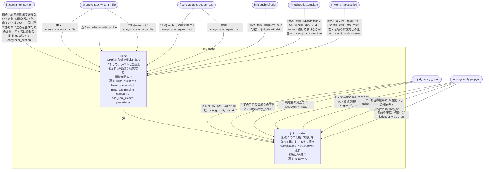

## blk-lens

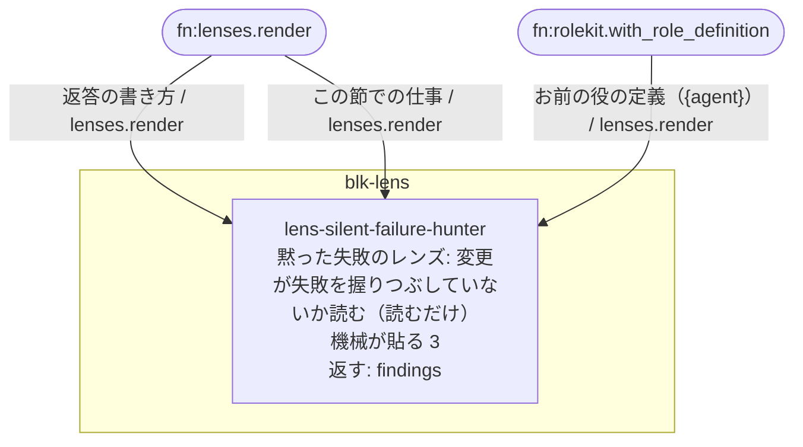

## blk-material

```mermaid
flowchart TD
  subgraph F_blk_material["blk-material"]
    prior_decisions["prior-decisions<br/>先行議論の突合: 過去の議論・決定と今回の変更が食い違わないか調べる<br/>機械が貼る 5<br/>返す: material, checked, searched, settled"]
    purpose_review["purpose-review<br/>目的の審査: 変更が目的に沿っているか、外れた所が無いかを読む（読むだけ）<br/>機械が貼る 5<br/>返す: verdict, reason, findings"]
    local_review["local-review<br/>局所レビュー: レビューのスキルと agent のレンズを起こして指摘を集める<br/>機械が貼る 5<br/>返す: material, findings, simplify_carried"]
    consistency_bypass["consistency-bypass<br/>整合性と標準機構の迂回を見る: 既存の仕組みを避けた作りが無いか読む（読むだけ）<br/>機械が貼る 5<br/>返す: consistency, bypass, findings, bypass_findings, seen, unseen"]
    hygiene["hygiene<br/>文脈を持たない読み手として差分を読み、観点に沿って指摘する（道具なし）<br/>機械が貼る 5<br/>返す: findings, seen"]
    external_standards["external-standards<br/>外部標準照合: 作る前に既製の定番解が無いかを疑って調べる<br/>機械が貼る 5<br/>返す: material, findings, seen, unseen, web_refetched, rankings"]
    procedure_trace["procedure-trace<br/>手順トレース: 変更に関わる手順を順にたどって確かめる<br/>機械が貼る 5<br/>返す: material, findings, unmeasured"]
    gate_efficacy["gate-efficacy<br/>ゲートの実効性確認: 検査が落とすべき物を本当に落とすかを写しの上で確かめる<br/>機械が貼る 5<br/>返す: material, arms"]
    test_double_fidelity["test-double-fidelity<br/>代役の忠実性: テストの代役が本物と同じ振る舞いかを確かめる<br/>機械が貼る 5<br/>返す: material, mismatches"]
    main_path_observation["main-path-observation<br/>主経路の実行観測: 変更した主経路を写しの上で実際に走らせて観測する<br/>機械が貼る 5<br/>返す: material, observed"]
    provenance["provenance<br/>根拠の出所検査: 変更が頼る根拠の出所を確かめる<br/>機械が貼る 5<br/>返す: material, claims"]
  end
  S_0(["fn:material._na_note"])
  S_1(["fn:material.prep"])
  S_1 -->|"/code-review の返り方（works の受け付けより。上の指示書の読み替え） / material.prep"| consistency_bypass
  S_1 -->|"必須のレンズの呼び出しの失敗（works の受け付けより。上の指示書の読み替え） / material.prep"| consistency_bypass
  S_1 -->|"所見の場所の書き方（works の受け付けより） / material.prep"| consistency_bypass
  S_0 -->|"『条件に当たらない』（not_applicable）を書けるか（works の受け付けより。上の指示書の読み替え） / material._na_note"| consistency_bypass
  S_1 -->|"前の回の受け付けが拒んだ理由 / material.prep"| consistency_bypass
  S_1 -->|"/code-review の返り方（works の受け付けより。上の指示書の読み替え） / material.prep"| external_standards
  S_1 -->|"必須のレンズの呼び出しの失敗（works の受け付けより。上の指示書の読み替え） / material.prep"| external_standards
  S_1 -->|"所見の場所の書き方（works の受け付けより） / material.prep"| external_standards
  S_0 -->|"『条件に当たらない』（not_applicable）を書けるか（works の受け付けより。上の指示書の読み替え） / material._na_note"| external_standards
  S_1 -->|"前の回の受け付けが拒んだ理由 / material.prep"| external_standards
  S_1 -->|"/code-review の返り方（works の受け付けより。上の指示書の読み替え） / material.prep"| gate_efficacy
  S_1 -->|"必須のレンズの呼び出しの失敗（works の受け付けより。上の指示書の読み替え） / material.prep"| gate_efficacy
  S_1 -->|"所見の場所の書き方（works の受け付けより） / material.prep"| gate_efficacy
  S_0 -->|"『条件に当たらない』（not_applicable）を書けるか（works の受け付けより。上の指示書の読み替え） / material._na_note"| gate_efficacy
  S_1 -->|"前の回の受け付けが拒んだ理由 / material.prep"| gate_efficacy
  S_1 -->|"/code-review の返り方（works の受け付けより。上の指示書の読み替え） / material.prep"| hygiene
  S_1 -->|"必須のレンズの呼び出しの失敗（works の受け付けより。上の指示書の読み替え） / material.prep"| hygiene
  S_1 -->|"所見の場所の書き方（works の受け付けより） / material.prep"| hygiene
  S_0 -->|"『条件に当たらない』（not_applicable）を書けるか（works の受け付けより。上の指示書の読み替え） / material._na_note"| hygiene
  S_1 -->|"前の回の受け付けが拒んだ理由 / material.prep"| hygiene
  S_1 -->|"/code-review の返り方（works の受け付けより。上の指示書の読み替え） / material.prep"| local_review
  S_1 -->|"必須のレンズの呼び出しの失敗（works の受け付けより。上の指示書の読み替え） / material.prep"| local_review
  S_1 -->|"所見の場所の書き方（works の受け付けより） / material.prep"| local_review
  S_0 -->|"『条件に当たらない』（not_applicable）を書けるか（works の受け付けより。上の指示書の読み替え） / material._na_note"| local_review
  S_1 -->|"前の回の受け付けが拒んだ理由 / material.prep"| local_review
  S_1 -->|"/code-review の返り方（works の受け付けより。上の指示書の読み替え） / material.prep"| main_path_observation
  S_1 -->|"必須のレンズの呼び出しの失敗（works の受け付けより。上の指示書の読み替え） / material.prep"| main_path_observation
  S_1 -->|"所見の場所の書き方（works の受け付けより） / material.prep"| main_path_observation
  S_0 -->|"『条件に当たらない』（not_applicable）を書けるか（works の受け付けより。上の指示書の読み替え） / material._na_note"| main_path_observation
  S_1 -->|"前の回の受け付けが拒んだ理由 / material.prep"| main_path_observation
  S_1 -->|"/code-review の返り方（works の受け付けより。上の指示書の読み替え） / material.prep"| prior_decisions
  S_1 -->|"必須のレンズの呼び出しの失敗（works の受け付けより。上の指示書の読み替え） / material.prep"| prior_decisions
  S_1 -->|"所見の場所の書き方（works の受け付けより） / material.prep"| prior_decisions
  S_0 -->|"『条件に当たらない』（not_applicable）を書けるか（works の受け付けより。上の指示書の読み替え） / material._na_note"| prior_decisions
  S_1 -->|"前の回の受け付けが拒んだ理由 / material.prep"| prior_decisions
  S_1 -->|"/code-review の返り方（works の受け付けより。上の指示書の読み替え） / material.prep"| procedure_trace
  S_1 -->|"必須のレンズの呼び出しの失敗（works の受け付けより。上の指示書の読み替え） / material.prep"| procedure_trace
  S_1 -->|"所見の場所の書き方（works の受け付けより） / material.prep"| procedure_trace
  S_0 -->|"『条件に当たらない』（not_applicable）を書けるか（works の受け付けより。上の指示書の読み替え） / material._na_note"| procedure_trace
  S_1 -->|"前の回の受け付けが拒んだ理由 / material.prep"| procedure_trace
  S_1 -->|"/code-review の返り方（works の受け付けより。上の指示書の読み替え） / material.prep"| provenance
  S_1 -->|"必須のレンズの呼び出しの失敗（works の受け付けより。上の指示書の読み替え） / material.prep"| provenance
  S_1 -->|"所見の場所の書き方（works の受け付けより） / material.prep"| provenance
  S_0 -->|"『条件に当たらない』（not_applicable）を書けるか（works の受け付けより。上の指示書の読み替え） / material._na_note"| provenance
  S_1 -->|"前の回の受け付けが拒んだ理由 / material.prep"| provenance
  S_1 -->|"/code-review の返り方（works の受け付けより。上の指示書の読み替え） / material.prep"| purpose_review
  S_1 -->|"必須のレンズの呼び出しの失敗（works の受け付けより。上の指示書の読み替え） / material.prep"| purpose_review
  S_1 -->|"所見の場所の書き方（works の受け付けより） / material.prep"| purpose_review
  S_0 -->|"『条件に当たらない』（not_applicable）を書けるか（works の受け付けより。上の指示書の読み替え） / material._na_note"| purpose_review
  S_1 -->|"前の回の受け付けが拒んだ理由 / material.prep"| purpose_review
  S_1 -->|"/code-review の返り方（works の受け付けより。上の指示書の読み替え） / material.prep"| test_double_fidelity
  S_1 -->|"必須のレンズの呼び出しの失敗（works の受け付けより。上の指示書の読み替え） / material.prep"| test_double_fidelity
  S_1 -->|"所見の場所の書き方（works の受け付けより） / material.prep"| test_double_fidelity
  S_0 -->|"『条件に当たらない』（not_applicable）を書けるか（works の受け付けより。上の指示書の読み替え） / material._na_note"| test_double_fidelity
  S_1 -->|"前の回の受け付けが拒んだ理由 / material.prep"| test_double_fidelity
```

## blk-plan

```mermaid
flowchart TD
  subgraph F_blk_plan["blk-plan"]
    r2_design["r2-design<br/>独立設計の役（道具ゼロ）<br/>機械が貼る 8<br/>返す: question_stands, reason, design"]
    plan["plan<br/>修正案の役: 判定の単位を直す項目（書いてよい範囲・テスト）に分ける<br/>機械が貼る 21<br/>返す: plan"]
    plan_revise["plan-revise<br/>block に答えて案を直す（修正案の会話の続き）<br/>機械が貼る 11<br/>返す: plan, block_answers"]
    plan_review["plan-review<br/>事前審査の役（review_tree が on か、auto で開いた項目が 2 つ以上なら項目ごとの下請けと相乗りの審査）<br/>機械が貼る 35<br/>返す: faces, shrink, reason"]
  end
  S_0(["fn:carry.prior_section"])
  S_1(["fn:concepthome.section"])
  S_2(["fn:converge._face_text"])
  S_3(["fn:converge.review_section"])
  S_4(["fn:design.human_answers"])
  S_5(["fn:design.named_sections"])
  S_6(["fn:design.prep"])
  S_7(["fn:design.repo_map"])
  S_8(["fn:libdocs._local_text"])
  S_9(["fn:libdocs._render"])
  S_10(["fn:libdocs.section"])
  S_11(["fn:planblk._carried_part"])
  S_12(["fn:planblk._diff_part"])
  S_13(["fn:planblk._errors_part"])
  S_14(["fn:planblk._item_history"])
  S_15(["fn:planblk._precedent_part"])
  S_16(["fn:planblk.brief_head"])
  S_17(["fn:planblk.design_only"])
  S_18(["fn:planblk.plan_slots_section"])
  S_19(["fn:planblk.prescription_section"])
  S_20(["fn:planblk.tree_part"])
  S_21(["fn:planblk.verify_part"])
  S_22(["fn:planmarks.review_section"])
  S_23(["fn:replan._section"])
  S_24(["fn:ripple.item_text"])
  S_25(["fn:ripple.section"])
  S_26(["fn:ripple.units_section"])
  S_27(["fn:rolekit.with_reject"])
  S_28(["fn:rolekit.with_role_definition"])
  S_29(["fn:structmark.plan_section"])
  S_30(["fn:worldmark.section"])
  plan --> plan_review
  plan --> plan_revise
  plan_revise --> plan_review
  r2_design --> plan
  r2_design --> plan_review
  r2_design --> plan_revise
  S_0 -->|"前の run で最後まで通らなかった物（機械が貼った。直す穴ではない——同じ所で落ちない返答を出すための注意。直す穴は依頼の findings だけ） / carry.prior_section"| plan
  S_1 -->|"考えの住処の地図（機械が追跡されたファイルから探した。先に Read で読め） / concepthome.section"| plan
  S_1 -->|"考えの住処の地図 / concepthome.section"| plan
  S_2 -->|"{key} / converge._face_text"| plan
  S_27 -->|"前の回の受け付けが拒んだ理由 / rolekit.with_reject"| plan
  S_8 -->|"{lib} {version}（手元の版。import せずに読んだ署名と説明） / libdocs._local_text"| plan
  S_8 -->|"{title} / libdocs._local_text"| plan
  S_9 -->|"{lib} {version} / libdocs._render"| plan
  S_10 -->|"ライブラリの文書（手元の版・公式） / libdocs.section"| plan
  S_18 -->|"案に入れてよい単位の no（機械が受け付けと同じ述語から作った。下の本文の『今の周に直す単位』の見出しと、one_shot_closes に載る単位より、この節が優先する） / planblk.plan_slots_section"| plan
  S_19 -->|"判定の処方（判定役が単位ごとに書いた直し方の案。零処方から並ぶ。機械が判定の記録から貼った） / planblk.prescription_section"| plan
  S_19 -->|"{key} / planblk.prescription_section"| plan
  S_21 -->|"判定の単位の裏取り（判定とは別の目が単位ごとに確かめた申し送り。機械が貼った） / planblk.verify_part"| plan
  S_23 -->|"直す項目 {n}（承認済みの修正案の項目の番号） / replan._section"| plan
  S_23 -->|"前の項目（承認済み。機械が貼った） / replan._section"| plan
  S_23 -->|"修正の段の申し出と裁定（{id}） / replan._section"| plan
  S_26 -->|"波及の一覧（機械が git grep で引いた。単位の key が名指す名の呼び出し元と試験。案を書く前に読め） / ripple.units_section"| plan
  S_26 -->|"単位 {unit_key} / ripple.units_section"| plan
  S_28 -->|"お前の役の定義（{agent}） / rolekit.with_role_definition"| plan
  S_29 -->|"構造の目の行（設計を知らない次の人が足す形が増えないかを別の目が見た判定。機械が貼った） / structmark.plan_section"| plan
  S_30 -->|"世界の解の行（依頼の行ごとの問題の類・世の中の定石・依頼の解き方との比べ） / worldmark.section"| plan
  S_1 -->|"考えの住処の地図（機械が追跡されたファイルから探した。先に Read で読め） / concepthome.section"| plan_review
  S_1 -->|"考えの住処の地図 / concepthome.section"| plan_review
  S_2 -->|"{key} / converge._face_text"| plan_review
  S_3 -->|"{n} 往復目の block / converge.review_section"| plan_review
  S_27 -->|"前の回の受け付けが拒んだ理由 / rolekit.with_reject"| plan_review
  S_8 -->|"{lib} {version}（手元の版。import せずに読んだ署名と説明） / libdocs._local_text"| plan_review
  S_8 -->|"{title} / libdocs._local_text"| plan_review
  S_9 -->|"{lib} {version} / libdocs._render"| plan_review
  S_10 -->|"ライブラリの文書（手元の版・公式） / libdocs.section"| plan_review
  S_20 -->|"束ね役の頼み（項目ごとの下請けを並べる。機械が貼った） / planblk.tree_part"| plan_review
  S_20 -->|"項目の全部（閉じた項目も含む） / planblk.tree_part"| plan_review
  S_16 -->|"事前審査の下請け / planblk.brief_head"| plan_review
  S_11 -->|"前の往復で答えた当たり（機械が答えを引き継ぐ。hits に入れなくてよい。差分で答えが変わる物だけ入れ直せ） / planblk._carried_part"| plan_review
  S_17 -->|"独立設計（修正案を見ない別の目が、目的と実測した制約・人の関所の答え・依頼が名指した設計書の節から作った理想解。機械が貼った） / planblk.design_only"| plan_review
  S_12 -->|"前の往復からのこの項目の案の差分（見るのはこの差分と前の block の行き先だけ） / planblk._diff_part"| plan_review
  S_13 -->|"前の答えの誤り（機械の確かめ。この誤りだけを直して同じファイルに書き直せ） / planblk._errors_part"| plan_review
  S_14 -->|"この項目の前の往復の block（下は前の往復で挙がった block と、修正案の役の答え（fixed＝直した・disputed＝異を唱えた）。今の案を読み、前の block の key ごとに、穴が消えたなら resolved にその key を入れ、残っていれば同じ key のまま faces に severity block で挙げ直せ（同じ穴に別の key を付けない。key は一字も変えずに写す）。新しい穴は新しい key で挙げよ。前の block が 1 つでも block のまま残ると、案は直しへ進まず人の関所で止まる。） / planblk._item_history"| plan_review
  S_20 -->|"お前の項目: 項目 {n} / planblk.tree_part"| plan_review
  S_20 -->|"項目 {n} の案 / planblk.tree_part"| plan_review
  S_20 -->|"項目 {n} の単位（判定） / planblk.tree_part"| plan_review
  S_20 -->|"項目どうしの重なり（機械が範囲と波及の一覧から引いた） / planblk.tree_part"| plan_review
  S_15 -->|"この項目の先行例の出典（判定者の先行例のうち adopt・adapt。見ること 8） / planblk._precedent_part"| plan_review
  S_16 -->|"答え方（全部の下請けで同じ） / planblk.brief_head"| plan_review
  S_20 -->|"お前の審査: 相乗りの審査 / planblk.tree_part"| plan_review
  S_22 -->|"構造の目の避け方・判定の処方・世界の解から外れた訳（修正案の欄 structure から機械が並べた。訳が成り立つかを見よ） / planmarks.review_section"| plan_review
  S_22 -->|"修正案の項目 {n} / planmarks.review_section"| plan_review
  S_22 -->|"修正案の項目の works の欄（機械が貼った） / planmarks.review_section"| plan_review
  S_23 -->|"直す項目 {n}（承認済みの修正案の項目の番号） / replan._section"| plan_review
  S_23 -->|"直した項目（修正案の役が返した形。機械が貼った） / replan._section"| plan_review
  S_23 -->|"前の項目（承認済み。機械が貼った） / replan._section"| plan_review
  S_23 -->|"修正の段の申し出と裁定（{id}） / replan._section"| plan_review
  S_25 -->|"波及の一覧（機械が git grep で引いた。項目が変える名の呼び出し元と試験） / ripple.section"| plan_review
  S_24 -->|"項目 {n} / ripple.item_text"| plan_review
  S_24 -->|"項目 {n}（unit_keys: {keys}） / ripple.item_text"| plan_review
  S_28 -->|"お前の役の定義（{agent}） / rolekit.with_role_definition"| plan_review
  S_0 -->|"前の run で最後まで通らなかった物（機械が貼った。直す穴ではない——同じ所で落ちない返答を出すための注意。直す穴は依頼の findings だけ） / carry.prior_section"| plan_revise
  S_2 -->|"{key} / converge._face_text"| plan_revise
  S_27 -->|"前の回の受け付けが拒んだ理由 / rolekit.with_reject"| plan_revise
  S_18 -->|"案に入れてよい単位の no（機械が受け付けと同じ述語から作った。下の本文の『今の周に直す単位』の見出しと、one_shot_closes に載る単位より、この節が優先する） / planblk.plan_slots_section"| plan_revise
  S_19 -->|"判定の処方（判定役が単位ごとに書いた直し方の案。零処方から並ぶ。機械が判定の記録から貼った） / planblk.prescription_section"| plan_revise
  S_19 -->|"{key} / planblk.prescription_section"| plan_revise
  S_21 -->|"判定の単位の裏取り（判定とは別の目が単位ごとに確かめた申し送り。機械が貼った） / planblk.verify_part"| plan_revise
  S_26 -->|"波及の一覧（機械が git grep で引いた。単位の key が名指す名の呼び出し元と試験。案を書く前に読め） / ripple.units_section"| plan_revise
  S_26 -->|"単位 {unit_key} / ripple.units_section"| plan_revise
  S_28 -->|"お前の役の定義（{agent}） / rolekit.with_role_definition"| plan_revise
  S_29 -->|"構造の目の行（設計を知らない次の人が足す形が増えないかを別の目が見た判定。機械が貼った） / structmark.plan_section"| plan_revise
  S_6 -->|"人が決めた前提（機械が貼った） / design.prep"| r2_design
  S_4 -->|"人の関所の答え / design.human_answers"| r2_design
  S_7 -->|"{name}:1-{total} / design.repo_map"| r2_design
  S_7 -->|"対象のリポジトリの地図 / design.repo_map"| r2_design
  S_5 -->|"{name}（{src}） / design.named_sections"| r2_design
  S_5 -->|"依頼が名指した設計書の節 / design.named_sections"| r2_design
  S_27 -->|"前の回の受け付けが拒んだ理由 / rolekit.with_reject"| r2_design
  S_28 -->|"お前の役の定義（{agent}） / rolekit.with_role_definition"| r2_design
```

## blk-pr

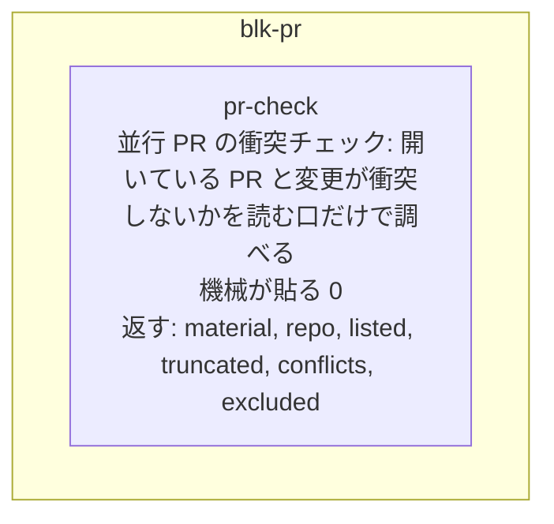

## blk-premises

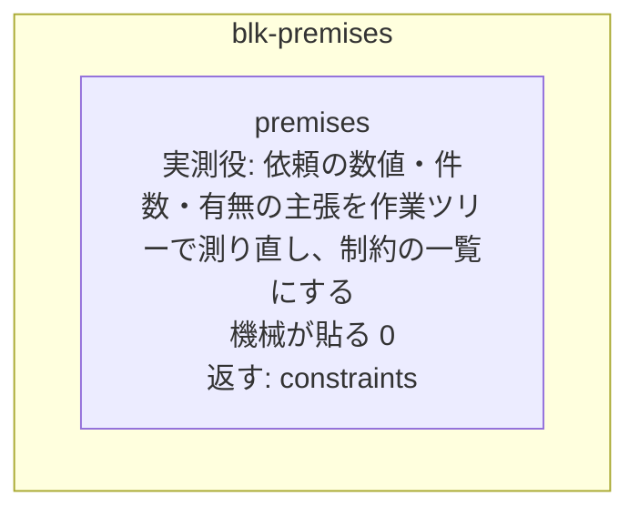

## blk-purpose

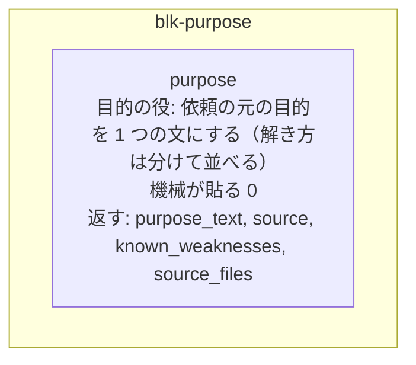

## blk-refix

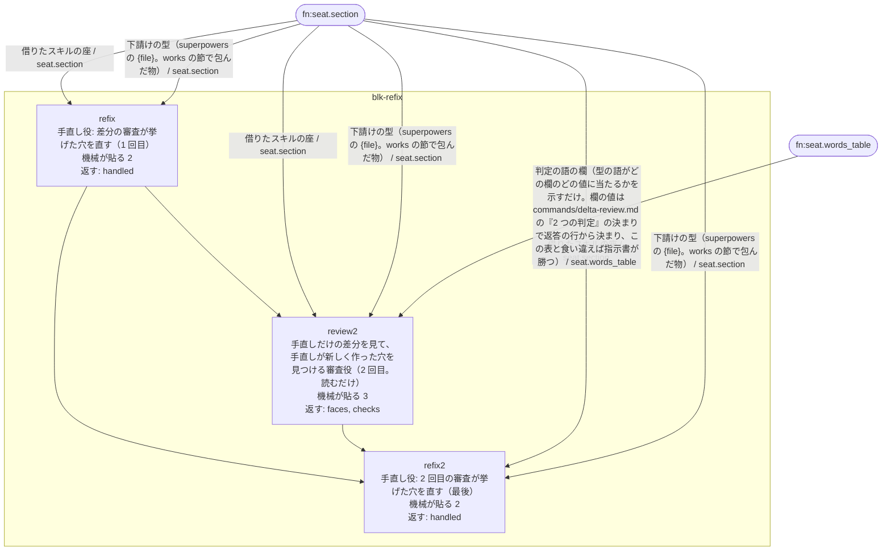

## blk-rejudge

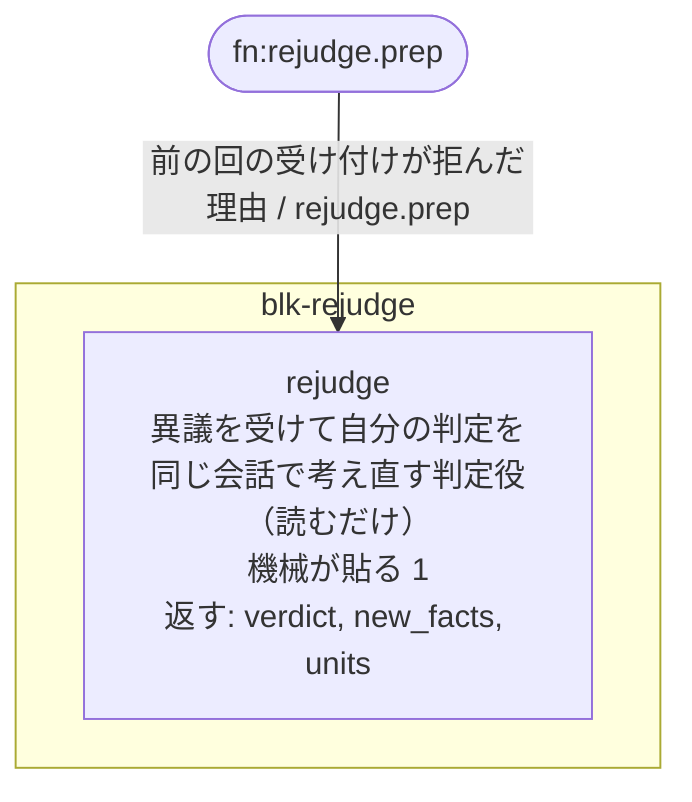

## blk-report

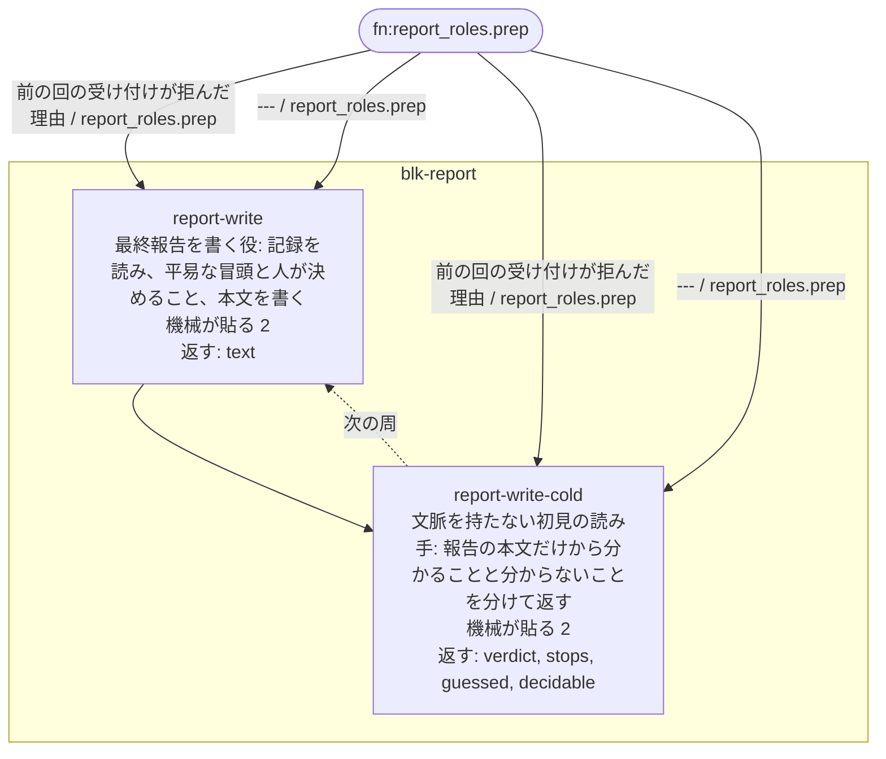

## blk-spec

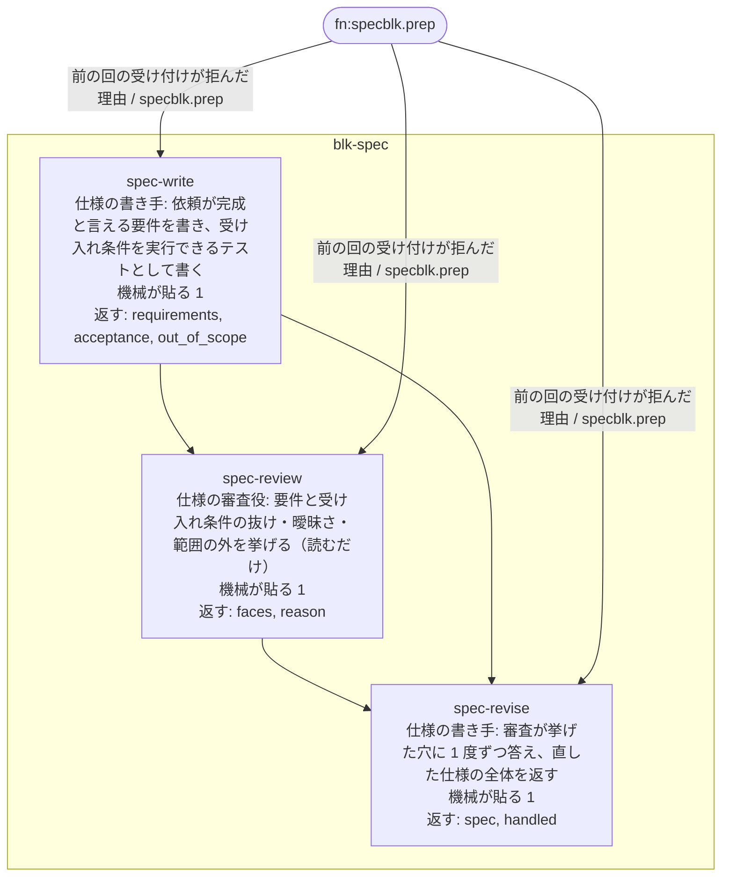

## blk-structure

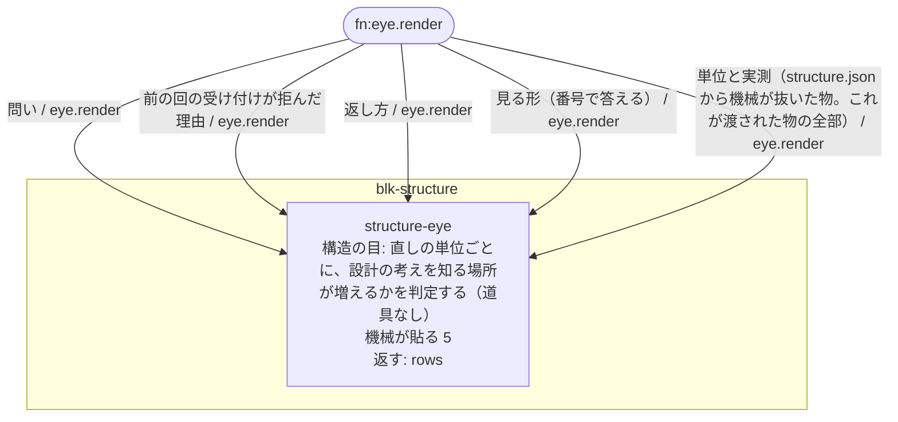

## blk-tests


## blk-world

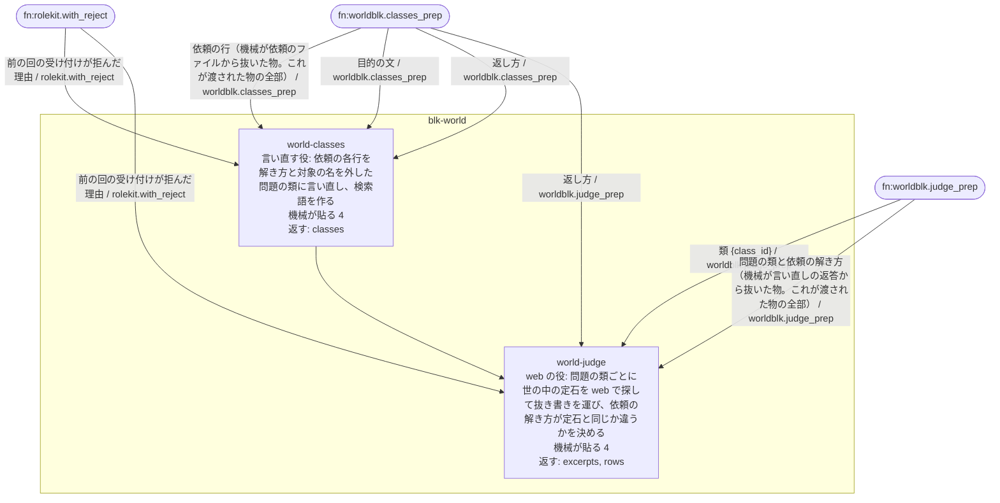
