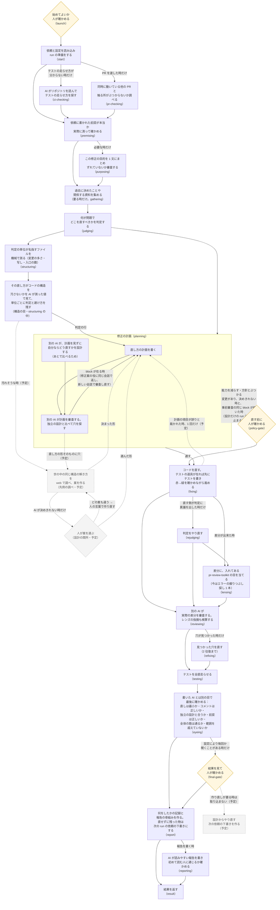

# darkfactory の流れの図

## 平易版（3 行）

- darkfactory は、修正の依頼を受けて「調べる → 判定する → 計画する → 直す → 審査する → 試す → 報告する」を 1 本の流れで回す、AI の修正の工場。
- 下の図は、その 1 回（run）が通る工程を始めから終わりまで描いたもの。箱の中に、その工程で何をしているかを書いた。
- 実線は今動いている流れ、点線と薄い箱はこれから入る予定の流れ（2026-10-03 の wip/works-next に依頼 231 の事前審査の壁打ちを足した形に合わせた）。

## 図の読み方

- 四角: AI や機械が作業する工程。1 行目が何をしているか、最後の行の括弧は設定ファイル（`darkfactory/darkfactory.yaml`）での名前。
- ひし形: 人が確かめる所（関所）。いつも止まるわけではなく、AI と機械がまず考え、決めきれない物だけ人に聞く。
- 線の上の字: その工程を回す条件。字の無い線はいつも通る。
- 省いた物: 工程と工程の間では毎回、機械が「次の工程を回すか・飛ばすか」を決めている（設定ファイルの h- で始まる節）。図が混むので描いていない。

## 工程ごとに何をしているか

1. **始める関所（launch）**: run を始めてよいかを人が確かめる。無人で回す設定なら自動で越える。
2. **準備（start）**: 依頼・対象のリポジトリ・テストのコマンドなどを読み込み、run の記録の置き場（盤面）を作る。
3. **テストの走らせ方を探す（ci-checking）**: テストのコマンドも宣言も無い時だけ、AI がリポジトリを読んで走らせ方を探す。
4. **他の PR とのぶつかり（pr-checking）**: PR を名指した run だけ。同時に動いている他の PR と、触る所が重ならないかを読む。
5. **前提の実測（premising）**: 依頼に書かれた「今こうなっている」が本当かを、コマンドを走らせて確かめる。
6. **目的（purposing）**: 要る時だけ。この修正で何を良くしたいかを 1 文にまとめ、依頼とずれていないかを別の AI が審査する。
7. **資料集め（gathering）**: 過去の設計の決定（ADR・変更の記録など）や関係する資料を集め、判定の材料にする。
8. **判定（judging）**: 何が問題か、直す単位はどれか、人に聞くべきことはあるかを決める。
9. **設計のブロック（実測の段と構造の目は入った・先例の調べと設計の関所は予定）**: 直し方が構造を汚す一手にならないかを見る。入ったのは 2 つ（どちらも structuring の中）。機械の実測の段は、判定の単位が名指すファイルの変更の多さ・写しの在りか・入口の数を測って run の記録に残す。構造の目は、その測った値を AI が読み、単位ごとに「汚れる・汚れない」の判定と根拠・理由（汚れるなら避け方）を 1 行ずつ残す。修正の計画はこのブロックの終わりを待ち、判定の行を計画の頭に受ける。ブロックが落ちた周も計画は止めず、判定の行なしで進み、その印（理由つき）を計画の頭・報告・最後の関所に出す。構造の目の判定とブロックで増えた時間は報告に出る。予定の残り: 汚れそうな時だけ世の中の同じ構造の解き方を web で調べ（集める役は軽い AI、判断は重い AI）、汚れない形を選ぶ（先例の調べ）。決めきれない時だけ人に案を出す（設計の関所）。
10. **修正の計画（planning）**: 別の AI が計画を見ずに独立の設計を作り、それとは別に直し方の計画を書き、さらに別の AI が両者を比べて計画を審査する。事前審査が block（直しへ進めない穴）を挙げたら、修正案の役に同じ会話で返して直させ、新しい会話の事前審査に掛け直す（壁打ち。依頼 231）。直しへ進むのは最後の審査に block の無い案だけ。往復ごとの案と審査は run の記録に残り、報告の冒頭と最後の関所に往復の行が並ぶ。
11. **直す前の関所（policy-gate）**: 今ある能力を減らす・方針とぶつかる変更があり、AI が決めきれない時だけ人が確かめる。設計だけの run（`WORKS_DESIGN_ONLY=1`）は項目が無くてもここで止まり、continue で修正へ、stop で報告へ進む。事前審査の同じ block が続いた（か 3 往復でも消えない）案も、設計だけの run と同じくここで止まる（設計だけの行に止まった理由が付く）。無人の run も止まって報告へ進む（依頼 231 で変わった振る舞い: 前は block が残っても直しへ進んだ）。依頼 230（工場が自分で設計を先に通す）はこの決まりに寄せた——判定の役の出口に欄を足す案は、判定が案と独立設計より前に走るので採らない。無人の run は判定の保留の問いだけでは開かず、問いを報告の冒頭に並べる。
12. **修正（fixing）**: 直す単位ごとに直す。テストの実行器が在れば、先に落ちるテストを書いてから直し、赤→緑を確かめる（TDD）。直す側と判定がぶつかったら、別の AI が裁定する。裁定が「計画の項目の誤り」の時は、今はその単位を直さずに残し、次の run の依頼の下書きに回す。予定（依頼 226）: 同じ run の中で 1 回だけ修正の計画に戻し、項目を直して事前審査と直す前の関所を通してから直し直す。もう 1 つの予定（依頼 220）: 修正の工程の形を run の入力で切り替えられるようにする（図の線は変わらない）。
13. **判定のやり直し（rejudging）**: 直す側が「判定がおかしい」と異議を出した時だけ、判定をやり直す。
14. **修正の後のレンズ（lensing）**: 修正が差分を作った run だけ。利用者が入れてある pr-review-toolkit の agent を 1 本ずつ別の工程として差分に当て、指摘を出どころつきで残す。今当てているのはエラーの握りつぶし探し（silent-failure-hunter）の 1 本。レンズが落ちても止めず、次の差分の審査がその指摘を検算する。
15. **差分の審査（reviewing）**: 別の AI が、実際に書かれた差分を読み、穴を探す。修正の後のレンズの指摘も確かめ直す。
16. **手直し（refixing）**: 審査で見つかった穴を直す。2 往復まで。
17. **最後のテスト（testing）**: テストの一式を全部走らせる。
18. **独立の目（eyeing）**: 書いた AI とは別の目で確かめる。直しが最小か・コメントが正しいか（R1）、独立の設計と構造が合うか（R2）、前提が正しいか、全体の筋が通るか（R3）、依頼の範囲を超えていないか（R4）。
19. **最後の関所（final-gate）**: テストの結果・審査の穴・独立の目の判定を並べて人が確かめる。毎回止まるか、聞くことがある時だけ止まるかは run の設定で決まる。作り直しが要る時は取り込まず、設計からやり直す次の依頼の下書きを作る（予定）。
20. **報告（report・reporting）**: 何をしたか・何が残ったか・人が決めることを報告にまとめ、初めて読む人に通じるかを別の AI が確かめる。直せずに残った物とテストの赤は、次の run に渡す依頼の下書き（next-request.json）にする。途中の工程が落ちた run でも報告は必ず走る。

## 保守のための注

- 元にした版: 依頼 231 の枝（wip/sdd-231）の 72a9bb94 の設定ファイル（2026-10-03。事前審査の壁打ちの輪を入れた後。その前は wip/works-next の aa07f883）。手で描いた図なので、`darkfactory/darkfactory.yaml` の工程の並びを変えたらこの図も直す。
- この版で足した物: 修正の後のレンズ（lensing）、報告が書く次の run の依頼の下書き、直す前の関所の設計だけの run と無人の run での振る舞い、作業中の依頼 226（修正から計画への 1 回の戻り。点線）と 220（修正の工程の形の切り替え。図の線は変わらないので文だけ）、依頼 231 の事前審査の壁打ち（事前審査から修正案への戻りを実線に。同じ block が続いた案は直す前の関所へ）。
- 予定の流れは、依頼 114 番（設計のブロック・設計の関所・事前審査から先例の調べへの戻り）と 115 番（最後の関所からの戻り）。入ったら点線を実線に直す。事前審査から修正案への戻り（細部の穴）は依頼 231 の壁打ちで入ったので実線にした。直し方の形そのものの穴も、先例の調べが入るまでは同じ壁打ちで修正案へ戻る（点線は先例の調べへの予定のまま）。設計のブロックのうち実測の段と構造の目（どちらも structuring）は入ったので実線にした。先例の調べと設計の関所は点線のまま。
- 各工程の中の細かい順（AI の返答の受け付けと出し直し・役の会話の引き継ぎ）は、工程ごとの `blk-*/blk-*.yaml` に在る。図では「修正の計画」の中だけを描いた（設計のブロックからの戻りの線がその中に着くため）。
- 図に描いていない枠: 修正と差分の審査の間に「中の検査」の枠（設定ファイルの h-mid）が在るが、この版では回す物が無い。
- 図に描いていない境の節: 最後の関所の後の h-eyes（関所の答えを盤面へ渡し、答えを待つ物が残るのに関所が開かなかったら止める）。他の h- の節と同じく省いた。
- 資料集め（gathering）は盤面が資料集めの役を待っている時だけ走り、飛んだ周は判定へ直接進む。図では箱の字だけで示した。
- 2026-09-27 の目標の図（枝 wip/works-tdd の振り分けの設計書の 2 節）は、その日の目標の流れで、差分の審査・独立の目・最後の関所の順がこの図と違う。今の順はこの図が正しい。
