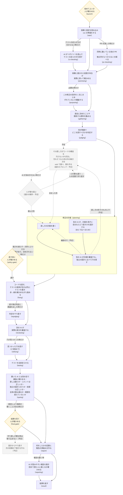

# darkfactory の流れの図

## 平易版（3 行）

- darkfactory は、修正の依頼を受けて「調べる → 判定する → 計画する → 直す → 審査する → 試す → 報告する」を 1 本の流れで回す、AI の修正の工場。
- 下の図は、その 1 回（run）が通る工程を始めから終わりまで描いたもの。箱の中に、その工程で何をしているかを書いた。
- 実線は今動いている流れ、点線と薄い箱はこれから入る予定の流れ（2026-09-29 に決めた）。

## 図の読み方

- 四角: AI や機械が作業する工程。1 行目が何をしているか、最後の行の括弧は設定ファイル（`darkfactory/darkfactory.yaml`）での名前。
- ひし形: 人が確かめる所（関所）。いつも止まるわけではなく、AI と機械がまず考え、決めきれない物だけ人に聞く。
- 線の上の字: その工程を回す条件。字の無い線はいつも通る。
- 省いた物: 工程と工程の間では毎回、機械が「次の工程を回すか・飛ばすか」を決めている（設定ファイルの h- で始まる節）。図が混むので描いていない。

## 工程ごとに何をしているか

1. **始める関所（launch）**: run を始めてよいかを人が確かめる。無人で回す設定なら自動で越える。
2. **準備（start）**: 依頼・対象のリポジトリ・テストのコマンドなどを読み込み、run の記録の置き場（盤面）を作る。
3. **テストの走らせ方を探す（ci-checking）**: テストのコマンドも宣言も無い時だけ、AI がリポジトリを読んで走らせ方を探す。
4. **他の PR とのぶつかり（pr-checking）**: PR を名指した run だけ。同時に動いている他の PR と、触る所が重ならないかを読む。
5. **前提の実測（premising）**: 依頼に書かれた「今こうなっている」が本当かを、コマンドを走らせて確かめる。
6. **目的（purposing）**: 要る時だけ。この修正で何を良くしたいかを 1 文にまとめ、依頼とずれていないかを別の AI が審査する。
7. **資料集め（gathering）**: 過去の設計の決定（ADR・変更の記録など）や関係する資料を集め、判定の材料にする。
8. **判定（judging）**: 何が問題か、直す単位はどれか、人に聞くべきことはあるかを決める。
9. **設計のブロック（予定）**: 直し方が構造を汚す一手にならないかを、機械の実測（変更の多い所・写しの在りか・入口の数）と AI の目で見る。汚れそうな時だけ、世の中の同じ構造の解き方を web で調べ（集める役は軽い AI、判断は重い AI）、汚れない形を選ぶ。決めきれない時だけ人に案を出す。
10. **修正の計画（planning）**: 別の AI が計画を見ずに独立の設計を作り、それとは別に直し方の計画を書き、さらに別の AI が両者を比べて計画を審査する。
11. **直す前の関所（policy-gate）**: 今ある能力を減らす・方針とぶつかる変更があり、AI が決めきれない時だけ人が確かめる。
12. **修正（fixing）**: 直す単位ごとに直す。テストの実行器が在れば、先に落ちるテストを書いてから直し、赤→緑を確かめる（TDD）。直す側と判定がぶつかったら、別の AI が裁定する。
13. **判定のやり直し（rejudging）**: 直す側が「判定がおかしい」と異議を出した時だけ、判定をやり直す。
14. **差分の審査（reviewing）**: 別の AI が、実際に書かれた差分を読み、穴を探す。
15. **手直し（refixing）**: 審査で見つかった穴を直す。2 往復まで。
16. **最後のテスト（testing）**: テストの一式を全部走らせる。
17. **独立の目（eyeing）**: 書いた AI とは別の目で確かめる。直しが最小か・コメントが正しいか（R1）、独立の設計と構造が合うか（R2）、前提が正しいか、全体の筋が通るか（R3）、依頼の範囲を超えていないか（R4）。
18. **最後の関所（final-gate）**: テストの結果・審査の穴・独立の目の判定を並べて人が確かめる。毎回止まるか、聞くことがある時だけ止まるかは run の設定で決まる。作り直しが要る時は取り込まず、設計からやり直す次の依頼の下書きを作る（予定）。
19. **報告（report・reporting）**: 何をしたか・何が残ったか・人が決めることを報告にまとめ、初めて読む人に通じるかを別の AI が確かめる。

## 保守のための注

- 元にした版: wip/works-next の aa1a3892 の設定ファイル（2026-09-29）。手で描いた図なので、`darkfactory/darkfactory.yaml` の工程の並びを変えたらこの図も直す。
- 予定の流れは、依頼 114 番（設計のブロック・設計の関所・事前審査からの戻り）と 115 番（最後の関所からの戻り）。入ったら点線を実線に直す。
- 各工程の中の細かい順（AI の返答の受け付けと出し直し・役の会話の引き継ぎ）は、工程ごとの `blk-*/blk-*.yaml` に在る。図では「修正の計画」の中だけを描いた（設計のブロックからの戻りの線がその中に着くため）。
- 図に描いていない枠: 修正と差分の審査の間に「中の検査」の枠（設定ファイルの h-mid）が在るが、この版では回す物が無い。
- 2026-09-27 の目標の図（枝 wip/works-tdd の振り分けの設計書の 2 節）は、その日の目標の流れで、差分の審査・独立の目・最後の関所の順がこの図と違う。今の順はこの図が正しい。
