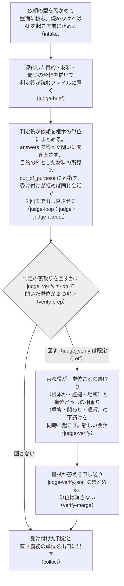
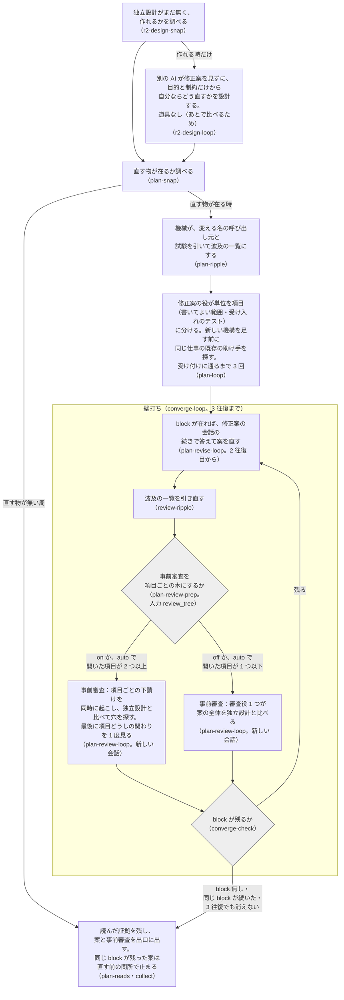
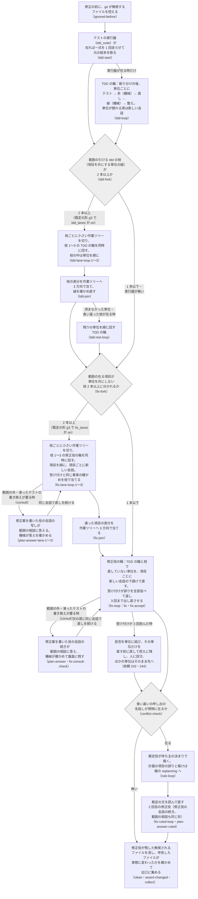
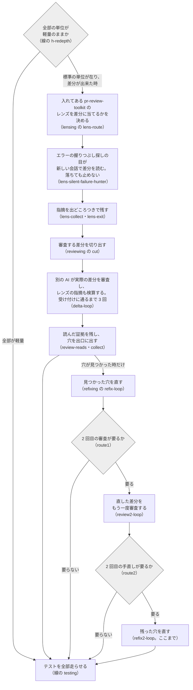
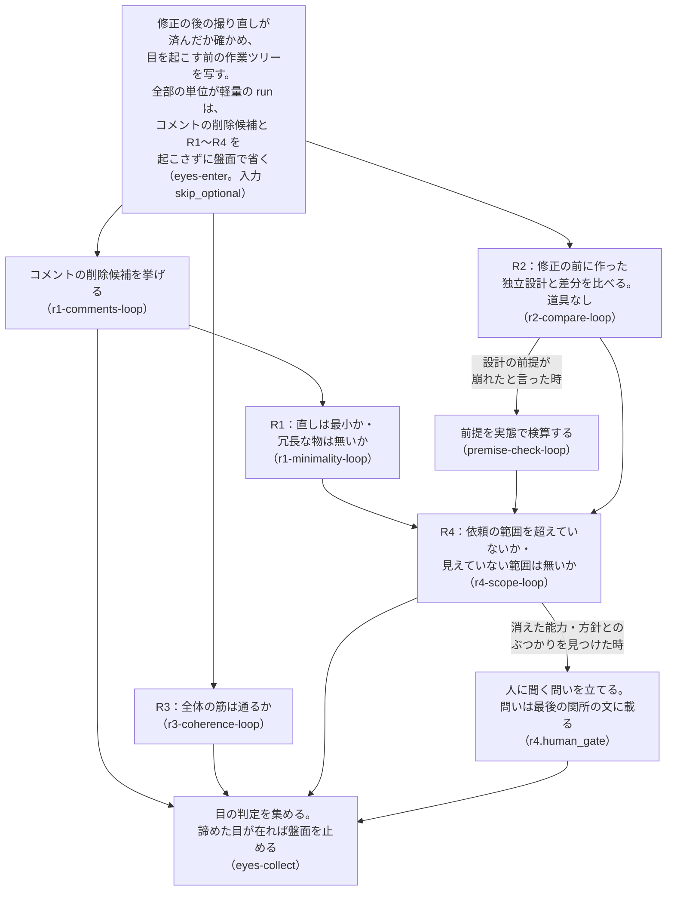
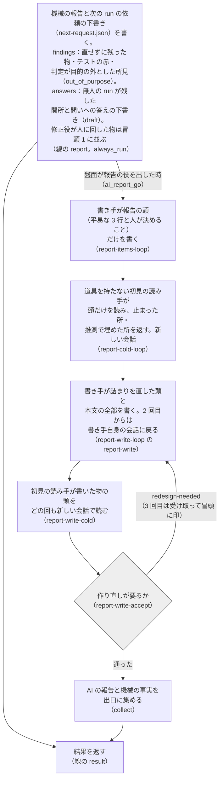

# darkfactory の流れの図

## 平易版（3 行）

- darkfactory は、修正の依頼を受けて「調べる → 判定する → 計画する → 直す → 審査する → 試す → 報告する」を 1 本の流れで回す、AI の修正の工場。
- 下の図は、その 1 回（run）が通る工程を始めから終わりまで描いたもの。最初の全体の図で工程の並びを、その後の 6 枚で判定・計画・修正・差分の審査・独立の目・報告の中を描いた。箱の中に、その工程で何をしているかを書いた。
- 実線は今動いている流れ、点線と薄い箱はこれから入る予定の流れ（2026-10-08 の works 0.2.47 の形）。

## 図の読み方

- 四角: AI や機械が作業する工程。1 行目が何をしているか、最後の行の括弧は設定ファイルでの名前（全体の図は線 `darkfactory/darkfactory.yaml` の節の id、段ごとの図はブロック `blk-*/blk-*.yaml` の節の id）。
- 黄色のひし形: 人が確かめる所（関所）。いつも止まるわけではなく、AI と機械がまず考え、決めきれない物だけ人に聞く。関所で人が止めた時は報告へ進む（その線は図では省いた）。
- 灰色のひし形: 機械が決める分かれ目（AI には決めさせない）。
- 線の上の字: その工程を回す条件。字の無い線はいつも通る。
- 赤い枠: 盤面（run の記録の置き場）を止めて、報告へ飛ぶ道。止めた後も報告は必ず書かれる。
- 省いた物: 工程と工程の間では毎回、機械が「次の工程を回すか・飛ばすか」を決めている（設定ファイルの h- で始まる節）。図が混むので、深さを決める h-depth・h-redepth と、関所を開くかを決める h-regate・h-final だけを描いた。
- 機能の切り替え: run の入力 `features_on`・`features_off` で、判定の裏取り（`judge_verify`）・事前審査の木（`review_tree`）・TDD の輪の並べ（`tdd_lanes`）・修正役の並べ（`fix_lanes`）・工程の地図（`graph_map`）を入れたり切ったりできる。既定は `judge_verify` が off、`review_tree` が auto、ほかは on（12b）。図の線の字にその機能の名を書いた。

## 全体の図

```mermaid
flowchart TD
  L{"始めてよいか<br/>人が確かめる<br/>（launch）"} --> ST["依頼と設定を読み込み<br/>run の準備をする。<br/>依頼の answers（前の問いへの<br/>依頼者の答え）と、機能の切り替え<br/>（features_on・features_off）・<br/>深さの入力（thickness）も控える<br/>（start）"]
  ST -- "テストの走らせ方が<br/>分からない時だけ" --> CI["AI がリポジトリを読んで<br/>テストの走らせ方を探す<br/>（ci-checking）"]
  ST --> PM
  CI --> PM
  ST -- "前の run の固定材料を<br/>渡した時だけ（fix_fixture）" --> DEP
  ST -- "origin が GitHub で<br/>機械が済ませられない時だけ" --> PR["同時に動いている他の PR と<br/>触る所がぶつからないか調べる<br/>（pr-checking）"]
  PR --> PM["依頼に書かれた前提が本当か<br/>実際に測って確かめる<br/>（premising）"]
  PM -- "必要な時だけ" --> PU["依頼の元の目的を<br/>1 文に固める<br/>（purposing）"]
  PM --> MA
  PU --> MA["判定の前に材料を集める：<br/>過去の決定・目的の文の審査・<br/>差分の局所レビューなど<br/>（要る時だけ。gathering）"]
  MA --> JU["何が問題で<br/>どこを直すべきかを判定する<br/>（judging。下の判定の図）"]

  JU --> SA["判定の単位が名指すファイルを<br/>機械で測り、その直し方が<br/>コードの構造を汚さないかを<br/>AI が単位ごとに判定する<br/>（structuring）"]
  SA -- "判定の行" --> PLAN
  SA -. "汚れそうな時（予定）" .-> DS["世の中の同じ構造の解き方を<br/>web で調べ、案を作る<br/>（先例の調べ・予定）"]
  DS -. "AI が決めきれない時だけ" .-> DG{"人が案を選ぶ<br/>（設計の関所・予定）"}
  DG -. "どの案も違う →<br/>人の言葉で作り直す" .-> DS
  DS -. "決まった形" .-> PLAN
  DG -. "選んだ形" .-> PLAN

  JU --> PLAN["独立設計・修正案・<br/>事前審査の壁打ち<br/>（planning。下の計画の図）"]
  PLAN -. "直し方の形そのものに穴（予定）" .-> DS

  PLAN -- "能力を減らす・方針とぶつかる<br/>変更があり、決めきれない時と、<br/>事前審査の同じ block が続いた時<br/>（設計だけの run はいつも止まる）" --> PG{"直す前に<br/>人が確かめる<br/>（policy-gate）"}
  PLAN --> DEP
  PG -- "通す" --> DEP["直す単位ごとに<br/>深さ（軽量か標準）を機械が決める。<br/>入力 thickness が空なら自動、<br/>軽量・標準なら全部をその深さに<br/>（h-depth）"]
  DEP --> FX["コードを直す。<br/>TDD の輪と修正役の輪。<br/>範囲の重ならない枝は<br/>小さい作業ツリーで同時に回し、<br/>機械が 3 方向で合わせる<br/>（fixing。下の修正の図）"]

  FX -- "裁定が計画の項目そのものを<br/>誤りとした時だけ（1 run に 1 回）" --> RPN["誤りと裁いた計画の項目だけを<br/>別の AI が直し、別の AI が審査する<br/>（replanning）"]
  RPN --> RGD{"直した計画を<br/>人に聞くか<br/>（h-regate）"}
  RGD -- "約束が変わる・<br/>人に聞く穴がある" --> RG{"直した計画を<br/>人が確かめる<br/>（replan-gate）"}
  RGD -- "約束が変わらず穴も無い・<br/>無人の run で範囲を<br/>広げるだけの直し" --> RFT
  RG -- "通す" --> RFT["直した項目の単位だけを<br/>もう一度直す<br/>（refitting）"]
  FX -- "直す側が判定に<br/>異議を出した時だけ" --> RJ["判定をやり直す<br/>（rejudging）"]
  RFT -- "異議を出した時だけ" --> RJ

  FX --> RD
  RFT --> RD
  RJ --> RD{"修正の後の信号で<br/>標準へ上げた後も<br/>全部の単位が軽量か<br/>（h-redepth）"}
  RD -- "標準の単位が在る<br/>（差分が出来た時）" --> RV["差分を局所レビューの目と<br/>別の AI の審査に当て、<br/>穴が在れば手直しする<br/>（lensing・reviewing・refixing。<br/>下の差分の審査の図）"]
  RD -- "全部が軽量<br/>（差分の審査・レンズ・<br/>手直しを省く）" --> TE
  RV --> TE["テストを全部走らせる<br/>（testing）"]
  TE --> EY["書いた AI とは別の目で<br/>最後に確かめる<br/>（eyeing。全部が軽量なら<br/>R1〜R4 を省く。下の独立の目の図）"]
  EY --> FGD{"最後の関所を開くか<br/>（h-final。入力 final_gate）"}
  FGD -- "always：いつも<br/>when_needed：聞くことが在る時<br/>protected_only：守りのファイルを<br/>触った時（use.sh の既定）" --> FG{"結果を見て<br/>人が確かめる<br/>（final-gate）"}
  FGD -- "開かない" --> RP
  FG -. "作り直しが要る時は<br/>取り込まない（予定）" .-> NEXT["設計からやり直す<br/>次の依頼の下書きを作る<br/>（予定）"]
  FG -- "通す" --> RP["何をしたかの記録・報告の骨組みと、<br/>次の run の依頼の下書き<br/>（next-request.json）を作る。<br/>途中で落ちた run でも、<br/>resume のたびにも必ず走る<br/>（report。下の報告の図）"]
  RP -- "AI の報告を書く時" --> RPA["AI が読みやすい報告を書き<br/>初めて読む人に通じるか確かめる<br/>（reporting）"]
  RP --> RS["結果を返す<br/>（result）"]
  RPA --> RS
  SC["どの工程の後でも：<br/>部品が宣言の外に書いたら<br/>盤面を止める<br/>（照らし・依頼 239）"] --> RP

  classDef plan fill:#f4f4f4,stroke:#999,stroke-dasharray:4 3,color:#555
  classDef gate fill:#fff7e0,stroke:#c90
  classDef mdec fill:#eeeeee,stroke:#666
  classDef halt fill:#fdecec,stroke:#c33
  class DS,DG,NEXT plan
  class SC halt
  class L,PG,RG,FG gate
  class RGD,RD,FGD mdec
```



## 判定の図（judging・blk-judge）



## 計画の図（planning・replanning・blk-plan）



## 修正の図（fixing・refitting・blk-fix）



## 差分の審査の図（lensing・reviewing・refixing）



## 独立の目の図（eyeing・blk-eyes）



## 報告の図（report・reporting・blk-report）



## 工程ごとに何をしているか

1. **始める関所（launch）**: run を始めてよいかを人が確かめる。無人で回す設定なら自動で越える。
2. **準備（start）**: 依頼・対象のリポジトリ・テストのコマンドなどを読み込み、run の記録の置き場（盤面）を作る。入力 `fix_fixture` で前の run の固定材料（修正の直前の盤面の写し）を渡した時は、判定と修正案を作り直さずに修正から始める（修正の進め方を同じ所から比べるための物）。
3. **テストの走らせ方を探す（ci-checking）**: テストのコマンドも宣言も無い時だけ、AI がリポジトリを読んで走らせ方を探す。
4. **他の PR とのぶつかり（pr-checking）**: 同時に動いている他の PR と、触る所が重ならないかを読む。まず機械が gh で一覧を引いて重なるファイルを数え、重なりが在る・gh が無い時だけ AI が読む。対象の origin が PR を持つホスト（GitHub）でない時（origin が無い・ローカルのパス・GitLab や自前のホスト）は、準備の段で機械が「条件に当たらない」（not_applicable。理由は `no_forge: <種類>`）と決め、この段は動かず、AI にも聞かない。報告の冒頭 2 に「PR を持つホスト（forge）: 無い」の 1 行が出る。
5. **前提の実測（premising）**: 依頼に書かれた「今こうなっている」が本当かを、コマンドを走らせて確かめる。
6. **目的（purposing）**: 要る時だけ。この修正で何を良くしたいかを 1 文にまとめ、依頼とずれていないかを別の AI が審査する。
7. **資料集め（gathering）**: 過去の設計の決定（ADR・変更の記録など）や関係する資料を集め、判定の材料にする。
8. **判定（judging）**: 何が問題か、直す単位はどれか、人に聞くべきことはあるかを決める。単位の粒はコードの上の欠陥の形で、同じ形の別の現れか 1 つの直しで閉じる物だけを 1 つの単位にする。直す所も形も別々の欠陥は、上の段の原因（テストが分かれ目を試さない など）が同じでも別々の単位にし、交わる原因は一撃と見立てに書く（canary の run a2fcf33a が 3 つの別々の式の誤りを 1 単位に束ね、並べの枝が立たなかったため）。直す単位が 2 つ以上なら、判定の後に単位ごとの確かめ役を同時に立てて「本当に根本か・証拠は在るか・場所は合っているか」を見させ、同時に単位どうしの重複・関わり・順番を見る役を 1 つ立てる（線の木の段 3。docs/plans/2026-10-06-judge-verify.md）。確かめ役は自分の単位だけを持つファイルを読み、答えを盤面の外に書く。機械が答えをまとめた申し送りは修正の計画の頭に貼られ、報告の冒頭に並ぶ。単位は消さない（「根本でない」と出ても申し送りになるだけ。減らすのは人の関所か再審）。単位が 1 つの run はこの確かめを回さない。
9. **設計のブロック（実測の段と構造の目は入った・先例の調べと設計の関所は予定）**: 直し方が構造を汚す一手にならないかを見る。入ったのは 2 つ（どちらも structuring の中）。機械の実測の段は、判定の単位が名指すファイルの変更の多さ・写しの在りか・入口の数を測って run の記録に残す。構造の目は、その測った値を AI が読み、単位ごとに「汚れる・汚れない」の判定と根拠・理由（汚れるなら避け方）を 1 行ずつ残す。修正の計画はこのブロックの終わりを待ち、判定の行を計画の頭に受ける。ブロックが落ちた周も計画は止めず、判定の行なしで進み、その印（理由つき）を計画の頭・報告・最後の関所に出す。構造の目の判定とブロックで増えた時間は報告に出る。予定の残り: 汚れそうな時だけ世の中の同じ構造の解き方を web で調べ（集める役は軽い AI、判断は重い AI）、汚れない形を選ぶ（先例の調べ）。決めきれない時だけ人に案を出す（設計の関所）。
10. **修正の計画（planning）**: 別の AI が計画を見ずに独立の設計を作り、それとは別に直し方の計画を書き、さらに別の AI が両者を比べて計画を審査する。事前審査が block（直しへ進めない穴）を挙げたら、修正案の役に同じ会話で返して直させ、新しい会話の事前審査に掛け直す（壁打ち。依頼 231）。直しへ進むのは最後の審査に block の無い案だけ。往復ごとの案と審査は run の記録に残り、報告の冒頭と最後の関所に往復の行が並ぶ。審査は項目ごと（線の木の段 1。docs/plans/2026-10-06-tree-line.md）: 機械が項目の変える名の呼び出し元と試験の一覧（波及の一覧）を作り、審査の役は項目ごとの下請けを同時に起こし、全部の項目が固まった往復の最後に項目どうしの関わりを 1 度見る。固まった項目は閉じて読み直さず、同じ穴が続いた項目は保留にしてほかを 3 往復まで進める。下請けは自分の項目だけを持つファイルを読み、答えを盤面の外の答えのファイルに書く。機械が答えを確かめて審査の結果にまとめ（審査の役は項目ごとの判定の要約だけを返す）、誤りはその項目の下請けにだけ返す。2 往復目からの下請けは、前の往復からの案の差分と前の穴が消えたかだけを見る。先行例の出典は run の中で 1 度だけ開いて控える。波及の一覧は修正の段にも渡り、範囲の外の当たりは範囲の相談の前に名指される。新しい機構（スクリプト・サブコマンド・助け手の関数・テストの仕掛け）を足す案は、触るファイルとその兄弟（同じ workflow・同じモジュール）に同じ仕事の既存の助け手が無いかを先に探し、当たった物と採らない理由を adds の canonical に書く。事前審査はその記録の無い新設を穴に挙げ、穴を閉じる形として新しい機構を求める前にも同じ所を探す。直す側に任せず人が決める物（方針の文書・ADR の書き換えなど）は、事前審査が kind policy・severity suggest の穴（柵 policy_doc）で挙げ、直す前の関所に載せる（無人の run はその関所で止まって報告へ進む。実の利用者の run 97fd532f）。新設を量った記録は canonical の頭の置くパスの後ろに書く（頭のパスで新しいモジュールを読む機械の読み方は変えない）。
11. **直す前の関所（policy-gate）**: 今ある能力を減らす・方針とぶつかる変更があり、AI が決めきれない時だけ人が確かめる。設計だけの run（`WORKS_DESIGN_ONLY=1`）は項目が無くてもここで止まり、continue で修正へ、stop で報告へ進む。事前審査の同じ block が続いた（か 3 往復でも消えない）案もここで止まる（止まった理由の行が付く）。無人の run も止まって報告へ進む（依頼 231 で変わった振る舞い: 前は block が残っても直しへ進んだ）。依頼 230（工場が自分で設計を先に通す）はこの決まりに寄せた——判定の役の出口に欄を足す案は、判定が案と独立設計より前に走るので採らない。無人の run は判定の保留の問いだけでは開かず、問いを報告の冒頭に並べる。
12. **修正（fixing）**: 直す単位ごとに直す。テストの実行器が在れば、先に落ちるテストを書いてから直し、赤→緑を確かめる（TDD）。赤・緑の確かめは名指しのテストと、単位の変更に直に関わる試験だけを走らせる（一式は線の最後のテストの段で 1 回）。修正役の返答の受け付けも、走らせる試験は変更に直に関わる物だけにする: 変えた・足した試験、変えたファイルを直に読む・言及する試験（変更の周りの地図で辺 1 本の所）、修正案の受け入れ・書き換えのテスト。届くだけの先の試験は受け付けでは回さず、「最後のテストの段に任せた試験」として最後の関所に名前で並べる（持ち主の決定 2026-10-06。run 195g では中心のファイルを変えた受け付けが 1 回に 1340 件・版の比べに 1516 件を回していた）。分からない物（動的な import など）が直に関わる所（変えたファイルか辺 1 本の所）に在る時だけ、受け付けと輪の緑で一式を回す。辺 2 本以上の遠くに在る物は一式を回す理由にせず、最後の関所に「最後のテストの段に任せた分からない物」として並べる（持ち主の決定 2026-10-06。理由: 最後のテストの段がテストのコマンドの一式を必ず回すので、遠くの取りこぼしはそこで拾える。run 195g は辺 2 本先の試験のファイルの動的 import 1 件で、受け付けが毎回一式を回していた）。直す側と判定がぶつかったら、別の AI が裁定する。修正の工程の形は 1 つ（g3。借りたスキルの座と、単位ごとの下請け）で、入力で切り替えない（依頼 220 の 4 つの形は 2026-10-09 に g3 だけにした）。TDD の輪の役は単位が替わる周だけ新しい会話で起き、修正役は残りの単位を 1 つの会話に積まず、単位（修正案の項目）ごとに新しい会話の下請けを起こす（依頼 243 の 2。前は 1 つの会話に全部の単位が積もり、run 195g の修正役は 5 単位で 86 分かかった）。前の単位の物は会話の履歴でなく引き継ぎ（単位の key・触ったファイル・緑にしたテスト）で渡す。TDD の輪で修正案の 1 つの項目に単位が 2 つ以上載る時は、項目の受け入れのテストを前の単位の段が全部名指して緑にするので、その段で同じ項目の後の単位（載る項目が全部前の単位の項目にも在る物）も一緒に直させ（「今は直すな」と言わない）、緑に届けば後の単位は機械が段を回さずに閉じる。別の項目の単位と、前の単位に無い項目にも載る単位は今どおり単位ごとに赤→緑を回す（canary の run 245042a7・4c32bf37 は、1 項目 2 単位で両方の単位が「今は直すな」と項目の受け入れのテストの緑の間で食い違いを申し出て、裁定役が 2 回起きていた）。既定の形 g3 では修正役の前に、書いてよい範囲（修正案の項目の allowed_paths と受け入れのテストのファイル）の在る項目が単位を共にしない 2 本以上の枝に分かれれば、機械が枝ごとの小さい作業ツリー（単位の worktree）を切り、枝ごとの輪（3 本まで。1 本の枝が 3 項目まで順に直す。枝の役は包みがその枝の作業ツリーを cwd に起こす Archon の AI の節で、項目ごとに新しい会話・審査の下請け・範囲の相談を持つ）が同時に回り、枝の確かめの節が受け付けと同じ事実の確かめ（凍ったテスト・書き込みの出どころ・この項目の単位・修正案の範囲・変更に当たる試験）を枝の作業ツリーで当てる（3 回拒まれた項目は直しを控えて戻す）。締めの節が差分を作業ツリーへ 3 方向で当てる。範囲が重なる項目も並べ、同じ試験のファイルの末尾に足しただけの食い違いは先の枝の行の後に後の枝の行を置いて合わせる。当たらない枝・戻した項目・枝に入らない項目・範囲の分からない項目は、修正役が今どおり 1 つずつ直し、枝が当てた単位は枝の返答の行を写して受け付けに渡す。受け付けは全部を合わせた作業ツリーを見る（依頼 243 の並べの 1・3・5 段目。docs/plans/2026-10-06-parallel-units.md・docs/plans/2026-10-07-overlap-lanes.md・docs/plans/2026-10-07-fix-lane-nodes.md。TDD の輪の並べと修正役の並べは同じ枝の部品 blk-fix/lib/lanekit.py を使う）。TDD の輪も同じ形で並べる: 既定の形 g3 では、振り分けの直後に範囲の引ける tdd の枝（修正案の項目を共にする単位の組）が 2 本以上あれば、機械が枝ごとの小さい作業ツリーを切り、枝ごとの輪（3 本まで。枝の役は包みがその枝の作業ツリーを cwd に起こす Archon の AI の節）が同時に回る（枝の中は順に、単位ごとに新しい会話で。前の単位の物は機械が指示書の引き継ぎの節で渡す）。範囲が重なる枝も並べる。枝の役はテスト → 赤 → 直し → 緑 → 整えを自分の作業ツリーで回し、赤・緑は段ごとに枝の確かめの節が今の輪と同じ確かめで決める。機械が差分を作業ツリーへ 3 方向で当てて、当てた後の木で緑を確かめ直す（同じファイルを変えた枝が在れば、そのファイルに届く試験まで広げる。赤なら後の枝だけを落として 1 回確かめ直す）。済まなかった単位・当たらない枝・当てた後に赤い枝は今どおり 1 つずつ回し直す（依頼 243 の並べの 2〜4 段目。docs/plans/2026-10-06-tdd-parallel.md・docs/plans/2026-10-07-overlap-lanes.md・docs/plans/2026-10-07-lane-nodes.md。4 本目からの枝・戻した単位は並べの後の順の輪が回す）。修正役の返答は機械が受け付け、誤りを確かめごとに全部並べて 1 回で返し、3 回まで出し直させる（依頼 224）。裁定で外れた単位の 1 回目の直しは作業ツリーに残す（依頼 241）。3 回拒まれた時は、盤面を止めずに単位を止めて先へ進む（依頼 242。前は盤面を止めて報告へ飛び、受けた単位の直しも取り込まれなかった。run 195f）。拒否の行を、名指した単位・テストが届く単位に結び、その単位とファイルを共にする単位だけを直す前（段の頭の木）に戻して控えの patch に残し、人に回す。どの単位にも結べない行は直す義務の全部の単位を止める。ほかの単位は差分の審査・最後の関所・報告へ進む。直す義務の単位を全部止めた時は、役の返答の代わりに機械の空の返答を渡して先へ進む（2 回目の修正の段では、1 回目に受けた単位の行を残す。その行が在れば差分の審査は飛ばさない）。修正役と並べの枝の役は、修正案の項目の範囲の外や凍ったテストの書き換えが要る時、返答の欄 consult で範囲を相談する（下請けは自分で相談せず、まとめ役の修正役に頼みを報告する。並べの枝の答えの節は修正案を書いた役の会話の写しで答える）。修正案の役が項目の out_of_scope に外したパスも相談に回り、役は外した理由を見せられて考え直す（許せば、その項目ではそのパスだけ out_of_scope から外れる。持ち主の決定 2026-10-07）。修正の輪の中の答えの節が修正案を書いた役の会話の続きで答え、機械が答えを確かめて盤面に残し、許された範囲は受け付けが範囲に入れる。その周は受け付けを回さず、修正役は同じ会話の続きで答えを読んで直しを続ける。返答の前には、受け付けの事実の確かめを試験なしで回せる（docs/plans/2026-10-06-ask-planner.md）。
12a. **単位ごとの深さ（h-depth・h-redepth）**: 修正の前に、直す単位ごとに機械が深さ（軽量か標準）を決める。軽量は、計画の項目が触るファイルが 3 個以下・受け入れと書き換えのテストが 2 本以下・約束の形のファイル（schema・yaml・json の表）を触らない・テストのコマンドか実行器が在る、を全部満たす単位だけ（触るファイルが全部配線（線とブロックの `<名>/<名>.yaml` と `manifest.json`）の単位は、約束の形のファイルに数えない）。標準は今の振る舞いのすべて。修正の後に、食い違いの申し出・止めた単位・答えていない問い・計画の項目の直し・判定のやり直しのどれかが立てば標準へ上げる。全部の単位が軽量のままの run だけ、差分の審査（とそれに続くレンズ・手直し）と、独立の目（コメントの削除候補と R1〜R4）を省き、報告の冒頭 2 に「軽量で省いた: …」と 1 行ずつ名指す（R1〜R4 と差分の審査を省けるのは持ち主の決定 2026-10-06。記録には省いた理由つきで残る）。AI の報告は省かない。軽量の単位は、修正の段の TDD の輪でも緑の後の run のテストのコマンド（test_cmd）を走らせない（同じコマンドを最後のテストが木の全部で走らせる。2 回目の修正の段は案の直しの後だけ走り、全部の単位が標準へ上がっているので今どおり）。run の入力 `thickness` で全部の単位を軽量か標準に固定できる（既定は自動）。測りと決めた理由は `docs/plans/2026-10-06-variable-depth.md`。
12b. **機能の切りと入れ（入力 features_off・features_on）**: 木・枝の形の機能は run ごとに切れる・入れられる（同じ依頼を機能を替えて回して比べる口。持ち主の依頼 2026-10-07）。`judge_verify` は 8 の確かめ役、`review_tree` は 10 の事前審査の項目ごとの確かめ役（切ると審査役 1 つが案の全体を審査する）、`tdd_lanes` は 12 の TDD の輪の並べ、`fix_lanes` は 12 の修正役の並べの枝を止めて順に回す。`graph_map` は 12c の工程の地図を役に足さない。既定（持ち主の決め 2026-10-08。測りで判定の裏取りは後の段を変えず、木は審査役 1 つが見逃した穴を出さなかった）は `judge_verify` が off、`review_tree` が auto（開いた項目が 2 つ以上の往復だけ木）、ほかは on。`features_on` に名指した語は on、`features_off` に名指した語は off で、名指しが既定に勝つ（同じ語を両方に名指せば start が拒む）。on でない機能は報告の冒頭 2 に、入力は `versions.json` の `settings` に残る。
12c. **工程の地図（包みが足す）**: 印に旗 `map` を持つ役（今は修正案の役の会話: 10 の修正案・その直し、12 の範囲の相談の答え（修正役の並べの枝の答えは修正案の役の会話の写しで、同じ地図を受ける））には、包みが system prompt に工程の地図を足す。地図は工程の YAML から機械で組んだ全体のグラフ（線の段を上から順に、節の目的は YAML の節の `description:` の 1 行）に、その役の会話が走る節の ★ と、後の流れ（修正の段で項目が枝に分かれて同時に走り、3 方向で合わさる）を描いた物で、run の切り替え（start の控えの実効で off の機能 `features_cut`。既定で off の機能を含む）で走らない節は出さない。指示書は替えず、地図は指示でなく事実として渡す。設計 [plans/2026-10-07-graph-map.md](plans/2026-10-07-graph-map.md)。
13. **計画の項目の直し（replanning・replan-gate・refitting）**: 修正の裁定が「計画の項目そのものが誤り」と出た時だけ、1 run に 1 回。別の AI がその項目だけを直し、別の AI が審査する（この 2 度目の計画では壁打ちを回さない。審査の穴は次の関所が項目ごとに読む）。約束（直す単位・範囲・受け入れのテストなど）が変わらず、人に聞く穴も無ければ人に聞かずに進み、そうでなければ人が確かめる（replan-gate。止めれば run が止まり、1 回目の直しは報告に残る）。聞くかは境の節 h-regate が機械で決める。無人の run（`WORKS_USE_UNATTENDED=1`）では、範囲を広げるだけの直し（承認済みの項目との違いが `allowed_paths` に足した行と `out_of_scope` から外した行だけで、事前審査が人に聞く種類の穴を挙げない物）も関所を開かずに進む（0.2.45。持ち主の決定 2026-10-08）。聞かずに通した事は trace の行 `replan_widened_unattended` と、報告の冒頭 1・最後の関所の文の「同じ run の中で直した修正案の項目」の行に残る。人の居る run は今どおり関所で聞く。通った項目の単位だけをもう一度直す。直せなかった単位は最後の関所と次の依頼の下書きに回る。
14. **判定のやり直し（rejudging）**: 直す側が「判定がおかしい」と異議を出した時だけ、判定をやり直す。
15. **修正の後のレンズ（lensing）**: 修正が差分を作った run だけ（全部の単位が軽量の run は差分の審査ごと省く。12a）。利用者が入れてある pr-review-toolkit の agent を 1 本ずつ別の工程として差分に当て、指摘を出どころつきで残す。今当てているのはエラーの握りつぶし探し（silent-failure-hunter）の 1 本。レンズが落ちても止めず、次の差分の審査がその指摘を検算する。
16. **差分の審査（reviewing）**: 全部の単位が軽量の run は省く（12a）。別の AI が、実際に書かれた差分を読み、穴を探す。修正の後のレンズの指摘も確かめ直す。
17. **手直し（refixing）**: 審査で見つかった穴を直す。2 往復まで。
18. **最後のテスト（testing）**: テストの一式を全部走らせる。受け付けが任せた、変更に届くだけの試験もここで確かめる。ここで赤なら、最後の関所と報告の冒頭に「最後のテストが赤」と出て、次の run に渡す依頼の下書きに載る（同じ run の中では直し直さない）。
19. **独立の目（eyeing）**: 書いた AI とは別の目で確かめる。全部の単位が軽量の run は省く（12a）。直しが最小か・コメントが正しいか（R1）、独立の設計と構造が合うか（R2）、前提が正しいか、全体の筋が通るか（R3）、依頼の範囲を超えていないか（R4）。
20. **最後の関所（final-gate）**: テストの結果・審査の穴・独立の目の判定を並べて人が確かめる。修正役が人に回した物（壊すと分かって通した理由 breaks.accepted）も節に並び、聞くことがある時だけ止まる設定でも止まる理由に数える。開くかは境の節 h-final が入力 `final_gate` で決める: `always`（入力が空の時。いつも開く）・`when_needed`（最後のテストが緑でない・食い違いの申し出を人に回した・修正役が人に回した物が在る・独立の目が阻害を返した・直したという申告と機械の数え直しが合わない・人に聞いている問いが盤面に在る・止めずに残った異議が在る・守りのファイルを触った、のどれかの時だけ）・`protected_only`（守りのファイルを触った時だけ。ほかの理由は報告の冒頭に並ぶ。`use.sh` の既定）。独立の目 R4 が人に聞いた問いもこの関所の文に載る。作り直しが要る時は取り込まず、設計からやり直す次の依頼の下書きを作る（予定）。
21. **報告（report・reporting）**: 何をしたか・何が残ったか・人が決めることを報告にまとめ、初めて読む人に通じるかを別の AI が確かめる。修正役が人に回した物（壊すと分かって通した理由 breaks.accepted）は、冒頭 1 の人が決めることに 1 件 1 行で並び、冒頭 3 行の決めてほしいことの件数に入る（実の利用者の run 97fd532f では、方針の文書の食い違いを「人に回す」と書いた行がどこにも載らずに消えた）。直せずに残った物とテストの赤は、次の run に渡す依頼の下書き（next-request.json の findings）にする。判定が凍結した目的の外として単位にしなかった材料の所見（判定の欄 out_of_purpose が名指し、受け付けが材料の行に当てて確かめた物）も、材料の行の全部の欄（where・text・mechanism・measured・false_positive_if）のまま、目的の外から運んだ印つきで同じ findings に載り、報告の冒頭 1 の次の run に渡す物の下に 1 件ずつ並ぶ。無人の run が関所で止めた項目と保留のままの台帳の問いを残したら、それぞれへの答えの下書き（推し）を同じ下書きの answers に draft: true・出どころ source つきで置く（機械は答えない。依頼の入口は下書きのままの行を拒む。台帳の問いの行は見直して draft と source を消せば次の run の問いに当たり、関所の項目の行は次の run の関所の一言の材料）。受け付けが最後まで通さなかった理由と独立設計の目の作り直しの理由は、同じ下書きの prior_failures（と prior-failures.json）に載せ、次の run では判定役と修正案の役の材料にだけ「直す穴ではない注意」として貼る。途中の工程が落ちた run でも報告は必ず走り、機械の報告（report）は Archon の resume のたびにも回し直す（`always_run`。0.2.44）。AI の報告は 3 段で書く: 書き手が頭（平易な 3 行と人が決めること）を書き（report-items）、道具を持たない初見の読み手が頭だけを読んで詰まりを返し（report-cold）、書き手が詰まりを直した頭と本文を書く（report-write）。書いた物の頭はどの回も新しい会話の初見の読み手（report-write-cold）がもう一度読み、作り直しが要れば書き手に返す（3 回目は受け取り、報告の冒頭に「初見の確かめを通っていない」と出す。0.2.46）。

## 部品の置き場と宣言

部品（`blk-*/` のブロック。線 `darkfactory/darkfactory.yaml` が `include` の節で差し込む節の束）は、run の記録の置き場（盤面。`$ARTIFACTS_DIR/board/`）を 1 つの決まりで使う（依頼 239）。同じ部品を 1 run で 2 度差し込んでも（今は修正の部品 `blk-fix` の `fixing` と `refitting`、修正案の部品 `blk-plan` の `planning` と `replanning`）、2 度目が 1 度目のファイルを上書きしない。

### 1 つの決まり

部品が盤面で読み書きしてよいのは次の 3 つだけ。

1. 自分の置き場（scope の根）: `board/<include の名>/` の下の全部。include の名は線の `include` の節の id（`fixing` など）で、ここではこれを scope と呼ぶ。
2. 宣言した入力（consumes）: ほかの部品か線が宣言した出力。
3. 宣言した出力（produces）: 自分が外に出す物。

ほかに、core（`.shared/core/` の共通の部品）・写しの engine・rules が書く共有の記録（`state.json`・`record.json`・`trace.jsonl`・`out/`・`runs/`・`prompts/`・修正の部品の試験の輪の `tdd-<k>/` など）は、どの部品の間に変わってもよい。全部の形は `.shared/core/scopes.py` の `SHARED` の 1 つの組に在る。

部品のコードは置き場を知らない。今までどおり `b.work(名)`（周 N の作業ファイルのパス）と `script_io.scope_dir(盤面)`（周をまたぐ私物の置き場）を使えば、盤面を開く口 `entry.open_board` が名を見て置き場を決める。

### 置き場の絵

```
board/
  state.json  record.json  trace.jsonl  out/  runs/ ...   共有の記録（core・engine・rules が書く）
  scope-window.json                                       今の窓（下の「照らし」）
  judgment.json  design.json ...                          at が root の宣言した出力（盤面の根）
  r1/                                                     周 1 の公開の置き場
    scopes.json                                           その周に居た include と、公開の名の持ち主（owns）
    lens.json  start.json ...                             at が round の宣言した出力（周ごとに書き手の scope は 1 つ）
    conflicts.json  libdocs.json                          周ごとの共有の記録
  fixing/                                                 include fixing の scope の根（私物と per_include の出力）
    reject-accept_fix-1.txt                               周をまたぐ私物（script_io.scope_dir）
    r1/rule-tree.json  r1/reads-fix.json ...              周ごとの私物と per_include の出力
  refitting/                                              同じ blk-fix の 2 度目の include（fixing と分かれる）
```

線の最上段の節（`start`・境の節 `h-*`）は scope が空で、盤面の根と `r<N>/` に今までどおり書く。

include の節に `fan_out` を付けると、Archon は子を同じ盤面で同時に走らせる。子の scope は `<fan の節>--<子の印>`（印は items の値から Archon が作る印の頭 8 字。同じ値なら走り直しても同じ）で、子ごとに `board/<fan の節>--<印>/` の置き場が分かれる。宣言は差し込んだ部品の `manifest.json`。読み方の正本は `.shared/core/flow_adapter.py`。今は線の最上段の `fan_out` だけを測っていて、include の中の `fan_out` は盤面を開く所で拒む。

### manifest の書き方

宣言は部品のフォルダごとの `manifest.json`（線は `darkfactory/manifest.json`）。形の正本は `.shared/core/manifest.schema.json`。

- `consumes`: `[{"name": <名>}]`。ほかの部品が公開した名だけを書く。出す部品の名は書かない（名から引く）。
- `produces`: `[{"name", "format": "md"|"json", "schema"?, "per_include"?, "required"?, "at"?}]`。
  - `name` は置き場からの名か、`/` で区切った段ごとの形（`*` は段をまたがない。末尾の `**` は下の全部）。字のままの名が形より勝つ。
  - `format` が `json` なら `schema`（部品のフォルダからの JSON Schema のパス）が要る。
  - `at`: `round`（既定）は周の置き場 `r<N>/<名>`、`root` は盤面の根 `<名>`。`root` の名は周を持たないので持ち主を記録しない（照らすのは名と Schema だけ）。同じ部品の 2 つの include が同じ周に書き直してよく、今は `blk-plan` の `planning` と `replanning` が `plan-fields.json`・`design.json` などを書き直す。
  - `per_include` が真なら公開の置き場でなく各 include の scope の根に残す（同じ部品の 2 つの include がそれぞれ出す物。読む側は `scopes.each`・`scopes.all_rounds` で集める）。偽なら公開の置き場に置き、周ごとに書き手の scope は 1 つ。
  - `required` が真なら、窓を閉じる時に無ければ trace と報告に載る（run は止めない。役が落ちた・諦めた部品の出力は無くなるので、止めると落ちた理由が隠れて報告も書けない）。
- 宣言しない名は全部、scope の根の中の私物。

### 照らし（宣言の外の書き込みで run を止める）

窓は、1 つの scope が盤面を開いてから、別の scope か線が盤面を開くまでの間。Archon の節（Archon が節の居場所を環境変数で渡したプロセス。`flow_adapter.in_flow_node`）が `entry.open_board` で盤面を開くたびに `scopes.enter` を呼び、scope が替わる時に前の窓の盤面の変化（パス・大きさ・mtime_ns）を前の部品の manifest に照らす。照らすのは窓ごとに 1 度で、同じ scope が開き直しても窓は開き直さない（Archon の再開で同じ節が走り直しても、1 回目からの書き込みを照らし続ける）。誤りが在れば盤面を止め（`state.stop.by` が `works:scope-check`。周を締めた・もう止まった盤面は止められないので、trace の行 `stop_after_round_end` に残す。周を締めた盤面では境の節がこの行を止まりと読み、最後の関所を開かずにその理由で止まる）、窓は開いた節へ移す（後の開きが同じ誤りで落ち続けない）。開いた節は BoardGap で落ちる。報告と結果の節は `allow_halted` で開くので落ちずに走り、報告の結末に止めた理由が載る。run の外の道具（`dev/report.sh`・`dev/fixmeasure.py`）と試験の手は節でないので窓に触らない。

誤りの文の読み方（1 行が 1 つのパス）:

- `planning/r1/z.json: scope fixing（blk-fix） が宣言の外に書いた。宣言: <produces の名の並び>` — include `fixing`（部品 `blk-fix`）の窓の間に、自分の scope の根でも宣言した出力でも共有の記録でもない `planning/r1/z.json` が変わった。直し方は、外が読む物なら manifest の produces に足す（JSON なら Schema も）、部品の私物なら `b.work`（周ごと）か `script_io.scope_dir`（周をまたぐ）に書き先を移す。
- `… が宣言の外に書いた（この周の持ち主は scope fixing。周ごとに書き手は 1 つ）` — 公開の名を同じ周に 2 つの scope が書いた。片方の書き手を外すか、per_include にする。
- `… の lens.json が Schema <パス> に合わない: <誤り>` — JSON の出力が宣言の Schema に合わない。

宣言の外の読み（部品の読んだ証拠 `reads-<役>.json` に、consumes に無い盤面のパスが在る）と必須の出力の欠けは止めない。trace の行 `scope_read_outside`（`{scope, paths}`）・`scope_required_missing`（`{scope, names}`）と、報告の冒頭の読んだ証拠の節の「宣言の外の読み」「必須の出力の欠け」の行に出る。

盤面を開く前に自分の scope の根に書く節（依頼の受け付けの intake・テストの走らせ）の物は、次に盤面を開いたその scope の物として通す。

照らしが見ない所（死角）:

- (a) 部品の節が盤面を初めて開く前に書いた物は、その前の窓の物に数える。前の窓が線の物なら照らさない（多くの部品の前には線の境の節 `h-*` が在る）。盤面の根の錠のファイル（`board.lock`・`.works-material.lock`）はこれで通っている。
- (b) 上の「自分の置き場」の決まりで、閉じる窓が、次に盤面を開く scope の置き場に書いた物は通る。
- (c) 起こされた部品の名は、スクリプトのパス（`sys.argv[0]` の `<部品>/scripts/<x>.py`）から引く。uv の起動などでこれが空になると、照らしは公開の名の持ち主で照らすが、必須の出力の欠け・scope の根の per_include の出力の Schema・同じ scope を 2 つの部品が名乗る確かめが弱まる。
- (d) `fan_out` の子の間は照らさない。同時に走る子の窓を子ごとに分けると、後から開いた子が前の子の窓を閉じ、前の子が後で自分の置き場に書いた物を後の子の宣言の外の書き込みと読む（盤面の変化を書いた子に結び付ける手が無い）。なので窓は fan の節ごとに 1 つ（窓の scope は `<fan の節>--*`）で、照らすのは子の全部を合わせた変化と部品の宣言。子がほかの子の置き場に書く・同じ周の同じ公開の名を 2 つの子が書く、は見えない。必須の出力はどれかの子に在れば欠けに数えない。役の読んだ証拠の出来事の名（`reads.node_path`）も子の道に合っていない（子の中で `<役>-reads` の節を回す前に直す）。

### 部品を足す・廃止する

- 足す: 部品のフォルダに `manifest.json` を書き、コードは `b.work(名)` と `script_io.scope_dir` だけで盤面に書く。試験 `tests/test_scopes.py`（manifest の形・持ち主が 1 つ・consumes が在る出力を指す）と `tests/test_block_scope.py`（2 度の include で上書きしない・宣言の外の書き込みで止まる）が全部の部品に掛かる。works を直したら今の手順どおり `.archon/workflows/works` へ写す（manifest も一緒に写る）。
- 廃止する: その部品の `manifest.json` と、線の YAML の `include` の節を消すだけ。scope ごとに片付ける処理は無く、run の置き場を丸ごと消せば片付く。
- run を調べる: `r<N>/scopes.json` で、その周にどの include が居たかと公開の名の持ち主が分かる。`<scope>/` の下にその include の私物と per_include の出力が全部残る。

### 聞き直しの形（作っていない）

後の節が前の節の AI に聞き直す道は塞がないが、まだ作らない。流れの道具に触る口 `.shared/core/flow_adapter.py` の `session_handle`・`resume` は NotImplementedError。形だけを決めた: 役を起こした節ごとに `<scope の根>/r<N>/session.json`（`.shared/core/session.schema.json`）、問いは自分の scope の根の `questions/<相手 scope>/<連番>.md`、答えは相手の scope の根の `answers/<問いの scope>/<連番>.md`。

### 設計から外した 5 点（外れ D1〜D5）

- D1: 私物は `<scope>/r<N>/<名>` に置く（設計の `r<N>/<scope>/<名>` でなく）。scope が空なら今の置き場とバイトまで同じになる。
- D2: 宣言した出力は初めから公開の置き場 `r<N>/<名>` に書き、周ごとの持ち主を `r<N>/scopes.json` の `owns` に記録する（写す手順を作らない）。
- D3: 照らしは窓ごとに `entry.open_board` の 1 か所で、パス・大きさ・mtime_ns で比べる（ハッシュは取らない。159 ファイルの dogfood の盤面で 1 回の控えが約 1.2 ms）。
- D4: 宣言の外の読みは落とさず、trace と報告に載せるだけ。
- D5: 線の最上段（scope が空）の窓は照らさない。線の窓の間に部品の節が盤面を開く前に書いた物（死角 (a)）と、線の最後の include の最後の書き込みも照らさない。

## 保守のための注

- 元にした版: works 0.2.47（cbfba415。2026-10-08）の線 `darkfactory/darkfactory.yaml` とブロックの `blk-*/blk-*.yaml`。手で描いた図なので、線かブロックの節の並びを変えたらこの図も直す。
- 2026-10-08 の版で変えた物: 1 枚の図を、全体の図と段ごとの 6 枚（判定・計画・修正・差分の審査・独立の目・報告）に分けた。足した物は、TDD の輪の並べ（tdd-fork → tdd-lane-loop-1〜3 → tdd-join → tdd-rest-loop）と修正役の並べ（fix-fork → fix-lane-loop-1〜3 と枝の範囲の相談 plan-answer-lane-1〜3 → fix-join）、修正役の輪の範囲の相談（plan-answer）、判定の裏取り（judge-verify。既定で off）と事前審査の木（review_tree。既定で auto）の分かれ目、機械が決める分かれ目のひし形（h-regate の無人の run の範囲を広げるだけの直しの素通り（0.2.45）・h-depth と h-redepth の深さ・h-final の最後の関所の開き方）、報告の 3 段（report-items・report-cold・report-write と新しい会話の初見の読み手）と、resume のたびに回す機械の報告と次の run の依頼の下書きの中身。遅さの根本対策（依頼 243）は全部入ったので、点線の箱と青い枠（run 195g の実測）を消した。
- 2026-10-04 の版で足した物: 固定材料から修正を始める道（`fix_fixture`）、宣言の外の書き込みで盤面を止める照らし（依頼 239）。2026-10-05 に、修正の受け付けが諦めて盤面を止める道を、依頼 242 の単位を止めて先へ進む道（実線）に替えた。工程 12 の文に依頼 224・241 を足した。
- 2026-10-03 の版で足した物: 修正の後のレンズ（lensing）、報告が書く次の run の依頼の下書き、直す前の関所の設計だけの run と無人の run での振る舞い、依頼 226（修正から計画への 1 回の戻り）、依頼 231 の事前審査の壁打ち（事前審査から修正案への戻りを実線に。同じ block が続いた案は直す前の関所へ）と 220（修正の工程の形の切り替え。図の線は変わらないので文だけ）。
- 予定の流れは、依頼 114 番（設計のブロック・設計の関所・事前審査から先例の調べへの戻り）と 115 番（最後の関所からの戻り）。入ったら点線を実線に直す。事前審査から修正案への戻り（細部の穴）は依頼 231 の壁打ちで入ったので実線にした。直し方の形そのものの穴も、先例の調べが入るまでは同じ壁打ちで修正案へ戻る（点線は先例の調べへの予定のまま）。設計のブロックのうち実測の段と構造の目（どちらも structuring）は入ったので実線にした。先例の調べと設計の関所は点線のまま。
- 各工程の中の細かい順（AI の返答の受け付けと出し直し・役の会話の引き継ぎ）は、工程ごとの `blk-*/blk-*.yaml` に在る。段ごとの図は判定・計画・修正・差分の審査・独立の目・報告の中を描いた。前提の実測・目的・材料集め・テストの走らせ方・PR のぶつかりの各ブロックの中は描いていない。
- 図に描いていない枠: 修正と差分の審査の間に「中の検査」の枠（設定ファイルの h-mid）が在るが、この版では回す物が無い。
- 図に描いていない境の節: 最後の関所の後の h-eyes（関所の答えを盤面へ渡し、答えを待つ物が残るのに関所が開かなかったら止める）。他の h- の節と同じく省いた。
- 資料集め（gathering）は盤面が資料集めの役を待っている時だけ走り、飛んだ周は判定へ直接進む。図では箱の字だけで示した。
- 2026-09-27 の目標の図（枝 wip/works-tdd の振り分けの設計書の 2 節）は、その日の目標の流れで、差分の審査・独立の目・最後の関所の順がこの図と違う。今の順はこの図が正しい。
