# darkfactory の流れの図

## 平易版（3 行）

- darkfactory（works の修正のライン）が 1 本の run で通る工程を、始めから報告まで 1 枚に描いた図。
- 実線は今の版で動く流れ、点線と薄い箱は入る予定の流れ（依頼 114 番と 115 番。2026-09-29 に持ち主と決めた）。
- 手で描いた図なので、`darkfactory/darkfactory.yaml` の節の並びを変えたらこの図も直す（元は yaml で、図は写し）。

## 読み方

- 四角: ブロック（Archon の include で入る工程の部品 blk-*）。中の主な役を 2 行目に書いた。
- 丸: 境の節 h-*（ブロックの間でいつも走る機械の節。盤面を読み、次のブロックを回すか・飛ばすかを決める）。
- ひし形: 人の関所（Archon の approval）。関所でもまず AI と機械が考え、決め手が在る物は聞かずに通し、決まらない物だけ人に聞く。
- 線の上の字: 回す条件。字の無い線はいつも通る。
- 元にした版: wip/works-next の dc2915f6（2026-09-29）。

```mermaid
flowchart TD
  L{"launch<br/>始める関所"} --> ST["start（機械）<br/>入力と宣言を固める"]
  ST -- "宣言も test_cmd も無い時" --> CI["ci-checking（blk-ci）<br/>CI の任せ先の役"]
  ST --> HE(("h-entry"))
  CI --> HE
  HE -- "PR を名指した時" --> PR["pr-checking（blk-pr）<br/>並行 PR との交差"]
  HE --> PM["premising（blk-premises）<br/>前提の実測"]
  PR --> PM
  PM --> HJ(("h-judge"))
  HJ -- "目的の審査が要る時" --> PU["purposing（blk-purpose）<br/>目的の文"]
  HJ --> HM(("h-mat"))
  PU --> HM
  HM -- "素材が要る時" --> MA["gathering（blk-material）<br/>前の決定の読み出し・P1 の目"]
  HM --> JU["judging（blk-judge）<br/>判定（直す単位と問い）"]
  MA --> JU
  JU --> HP(("h-plan"))

  HP -. "予定 114" .-> DS["設計のブロック（予定 114）<br/>実測 → 構造の目 →<br/>汚れそうな時だけ web の調べ（集める役 sonnet・判断 opus）→ 案"]
  DS -. "決まらない時だけ" .-> DG{"設計の関所（予定 114）"}
  DG -. "どの案も NG → 人の言葉で作り直す" .-> DS
  DS -. "決まった形" .-> PL
  DG -. "選んだ形" .-> PL

  HP --> PL
  subgraph PL["planning（blk-plan）"]
    R2D["独立設計 r2.design<br/>（設計のブロックの出力は見せない）"]
    FP["修正案 fix_plan"]
    PRV["事前審査 plan_review<br/>（独立設計と突き合わせる）"]
    FP --> PRV
    R2D --> PRV
  end
  PRV -. "形の穴（予定 114）" .-> DS
  PRV -. "細部の穴（予定 114）" .-> FP

  PL --> HG(("h-gate"))
  HG -- "人に聞く項目が在る時" --> PG{"policy-gate<br/>修正の前の関所"}
  HG --> HF(("h-fix"))
  PG -- "continue" --> HF
  HF --> FX["fixing（blk-fix）<br/>修正・TDD の輪・食い違いの裁定"]
  FX --> HR(("h-rejudge"))
  HR -- "修正役が判定に異議を出した時" --> RJ["rejudging（blk-rejudge）<br/>同じ周の再審"]
  HR --> HMID(("h-mid<br/>中の検査の枠"))
  RJ --> HMID
  HMID --> HRV(("h-review"))
  HRV --> RV["reviewing（blk-delta）<br/>修正差分の審査"]
  RV --> HRF(("h-refix"))
  HRF -- "穴が在る時" --> RF["refixing（blk-refix）<br/>手直し 2 往復まで"]
  HRF --> HT(("h-tests"))
  RF --> HT
  HT --> TE["testing（blk-tests）<br/>最後のテスト（p4.ci）"]
  TE --> HL(("h-look"))
  HL --> EY["eyeing（blk-eyes）<br/>独立の目 R1〜R4・前提の確かめ"]
  EY --> HFN(("h-final"))
  HFN -- "人に聞く時" --> FG{"final-gate<br/>最後の関所"}
  FG -. "作り直しが要る → 取り込まず設計へ（予定 115）" .-> NEXT["次の run の依頼の下書き<br/>（設計のブロックから始める。予定 115）"]
  HFN --> HEY(("h-eyes"))
  FG --> HEY
  HEY --> RP["report（機械）<br/>記録と報告の骨"]
  RP -- "AI の報告を書く時" --> RPA["reporting（blk-report）<br/>AI の報告・初見の検査"]
  RP --> RS["result（機械）"]
  RPA --> RS

  classDef plan fill:#f4f4f4,stroke:#999,stroke-dasharray:4 3,color:#555
  class DS,DG,NEXT plan
```

## 図に載らないこと

- 各ブロックの中の順（受け付けの出し直しの輪・役の会話の継ぎ）は、ブロックごとの `blk-*/blk-*.yaml` に在る。図には blk-plan の中だけを描いた（設計のブロックとの戻りの線が中の節に着くため）。
- 中の検査の枠（h-mid）には、この版では回すブロックが無い（動かす確かめ・holdout・変異は入っていない）。報告に mid_note として載る。
- 2026-09-27 の目標の図（枝 wip/works-tdd の `docs/specs/2026-09-27-dynamic-routing-design.md` の 2 節）は、その日の目標の流れで、この図と順が違う（差分の審査・独立の目・最後の関所の順）。今の順はこの図が正しい。
